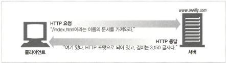

<h1>HTTP 개관</h1>

# 1.1 HTTP: 인터넷의 멀티미디어 배달부

    http는 신뢰성있는 데이터 전송 프로토콜을 사용하기 때문에 장거리 데이터 통신에도 전송 중 손상되거나 꼬이지 않습니다.

# 1.2 웹 클아이언트와 서버

    

# 1.3 리소스

    웹서버가 관리하는 웹 리소스

### 1.3.1 미디어 타입

    웹서버는 모든 HTTP 객체 데이터에 MIME(Multipurpose Internet Mail Extension, 다목적 인터넷 메일 확장) 타입을 붙입니다.
    MIME타입은 슬래쉬(/)로 구분된 문자열라벨입니다.

    1. HTML -> text/html
    2. plain ASCII -> text/plain
    3. JPEG -> image/jpeg
    4. GIF -> image/gif
    5. 애플 퀵타임 동영상 -> video/quicktime
    6. ppt -> application/vnd.ms-powerpoint

## 1.3.2 URI (uniform resource identifier)

    리소스를 고유하게 식별하고 위치를 지정할 수 있게합니다.

## 1.3.3 URL (uniform resource locator)

    특정서버의 한 리소스에 대한 구체적인 위치를 서술 오늘날의 URI는 대부분 URL입니다.
    3종류로 이루어져있으며

    1. 스킴은 프로토콜(http://)
    2. Domain (www.google.com)
    3. Path (/test/1)

## 1.3.4 URN (uniform resource name)

    리소스 위치에 영향 받지 않는 고유한 이름입니다. (urn:ietf:rfc:2141)

# 1.4 트랜잭션

    요청 명령과 응답 결과로 구성되며, 이 상호작용은 HTTP 메시지라고 불리는 정형화된 데이터 덩어리를 이용합니다.

## 1.4.1 메서드

    모든 HTTP 요청 메시지는 메서드를 가지며 어떤 동작을 취하는지 알려줍니다. 종류는 다음과 같습니다.
    GET, PUT, DELETE, POST, HEAD

## 1.4.2 상태코드

    모든 HTTP 응답 메시지에는 상태코드가 포함되며, 3자리 숫자로 표기됩니다. (200, 201, 400, 500 등)

## 1.4.3 웹페이지는 여러 객체로 이루어질 수 있다.

    웹페이지에 접속하게 되면 서버에서 뼈대가 되는 HTML 파일을 받고 추가적인 image 등을 받게됩니다. 이러하듯 웹이지는 보보통 하나의 리소스가 아닌 리소스 모음입니다.

# 1.5 메시지

    단순한 줄 단위의 문자열이며, 시작줄(메소드, Path, 프로토콜, 상태코드), 헤더(header), 본문(body)으로 이루어집니다.

# 1.6 TCP 커넥션

## 1.6.1 TCP/IP

    HTTP는 애플리케이션 계층(7켸층) 프로토콜로, 네트워크 통신의 세부사항에 대해서는 신경쓰지 않고 대중적이고 신뢰성있는 전송은 TCP/IP 프로토콜에 맡깁니다.

    1. 오류 없는 데이터 전송
    2. 순서에 맞는 전달
    3. 조각나지 않는 데이터 스트림

    패킷 교환 네트워크 프로토콜의 집합이며, 네트워크와 하드웨어의 특성을 숨기고, 어떤 종류의 컴퓨터나 네트워크든 서로 신뢰성 있는 의사소통을 하게 해줍니다.

## 1.6.2 접속, IP 주소 그리고 포트번호

    기본포트는 80, DNS는 IP주소를 외울수 없으니 google.com 형식의 Domain name service를 이용

1. URL에서 호스트 명 추출
2. 서버의 호스트 명을 IP로 변환
3. URL에 포트가 있다면 추출
4. 웹브라우저와 웹서버가 TCP 커넥션
5. 웹브라우저가 서버에게 요청을 보냄
6. 서버가 웹브라우저에게 응답을 돌려줌
7. 커넥션이 닫히면, 웹브라우저는 문서를 보여줌

## 1.6.3 털넷을 이용한 실제 예제

1. IP주소를 찾아 80번 포트로 TCP 커넥션
2. TCP커넥션이 연결되면 HTTP 요청
3. 서버는 콘테츠를 HTTP 응답에 담아 반환하고 커넥션은 끊음

nc는 HTTP, UDP, TCP 기반의 트래픽 조작이 가능하고 스크립트 지원

# 1.7 프로토콜 버전

    HTTP/0.9
    GET만 지워, 다수의 결함있음

    HTTP/1.0
    처음으로 널리쓰이기 시작, FORM 사용가능

    HTTP/1.0+
    상업적으로 이용, keep-alive 지원

    HTTP/1.1
    현재 쓰이는 버전, 결함을 교정하고 성능 최적화, 잘못된 기능 제거됨

    HTTP/2.0
    구글의 SPDY 프로토콜을 기반으로 설계

# 1.8 웹의 구성요소

## 1.8.1 프락시

    클라이언트와 서버 사이에 HTTP 중개자로 웹 보안, 애플리케이션 통합, 성능 최적화 등의 사용

## 1.8.1 캐시

    많이 찾는 웹페이지를 클라이언트 가까이에 보관하기 위한 HTTP 창고로 프락시 서버 성능 향상을 위해 사용

## 1.8.2 게이트웨이

    다른 어플리케이션과 연결된 특별한 프락시로 다른 서버들의 중개자하며, 주로 HTTP 트래픽을 다른 프로토콜로 변환하는 용도로 사용

## 1.8.4 터널

     단순히 HTTP 통신을 전달하기만하는 프락시로 데이터를 열어보지않고 그대로 전달합니다. 주로 암호화된 SSL 트래픽을 HTTP 커넥션으로 전송함으로써 웹 트래픽만 허용하는 사내 방화벽을 통과시키는 것이 있습니다.

## 1.8.5 에이전트

    자동화된 HTTP 요청을 만드는 준지능적 웹클라이언트, 스파이더, 웹로봇이라고도 불립니다.
