# HTTP 개관

## 1.1 HTTP: 인터넷의 멀티미디어 배달부

- HTTP는 신뢰성 있는 데이터 전송 프로토콜을 사용하기 때문에, 개발자는 인터넷의 결함이나 약점에 대한 걱정 없이 애플리케이션 고유의 기능을 구현하는 데 집중할 수 있다.

## 1.2 웹 클라이언트와 서버

- 웹 서버는 HTTP 프로토콜로 의사소통하기 때문에 보통 HTTP 서버라고 불린다.
- 클라이언트는 서버에게 HTTP 요청을 보내고 서버는 요청된 데이터를 HTTP 응답으로 돌려준다.
  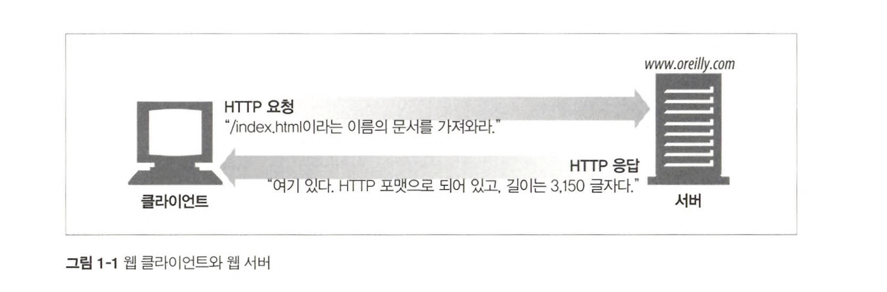
- 웹 브라우저는 HTTP 객체를 사용자의 화면에 보여준다.

## 1.3 리소스

- 웹 서버는 웹 리소스를 관리하고 제공한다.
- 어떤 종류의 콘텐츠 소스도 리소스가 될 수 있다. (정적 파일, 웹 게이트웨이, 인터넷 검색엔진 등등)

### 1.3.1 MIME 타입

MIME(Multipurpose Internet Mail Extensions, 다목적 인터넷 메일 확장)

- 웹 서버는 모든 HTTP 객체 데이터에 MIME 타입을 붙인다.
- 웹브라우저는 서버로부터 객체를 돌려받을 때, 다룰 수 있는 객체인지 MIME 타입을 통해 확인한다.
- MIME 타입 예시
  - text/html, text/plain, image/jpeg, image/gif 등등

### 1.3.2 URI

URI(Uniform Resource Identifier, 통합 자원 식별자)

- URI은 인터넷 우편물 주소 같은 것으로, 정보 리소스를 고유하게 식별하고 위치를 지정할 수 있다. (`https://www.naver.com`)
- URI의 종류에는 URL과 URN이 있다.

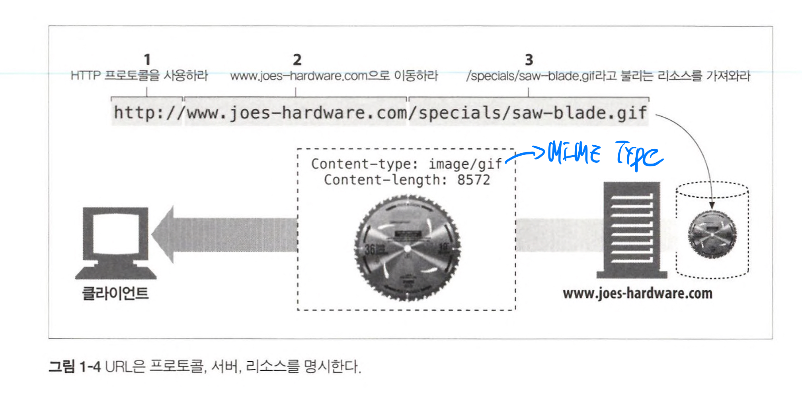

### 1.3.3 URL

URL(Uniform Resource Locator, 통합 자원 지시자)

- URL은 리소스 식별자의 가장 흔한 형태이다. 특정 서버의 한 리소스에 대한 구체적인 위치를 서술한다.
- URL은 세 부분으로 이루어진 표준 포맷을 따른다.
  - 첫 번째 부분인 스킴은 리소스에 접근하기 위해 사용되는 프로토콜을 서술한다. (`http://`)
  - 두 번째 부분은 서버의 인터넷 주소를 제공한다.(`www.naver.com`)
  - 마지막은 웹 서버의 리소스를 가리킨다.(`/cafe/flataex`)
- 오늘날 대부분의 URI는 URL이다.

### 1.3.4 URN

URN(Uniform Resource Name, 유니폼 리소스 이름)

- URN은 콘텐츠를 이루는 한 리소스에 대해, 그 리소스의 위치에 영향 받지 않는 유일무이한 이름 역할을 한다.
- URN은 여전히 실험 중인 상태이고 아직 널리 채택되지 않았다.
- URN이 대중화 되기에는 리소스 위치를 분석하기 위한 인프라 지원이 부족하다.

## 1.4 트랜잭션

- HTTP 트랜잭션은 요청명령, 응답 결과로 구성되어 있다.
  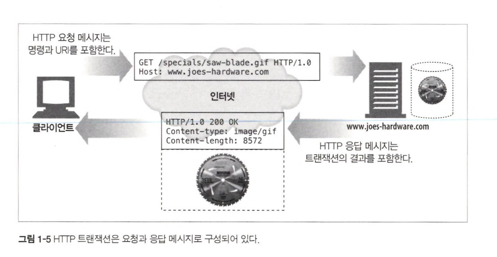

### 1.4.1 메서드

- 모든 HTTP 요청 메시지는 한 개의 메서드를 갖는다.
- 메서드는 서버에게 어떤 동작이 취해져야 하는지 말해준다. (GET, PUT, DELETE, POST)

### 1.4.2 상태코드

- 모든 HTTP 응답 메시지는 상태 코드와 함께 반환된다.
- 상태 코드는 요청이 성공했는지, 추가조치가 필요한지 알려주는 세 자리 숫자이다.
- HTTP는 각 숫자 상태 코드에 텍스트로 된 "사유 구절"도 함께 보낸다.
  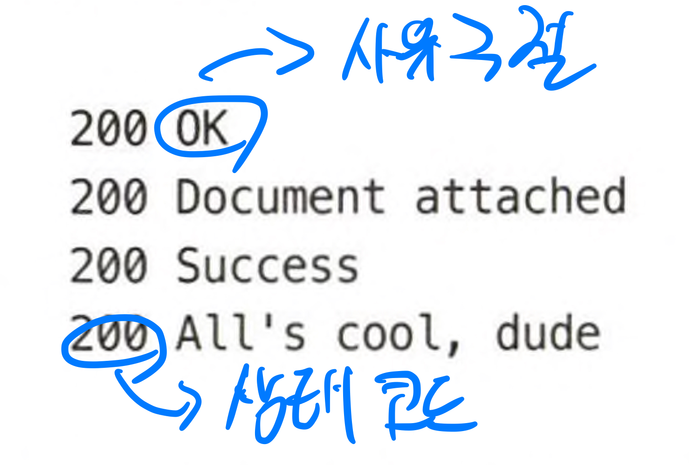

### 1.4.3 웹페이지는 여러 객체로 이루어질 수 있다

- 애플리케이션은 보통 하나의 작업을 수행하기 위해 여러 HTTP 트랜잭션을 수행한다.
  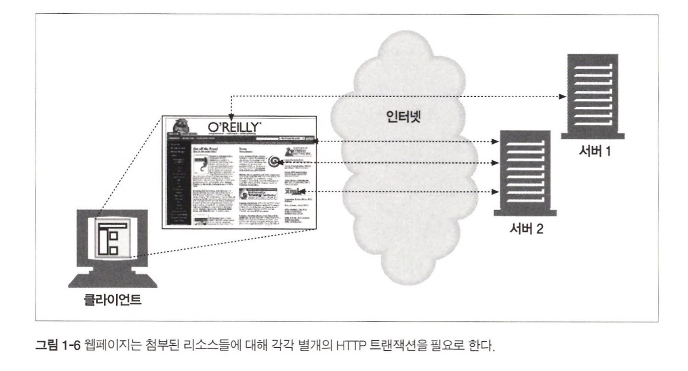

## 1.5 메시지

- HTTP 메시지는 단순한 줄 단위의 문자열이다.
- 웹 클라이언트에서 웹 서버로 보낸 HTTP 메시지를 요청 메시지라고 한다.
- 웹 서버에서 웹 클라이언트로 보낸 HTTP 메시지를 응답 메시지라고 한다.

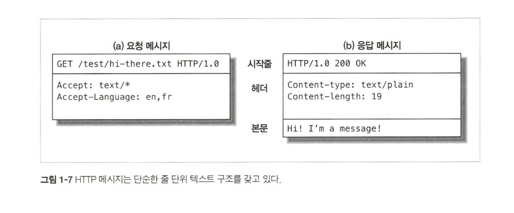

### 1.5.1 간단한 메시지의 예

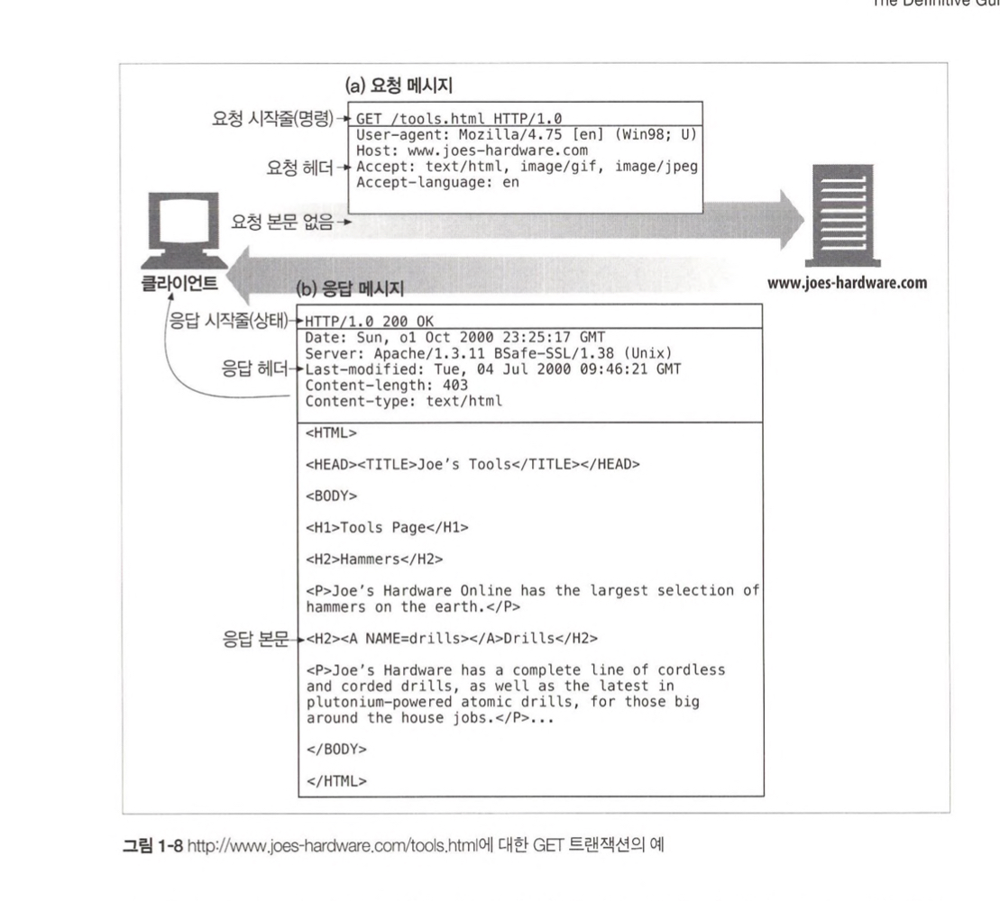

## 1.6 TCP 커넥션

TCP(Transmission Control Protocol, 전송 제어 프로토콜)

### 1.6.1 TCP/IP

- TCP 는 다음을 제공한다
  - 오류 없는 데이터 전송
  - 순서에 맞는 전달 (데이터는 언제나 보낸 순서대로 도착한다)
  - 조각나지 않는 데이터 스트림 (언제든 어떤 크기로든 보낼 수 있다)
- 인터넷은 TCP/IP에 기초하고 있다.
- 각 네트워크와 하드웨어의 특성을 숨기고 서로 신뢰성 있는 의사소통을 하게 해준다.

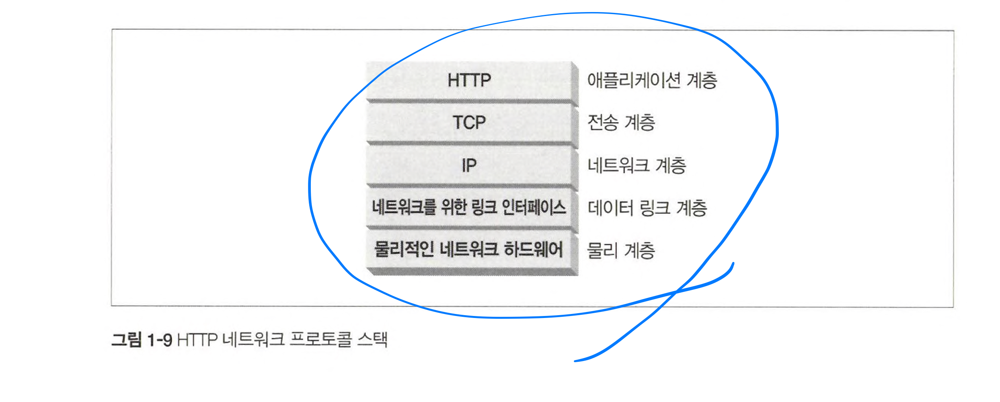

### 1.6.2 접속, IP 주소 그리고 포트번호

- HTTP 클라이언트가 서버에 메시지를 전송하려면 IP주소와 포트번호를 사용해 서버와 TCP/IP 커넥션을 맺어야 한다.
- IP주소를 모르더라도 호스트명(`www.naver.com`)을 통해 커넥션을 맺을 수 있다.
- 포트번호의 기본값은 80이다.

### 1.6.3 텔넷을 사용한 실전예제

- 텔넷은 당신의 키보드를 목적지의 TCP 포트로 연결해주고 출력 TCP 포트를 당신의 화면으로 연결해준다.

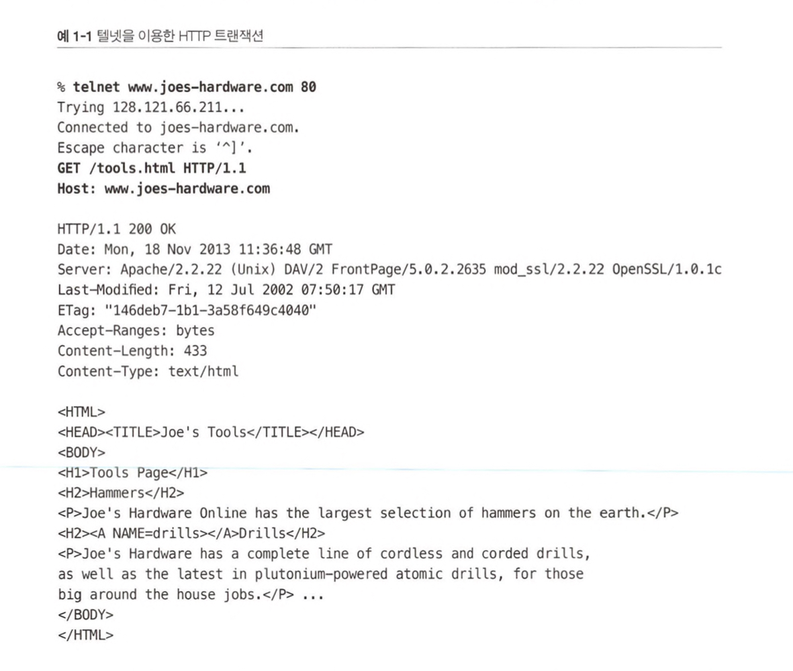

## 1.7 프로토콜 버전

### HTTP/0.9

- 심각한 디자인 결함이 있고 구식 클라이언트하고만 같이 사용할 수 있다.
- GET 메서드만 지원하고, MIME타입이나 HTTP헤더, 버전 번호는 지원하지 않는다.
- 간단한 HTML 개체를 받아오기 위해 설계되었다

### HTTP/1.0

- 처음으로 널리 쓰이기 시작한 버전이다.
- HTTP헤더, 추가 메서드, 멀티미디어 객체 처리가 추가되었다.
- 결코 잘 정의된 명세가 아니며, HTTP가 상업적, 학술적으로 급성장하던 시기에 만들어진, 잘 동작하는 용례들의 모음이다.

### HTTP/1.0+

- 오래 지속되는 keep-alive 커넥션, 가상호스팅 지원, 프락시 연결 지원 등이 추가되었다.

### HTTP/1.1

- HTTP 설계의 구조적 결함 교정, 두드러진 성능 최적화, 잘못된 기능 제거에 집중했다.
- 더 복잡해진 웹 애플리케이션과 배포를 지원한다.

### HTTP/2.0

- 기존의 성능 문제를 개선하기 위해 SPDY 프로토콜을 기반으로 설계가 진행중이다.

## 1.8 웹의 구성요소

- 프락시 : 클라이언트와 서버 사이에 위치한 HTTP 중계자
- 캐시 : 많이 찾는 웹페이지를 클라이언트 가까이 보관하는 HTTP 창고
- 게이트웨이 : 다른 애플리케이션과 연결된 특별한 웹 서버
- 터널 : 단순히 HTTP 통신을 전달하기만 하는 특별한 프락시
- 에이전트 : 자동화된 HTTP 요청을 만드는 준지능적 웹클라이언트

### 1.8.1 프락시

- 클라이언트와 서버 사이에 위치하며, 클라이언트의 모든 HTTP 요청을 받아 서버에 전달한다.
- 주로 보안을 위해 사용된다.
- 예시
  - 회사에서 무엇인가를 다운 받을 때 애플리케이션 바이러스를 검출
  - 초등학교 학생들에게서 성인 콘텐츠 차단

### 1.8.2 캐시

- 자신을 거쳐 가는 문서들 중 자주 찾는 것의 사본을 저장해 두는 프락시 서버이다.
- 다음번에 클라이언트가 같은 문서를 요청하면, 캐시가 갖고 있는 사본을 반환한다.

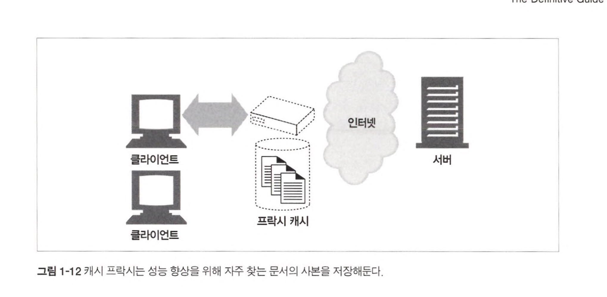

### 1.8.3 게이트웨이

- 게이트웨이는 주로 HTTP 트래픽을 다른 프로토콜로 변환하기 위해 사용된다.

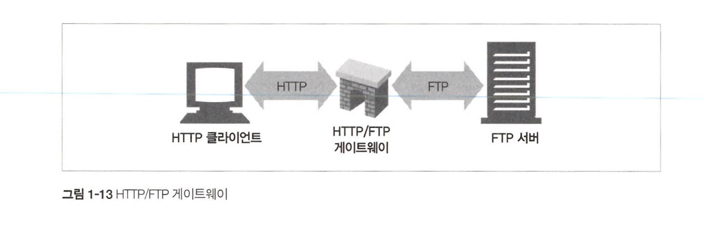

### 1.8.4 터널

- 터널은 두 커넥션 사이에서 raw 데이터를 열어보지 않고 그대로 전달해주는 HTTP 애플리케이션이다.
- 주로 비 HTTP 데이터를 하나 이상의 HTTP 연결을 통해 그대로 전송해주기 위해 사용된다.
- 대표적인 예시로 암호화된 SSL 트래픽을 HTTP 커넥션으로 전송함으로써 웹 트래픽만 허용하는 사내 방화벽이 있다.

### 1.8.5 에이전트

- 사용자 에이전트는 사용자를 위해 HTTP 요청을 만들어주는 클라이언트 프로그램이다.
- 웹 브라우저, 검색엔진 봇 등이 있다.
