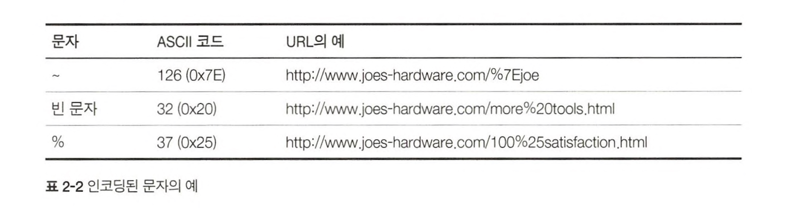

# 2. URL과 리소스

URL(Uniform Resource Locator) : 인터넷의 리소스를 가리키는 표준이름

## 2.1 인터넷의 리소스 탐색하기

- URL과 URN은 URI의 종류이다.
- URL은 브라우저가 정보를 찾는데 필요한 리소스의 위치를 카리킨다.
- URN은 리소스가 어디에 존재하든 상관없이 그 이름만으로 리소스를 식별한다.
- URL은 스킴(`https://`), 서버의 위치(`www.naver.com`), 리소스의 경로(`/news`)로 구성된다.
- mailto, ftp, rtsp 등 다른 프로토콜을 사용할 수도 있다.
- URL은 인터넷에 있는 어떤 리소스든지 가리킬 수 있다.

### 2.1.1 URL 이 있기 전 암흑의 시대

- URL이 있기전 사람들은 특정 애플리케이션을 통해 복잡한 절차로 통신해야 했다.
- 브라우저는 이러한 복잡한 절차를 편리하게 정리하였다. 복잡한 절차 대신 URL을 전달함으로써 통신이 가능하게 되었다.
- URL은 애플리케이션이 리소스에 접근할 수 있는 방법을 제공한다.

### 2.2 URL 문법

- 각 리소스들은 다른 스킴(HTTP,FTP,SMTP)를 통해 접근할 수 있으며, URL 문법은 스킴에 따라서 달라진다.
- 대부분 일반 URL 문법을 따르며, 서로 다른 URL 스킴도 형태와 문법 면에서 매우 유사하다.

### 2.2.1 스킴: 사용할 프로토콜

- 스킴은 주어진 리소스에 어떻게 접근하는지 알려주는 중요한 정보이다.
- 스킴은 알파벳으로 시작해야 하고나머지 URL의 나머지 부분들과 : 문자로 구분한다. 대소문자를 가리지 않는다.
- 예시 : https://www.naver.com

### 2.2.2 호스트와 포트

- 호스트 : 접근하려고 하는 리소스를 가지고 있는 인터넷상의 호스트 장비
  - www.naver.com, 110.401.20.213 등등
- 포트 : 서버가 열어놓은 네트워크 포트
  - 80, 8080, 22, 443 등등

### 2.2.3 사용자 이름과 비밀번호

- 많은 서버가 자신이 가지고 있는 데이터에 접근을 허용하기 전에 사용자 이름과 비밀번호를 요구한다.
- FTP 서버가 좋은 예다.
  
- 사용자 이름과 비밀번호를 기술하지 않고 FTP URL에 접근하면, 브라우저마다 가지고 있는 기본값을 사용한다.

### 2.2.4 경로

- 리소스가 서버의 어디에 있는지 알려준다.
- 유닉스의 계층적 파일 시스템 경로와 유사한 구조를 가진다.
- `https://www.naver.com/blog/minxd95` 에서 `/blog/minxd95`에 해당한다.
- `/`로 구분된 각 경로 조각은 각각의 파라미터 컴포넌트를 가질 수 있다.

### 2.2.5 파라미터

- 애플리케이션이 서버에 정확한 요청을 하기 위해 파라미터를 보낸다.
- 이름/값 쌍의 리스트로 URL의 나머지 부분들로부터 ';' 문자로 구분한다.
- 각각의 경로 조각이 파라미터를 가질 수 있다.
- 예시
  - ftp://prep.ai.mit.edu/pub/gnu;type=d
  - ftp://prep.ai.mit.edu/pub/gnu;type=d/ab;graphics=true

### 2.2.6 질의 문자열

- DB같은 서비스들은 요청받을 리소스 형식의 범위를 좁히기 위해서 질의를 받을 수 있다.
- URL의 나머지 부분과 '?' 문자로 구분하며 '&' 문자를 사용하여 여러 개를 보낼 수 있다.
  

### 2.2.7 프래그먼트

- 리소스의 특정 부분을 가리킬 수 있도록 URL은 리소스 내의 조각을 가리킬 수 있는 프래그먼트 컴포넌트를 제공한다.
- 예시 : http://www.document.com/quick-start.html#installation (#installation 부분에 해당)
- 클라이언트는 서버에 프래그먼트를 전달하지 않으며, 브라우저가 전체 리소스를 내려받은 후, 프래그먼트를 사용하여 당신이 보고자 하는 리소스의 일부를 보여준다.

## 2.3 단축 URL

상대 URL은 리소스 안에 있는 리소스를 간결하게 기술하는데 사용할 수 있다. 브라우저는 사용자가 URL 일부를 입력하면 나머지 부분을 자동으로 입력해주는 URL '자동 확장'을 지원한다.

### 2.3.1 상대 URL

URL은 상대 URL과 절대 URL 두가지로 나뉜다.

- 절대 URL : 리소스에 접근하는데 필요한 모든 정보를 가지고 있다.
- 상대 ULR : 모든 정보를 담고 있지 않다.
  - `http://www.joes-hardware.com/tools.html`에서 받아온 문서에서 `./hammers.html` 라는 경로를 참조한다면, 기저 URL은 `http://www.joes-hardware.com`이기 때문에 `http://www.joes-hardware.com/hammers.html`을 참조하게 된다.
- 상대경로 해석 알고리즘
  

### 2.3.2 URL 확장

어떤 브라우저들은 URL을 입력한 다음이나 입력하고 있는 동안에 자동으로 URL을 확장한다. 이는 사용자가 URL을 빠르게 입력하게 도와준다.

- 호스트명 확장
  - 단순한 휴리스틱만을 사용한다. 예를 들어 `yahoo`를 입력하면 `www.`와 `.com`을 붙여서 `www.yahoo.com`을 만들어준다.
- 히스토리 확장
  - 사용자가 방문했던 URL의 기록을 저장해놓고, URL이 일부가 입력되면 방문기록을 참고하여 완성된 URL을 추천해준다.

## 2.4 안전하지 않은 문자

- 안전한 전송이란, 정보가 유실될 위험 없이 URL을 전송할수 있어야 한다는 것을 의미한다.
- 안전한 전송을 위해, 이스케이프라는 기능은 안전하지 않은 문자를 안전한 문자로 인코딩 할 수 있게 한다.

### 2.4.1 URL 문자 집합

- US-ASCII 문자집합으로 표현할 수 없는 문자를 표현하기 위해, 이스케이프 문자열을 사용할 수 있다.

### 2.4.2 인코딩 체계

- 인코딩은 안전하지 않은 문자를 퍼센티지 기호(%)로 시작해, ASCII 코드로 표현되는 두 개의 16진수 숫자로 이루어진 '이스케이프' 문자로 바꾼다.
  

### 2.4.3 문자 제한

- 몇몇 문자는 URL 내에서 특별한 의미로 예약되어 있다. 이러한 문자를 본래의 목적이 아닌 다른 용도로 사용하려면, 그 전에 반드시 인코딩해야 한다.
  

### 2.4.4 좀더 알아보기

- 어떤 애플리케이션에 어떤 URL을 보내든지, 그 전에 클라이언트 애플리케이션에서 인코딩을 하는 것이 좋다.
- 입력받은 URL에서 어떤 문자를 인코딩해야 하는지 결정하는 데는 브라우저와 같이 사용자로부터 최초로 URL을 입력받는 애플리케이션에서 하는 것이 가장 적절하다.
- URL을 해석하는 애플리케이션은 요청을 처리하기 전에 URL을 디코딩 해야 한다.

## 2.5 스킴의 바다

## 2.6 미래

- URL은 모든 객체에 이름을 지을 수 있다.
- URL은 새로운 포맷을 쉽게 추가할 수 있다.
- URL은 인터넷 프로토콜 간에 공유할 수 있는 일관된 작명 규칙을 제공한다.
- 리소스가 옮겨지면 URL을 더 이상 사용할 수 없다.
  - 해결방안 : URN (위치가 변해도 이름 만으로 객체를 받아올 수 있다)
  - PURL을 사용하면 URL로 URN의 기능을 사용할 수 있다.
    

### 2.6.1 지금이 아니면, 언제?

- URL에서 URN으로 전환하기 위한 모든 것이 준비되려면 시간이 걸리기 때문에, URL은 당분간 계속 사용될 것이다.
