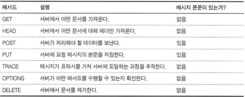
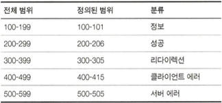

# HTTP 메시지

## 3.1 메시지의 흐름

- HTTP 애플리케이션이 서로 주고받은 데이터 블록입니다.
- 메시지 방형의 종류는 4가지가 있습니다.
  - 인바운드 : 클라이언트에서 서버로 요청하는 것
  - 아웃바운드 : 서버에서 클라이언트로 응답하는 것
  - 업스트림 : 요청과 응답을 발송하는 자는 수신자의 업스트림
  - 다운스트림 : 요청메시지, 응답메시지 상관없이 다운스트림

### 3.1.1 메시지는 원 서버 방향을 인바운드로 하여 송신된다.

### 3.1.2 다운스트림으로 흐르는 메시지

## 3.2 메시지의 각 부분

- 메시지는 3부분으로 이루어집니다.
  - 시작줄 : 이것이 어떤 메시지인지 서술합니다. 아스키 문자열로 구성됩니다.
  - 헤더 : 속성을 서술합니다. 아스키 문자열로 구성됩니다.
  - 본문 : 텍스트, 이진 데이터를 담으며, 없을 수도 있습니다.

### 3.2.1 메시지 문법


- 요청 메시지

```xml
<method/> <request URL/> <version/>
<headers />

<Entity>
```

- method : GET, HEAD, POST 등의 형식으로 클라이언트가 서버에게 리소스에 대해 수행해주길 바라는 동작입니다.

- request URL : 요청 대상이 되는 리소르를 지칭하는 완전한 URL이나 URL의 경로

- version : 사용중인 HTTP 버전

* 응답 메시지

```xml
<version/> <status code/> <reson phrase/>
<headers />

<Entity>
```

- status code : 요청중에 무엇이 일어났는지 설명하는 세자리의 숫자
- reson phrase : status code를 이해하기 쉽게 설명해준느 짧은 문구
- headers : key-value 형식의 문자열
- Entity : 임의의 데이터 블록이며, 본문이 없더라도 호환성을 위해 항상 빈줄(CRLF)로 끝나야합니다.

### 3.2.2 시작줄

- 모든 HTTP 메시지는 시작줄로 시작하합니다.
- 요청줄 : 무엇을 해야하는지 알려주며, method, request URL, version으로 구성되며 모든 필드는 공백으로 구분됩니다.
- 응답줄 : 무슨일이 일어났는지 알려주며 , version, status code, reson phrase으로 구성되며 모든 필드는 공백으로 구분됩니다.
- 메서드
  
- 상태 코드
  
- 사유 구절
- 버전 번호

### 3.2.3 헤더

- HTTP 헤더 필드는 요청과 응답 메시지에 key-value 형식의 문자열로 추가 정보를 제공합니다.
- 헤더 분류

| header      | 설명                                           |
| ----------- | ---------------------------------------------- |
| 일반 헤더   | 요청과 응답 양쪽에 모두 나타날 수 있음         |
| 요청 헤더   | 요청에 대한 부가 정보를 제공                   |
| 응답 헤더   | 응답에 대한 부가 정보를 제공                   |
| Entity 헤더 | 본문 크기와 콘텐츠, 혹은 리소스 그 자체를 서술 |
| 확장 헤더   | HTTP 명세에 정의되지 않은 비표준 헤더          |

- 추가 줄 앞에 최소 하나의 스페이스 혹은 탭 문자가 와야 합니다.
- Q. Entity 헤더dptj 본문을 서술한다며 본문의 필요성이 없지 않은가?

### 3.2.4 엔터티 본문

- HTTP의 메시지의 화물이라고 할 수 있습니다. 이미지, 비디오, HTML 문저, 소프트웨어 애플리케이션, 신용카드 트랜잭션, 전자우편 등 여러 종류의 디지털 데이터를 실어 나를수 있습니다.

### 3.2.5 버전 0.9 메시지

## 3.3 메서드

- 모든 메서드를 구현하지는 않을 수 있습니다. DELETE, PUT과 같은 경우 아무나 수정, 삭제를 못하게 하기 위함입니다.

### 3.3.1 안전한 메서드(Safe Method)

- GET, HEAD 같은 HTTP요청이 서버에 어떤 작용도 없는 것입니다.

### 3.3.2 GET

- 서버에 리소스를 요청할 떄 사용됩니다.

### 3.3.3 HEAD

- 서버에 리소스를 요청할 떄 헤더만을 가져올 수 있습니다.

  HEAD 메소드의 사용성의 예시입니다. 단, 개발자는 GET 메소드로 얻는 것과 일치함을 보장해야합니다.

  - 리소스를 가져오지 않고 타입 등을 확인할 수 있습니다.
  - 응답의 상태를 통해 개체가 존재하는지 확인할 수 있습니다.
  - 헤더를 통해 리소스가 변경되었는지 검사할 수 있습니다.

### 3.3.4 PUT

- 서버가 요청의 본문을 가지고 요청 URL의 이름대로 새 문서를 만들거나, 이미 URL이 존재한다면 본문을 사용해서 교체합니다.
- Q. 대체적으로 POST를 사용하여 입력을 하고 PUT을 사용하여 변경을 하는데 PUT으로 Update를 하는데 PUT으로

```SQL
INSERT INTO ON DUPLICATE KEY UPDATE
```

을 한다면 POST의 필요성이 있는가?

### 3.3.5 POST

- 서버에 입력 데이터를 전송하기 위해 설계되었으며, 흔히 HTML Form 태그를 사용하여 전송합니다.

### 3.3.6 TRACE

- 프록시나 다른 어플리케이션들을 통해 요청할때 변경이 있는지 확인하기 위해 루프백 진단을 통해 클라이언트의 요청이 서버에 어떠한 형태로 도달했는지 알려줍니다.
- 프록시 서버의 경우 GET, POST 의 캐시 동작이 다르며 어떠한 엔티티 본문도 보낼 수 없기에 한계점이 있습니다.

### 3.3.7 OPTIONS

- 특정 리소스가 어떤 메소드들을 지원하는 지 알려줍니다.
- 서버에서 별도로 구현하지 않아도 사용할수 있습니다.

### 3.3.8 DELETE

- 리소스 삭제를 요청합니다. 다만 삭제가 수행되는것을 보장하지는 않습니다.

### 3.3.9 확장 메서드

- HTTP/1.1 명세에 정의되지 않은 메서드들 입니다. 확장 메소드는 관용적인 이름으로 작성해야합니다.

## 3.4 상태 코드

## 3.5 헤더

### 3.5.1 일반 헤더

- 일반 캐시 헤더
  - 요청마다 원 서버로부터 객체를 가져오는 대신 로컬 복사본으로 캐시할 수 있도록 해주는 최초의 헤더입니다.

### 3.5.2 요청 헤더

- Accept 관련 헤더
  - 클라이언트는 자신의 선호오 능력을 Accept 헤더를 통해 알려줄 수 있습니다.
- 조건부 요청 헤더
  - 클라이언트가 서버에게 요청에 응답하기 전에 먼저 조건이 참인지 확인하게 하는 제약을 포함시킬 수 있습니다.
    
- 요청 보안 헤더
  - HTTP는 자체적으로 요청을 위한 간단한 인증요구/응답 체계를 갖고 있습니다.
- 프락시 요청 헤더
  - 프록시 사용이 대중화되면서 기능을 돕기 위해 만들어진 헤더입니다.

### 3.5.3 응답 헤더

- 협상 헤더
  - 서버에 프랑스어와 독일어로 번역된 HTML 문서가 있는 경우와 같이 여러가지 표현이 가능한 상환에서 서버와 클라이언트가 어떤 표현을 택할 것인가에 대한 협상을 할 수 있도록 지원합니다.
- 응답 보안 헤더

### 3.5.4 엔터티 헤더

- 콘텐츠 헤더

  - 콘텐츠의 구체적인 정보를 제공하며, 종류, 크기, 기타 콘텐츠를 처리할 때 유용하게 쓰입니다.

- 엔터티 캐싱 헤더
  - 일반 캐싱 헤더는 언제 어떻게 캐시가 되어야하는지에 대한 지시자를 제공하고 엔티티 캐싱헤더는 엔티티 캐싱에 대한 정보를 제공합니다.
