# HTTP 메시지

HTTP가 인터넷의 배달원이라면, HTTP 메시지는 무언가를 담아 보내는 소포이다.

## 3.1 메시지의 흐름

- HTTP 메시지는 hTPTP 애플리케이션 간에 주고받은 데이터의 블록들이다.
- 이 데이터의 블록들은 텍스트 메타 정보로 시작하고, 선택적으로 데이터가 올 수 있다.
- 이 메시지는 클라이언트, 서버, 프락시 사이를 흐른다.
- '인바운드', '아웃바운드', '업스트림', '다운스트림'은 메시지의 방향을 의미한다.

### 3.1.1 메시지는 원 서버 방향을 인바운드로 하여 송신된다.

- 인바운드 : 메시지가 원 서버로 향하는 것
- 아웃바운드 : 모든 처리가 끝난 뒤에 메시지가 사용자 에이전트로 돌아오는 것

### 3.1.2 다운스트림으로 흐르는 메시지

- 요청 메시지냐 응답 메시지냐에 관계없이 모든 메시지는 다운스트림으로 흐른다.
- 메시지의 발송자는 수신자의 업스트림이다.

## 3.2 메시지의 각 부분

- HTTP 메시지는 단순한, 데이터의 구조화된 블록이다.
- 각 메시지는 클라이언트로부터 요청이나 서버로부터의 응답 중 하나를 포함한다.
- 메시지의 구성
  - 시작줄 : 이것이 어떤 메시지인지
  - 헤더 블록 : 속성
  - 본문 : 데이터 (아예 없을 수도 있다.)
- 시작줄과 헤더는 줄 단위로 분리된 아스키 문자열이다.
- 본문은 단순히 선택적인 데이터 덩어리이다.

### 3.2.1 메시지 문법

- 모든 HTTP 메시지는 요청 메시지나 응답 메시지로 분류된다.
  - 요청 메시지 : 웹 서버에 어떤 동작을 요구한다.
  - 응답 메시지 : 요청의 결과를 클라이언트에게 돌려준다.
  - 요청 메시지와 응답 메시지는 시작줄에서만 문법이 다르다.
- 메서드 : 클라이언트 측에서 서버가 리소스에 대해 수행해주길 바라는 동작 (GET, HEAD, POST 등등)
- 요청 URL : 요청 대상이 되는 리소스를 지칭하는 완전한 URL 혹은 URL의 경로 구성요소.
  - 서버는 URL에서 생략된 호스트/포트가 자신을 가리키는 것으로 간주한다.
- 버전
  - 메시지에서 사용 중인 HTTP의 버전 (`HTTP/<메이저>,<마이너>`)
- 상태 코드
  - 요청 중에 무엇이 일어났는지 설명하는 세자리의 숫자
  - 첫 번째 자릿수는 상태의 일반적인 분류를 나타낸다. (2xx, 3xx, 4xx, 5xx)
- 사유 구절
  - 숫자로 된 상태 코드의 의미를 사람이 이해할 수 있게 설명해주는 짧은 문구
- 헤더들
  - 이름, 콜론, 선택적인 공백, 값, CRLF(줄바꿈)이 순서대로 나타나는 0개 이상의 헤더들.
  - 헤더의 목록은 빈 줄(CRLF)로 끝나 헤더 목록의 끝과 엔터티 본문의 시작을 표시한다.
  - HTTP/1.1 과 같은 몇몇 버전의 HTTP는 요청이나 응답에 어떤 특정 헤더가 포함되어야만 유효한 것으로 간주한다.
- 엔터티 본문
  - 엔터티 본문은 임의의 데이터 블록을 포함한다.
  - 때때로 엔터티 본문이 없는 경우, 메시지는 그냥 CRLF로 끝나게 된다.

### 3.2.2 시작줄

- 모든 HTTP 메시지는 시작줄로 시작한다.
- 요청 메시지의 시작줄 : 무엇을 해야 하는지 말해준다.
- 응답 메시지의 시작줄 : 무슨 일이 일어났는지 말해준다.
- 요청줄
  - 메서드, 요청 URL, HTTP 버전으로 이루어진다.
  - 모든 필드는 공백으로 구분된다.
- 응답줄
  - HTTP 버전, 숫자로 된 상태 코드, 텍스트로 된 사유 구절로 이루어진다.
  - 모든 필드는 공백으로 구분된다.
- 메서드
  - 서버에게 무엇을 해야 하는지 말해준다.
    - GET : 서버에서 문서를 가져온다.
    - POST : 서버가 처리해줬으면 하는 데이터를 보낸다.
    - OPTIONS : 웹 서버의 일반적인 지원 범위 혹은 웹 서버의 특정 리소스에 대한 지원 범위를 알아본다.
  - 확장 메서드 : HTTP에 명세되어 있지 않은 추가 메서드
- 상태 코드
  - 클라이언트에게 무엇이 일어났는지 말해준다.
  - 세 자리 숫자로 된 그들의 코드값을 기준으로 묶인다.
    - 200~299 : 성공
    - 300~399 : 리소스가 옮겨짐
    - 400~499 : 잘못된 요청
    - 500~599 : 서버에서 뭔가 실패함
- 사유 구절
  - 상태 코드에 대한 글로 된 설명을 제공한다.
  - HTTP 명세는 사유 구절이 어때야 한다는 어떤 엄격한 규칙도 제공하지 않는다.
- 버전 번호
  - HTTP/x.y 형식으로 요청과 응답 메시지 양쪽 모두에 기술된다.
  - 어떤 애플리케이션이 지원하는 가장 높은 HTTP버전을 가리킨다.
  - 버전 번호는 분수가 아니다. (HTTP/2.22는 HTTP/2.3보다 크다)

### 3.2.3 헤더

- HTTP 헤더 필드는 요청과 응답 메시지에 추가 정보를 더한다.
- 이름/값 쌍의 목록이다.
- 헤더 분류
  - 일반 헤더 : 요청과 응답 양쪽에 모두 나타날 수 있음
  - 요청 헤더 : 요청에 대한 부가 정보를 제공
  - 응답 헤더 : 응답에 대한 부가 정보를 제공
  - Entity 헤더 : 본문 크기와 콘텐츠, 혹은 리소스 그 자체를 서술
  - 확장 헤더 : 명세에 정의되지 않은 새로운 헤더
- 헤더를 여러 줄로 나누기
  - 추가 줄 앞에 최소 하나의 스페이스 혹은 탭 문자가 와야 한다.

### 3.2.4 엔터티 본문

- HTTP의 화물이라고 할 수 있다. 여러 종류의 디지털 데이터를 실어 나를 수 있다.

### 3.2.5 버전 0.9 메시지

- HTTP/0.9의 요청은 그저 메서드와 요청 URL로, 응답은 오직 엔터티로 구성되어 있다.

## 3.3 메서드

- 모든 서버가 모든 메서드를 구현하지는 않는다.

### 3.3.1 안전한 메서드(Safe Method)

- HTTP 요청의 결과로 서버에 어떤 작용도 없는 메서드를 안전한 메서드라고 한다. (GET, HEAD)

### 3.3.2 GET

서버에서 리소스를 달라고 요청하기 위해 쓰인다.

### 3.3.3 HEAD

- 정확히 GET처럼 행동하지만, 응답으로 헤더만을 돌려준다.
- 서버 개발자들은 반환되는 헤더가 GET으로 얻는 것과 정확히 일치함을 보장해야 한다.

### 3.3.4 PUT

- 서버가 요청의 본문을 가지고 요청 URL의 이름대로 새 문서를 만들거나, 이미 URL이 존재한다면 본문을 사용해서 교체한다.

### 3.3.5 POST

- 서버에 입력 데이터를 전송하기 위해 설계되었다.

### 3.3.6 TRACE

- 클라이언트에게 자신의 요청이 서버에 도달했을 때 어떻게 보이게 되는지 알려준다.
- 주로 진단을 위해 사용된다.
- 어떠한 엔터티 본문도 보낼 수 없다.

### 3.3.7 OPTIONS

- 서버에게 특정 리소스에 대해 어떤 메서드가 지원되는지 물어본다.

### 3.3.8 DELETE

- 서버에게 요청 URL로 지정한 리소스를 삭제할 것을 요청한다.

### 3.3.9 확장 메서드

- HTTP 명세에 정의되지 않은 메서드를 말한다.

## 3.4 상태 코드

- 101~199 : 정보성 상태 코드
  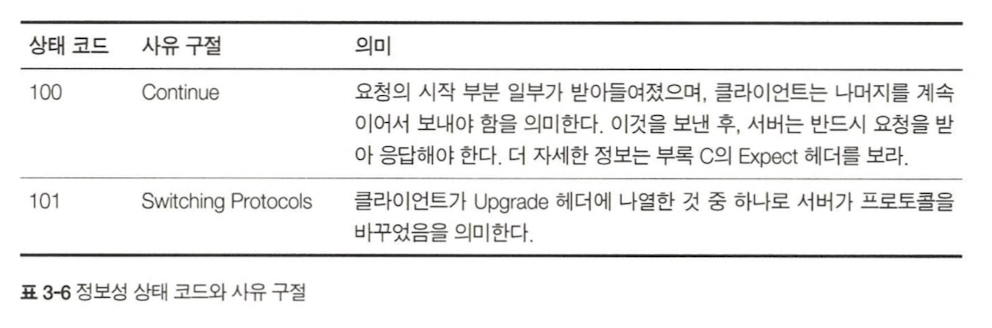
- 200~299 : 성공 상태 코드
  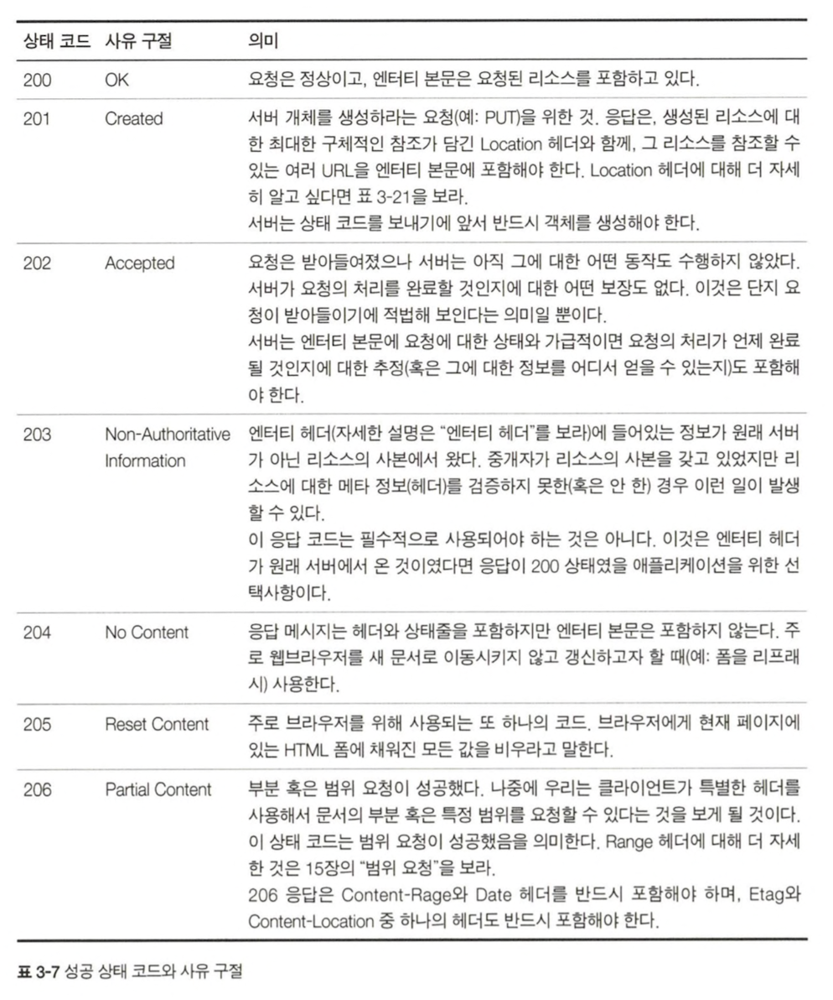
- 300~399 : 리다이렉션 상태 코드
  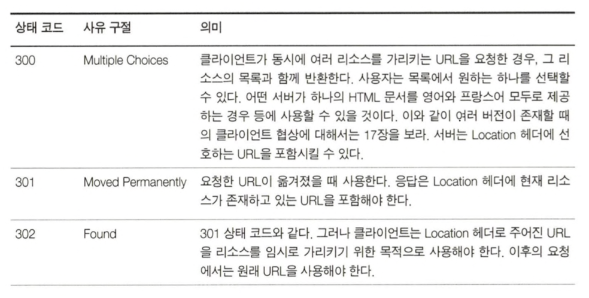
  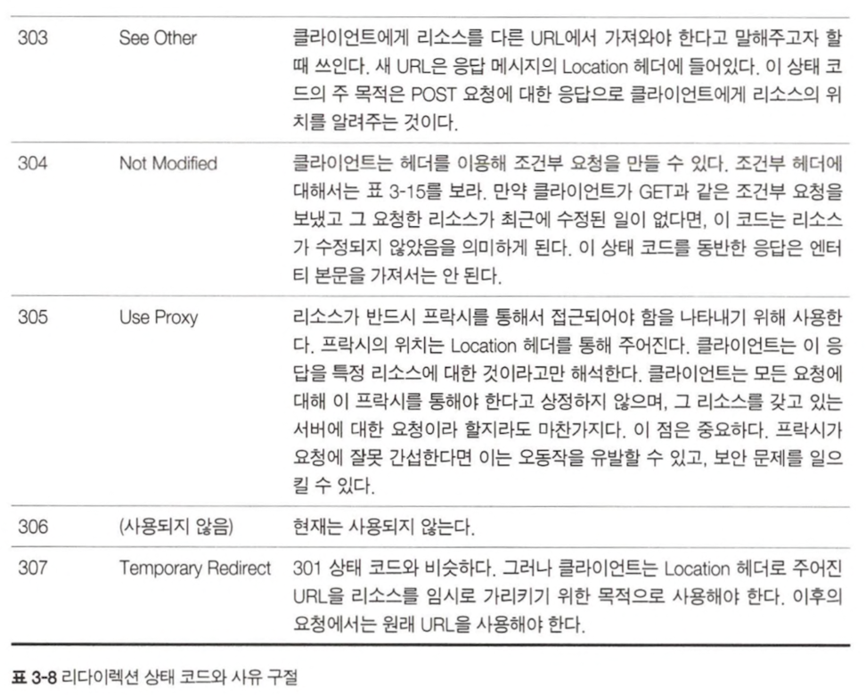
- 400~499 : 클라이언트 에러 상태 코드
  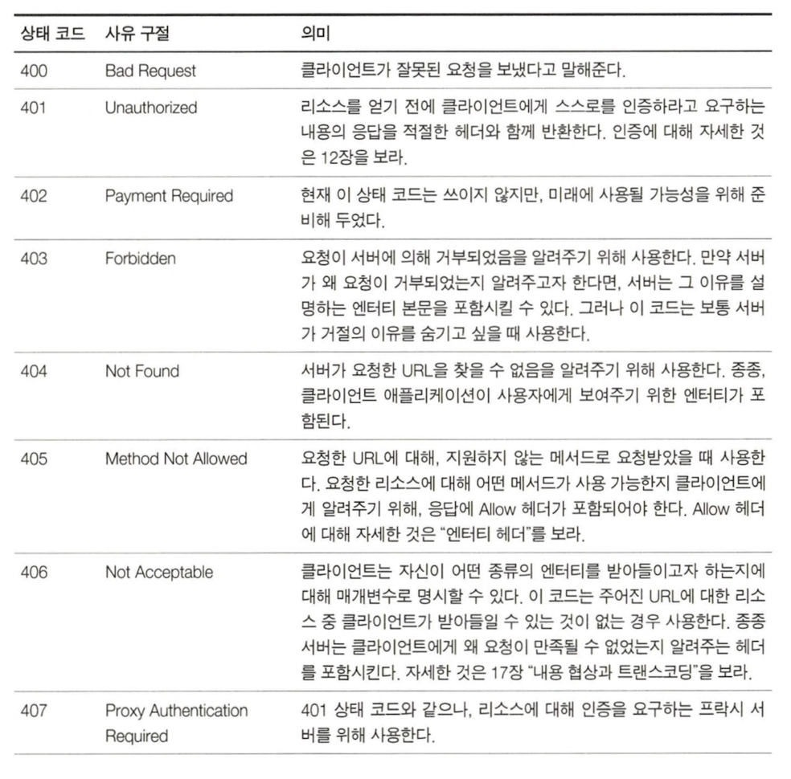
  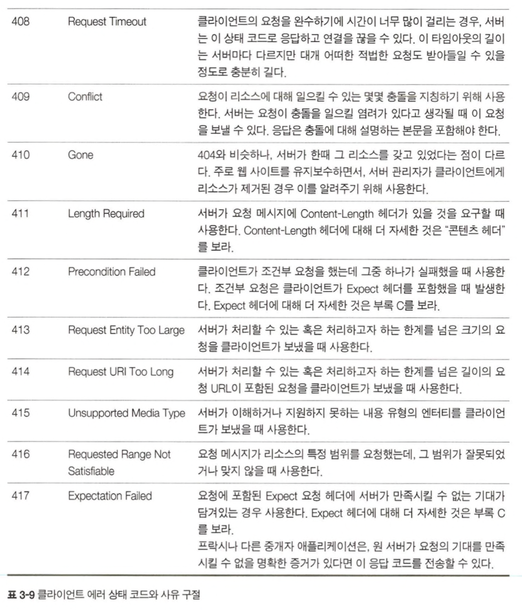
- 500~599 : 서버 에러 상태 코드
  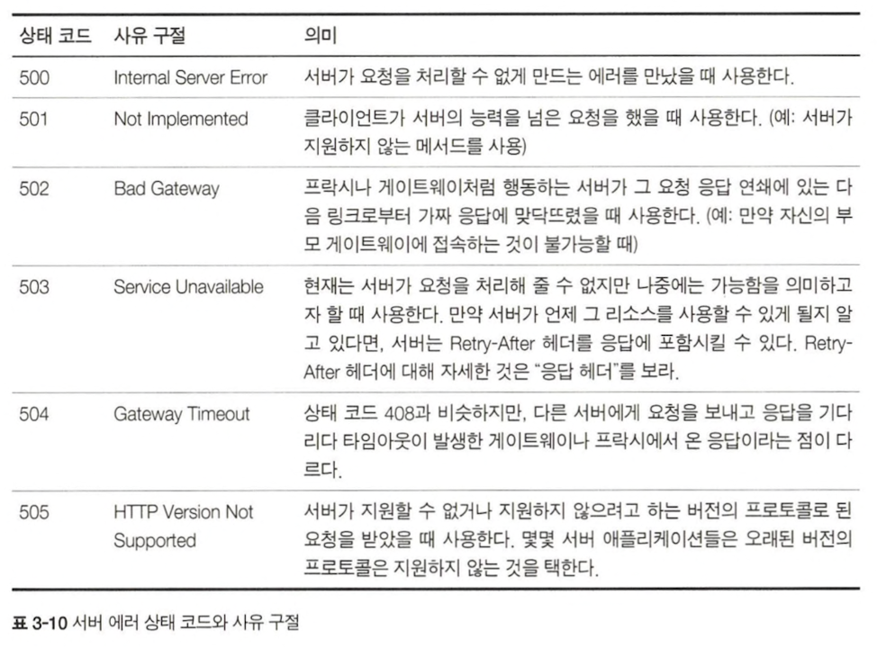

## 3.5 헤더

- 일반 헤더 : 클라이언트와 서버 양쪽 모두가 사용한다.
- 요청 헤더 : 요청 메시지를 위한 헤더
- 응답 헤더 : 클라이언트에게 정보를 제공하기 위한 헤더
- 엔터티 헤더 : 엔터티 본문에 대한 헤더
- 확장 헤더 : HTTP 명세에 추가되지 않은 비표준 헤더

### 3.5.1 일반 헤더

- 메시지가 어떤 종류이든 상관없이 유용한 정보를 제공한다.
  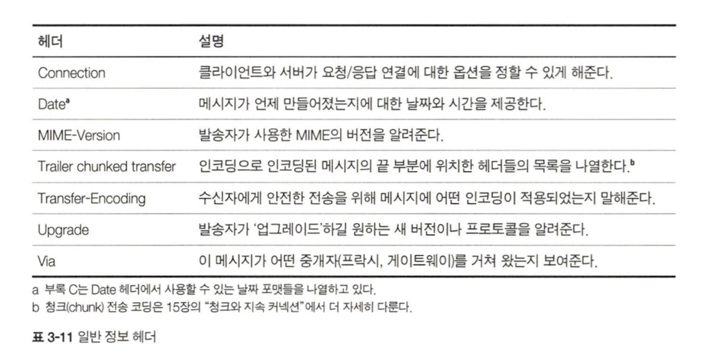
- 일반 캐시 헤더
  - 매번 원 서버로부터 객체를 가져오는 대신 로컬 복사본으로 캐시할 수 있도록 해주는 최초의 헤더
    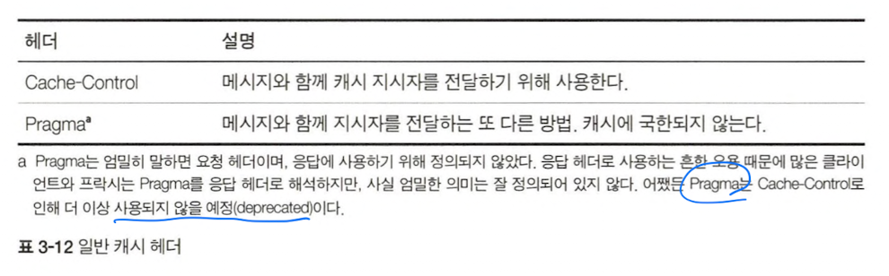

### 3.5.2 요청 헤더

- 요청 메시지에서만 의미를 갖는 헤더
- 누가 혹은 무엇이 요청을 보냈는지에 대한 정보
- 클라이언트의 선호나 능력에 대한 정보
  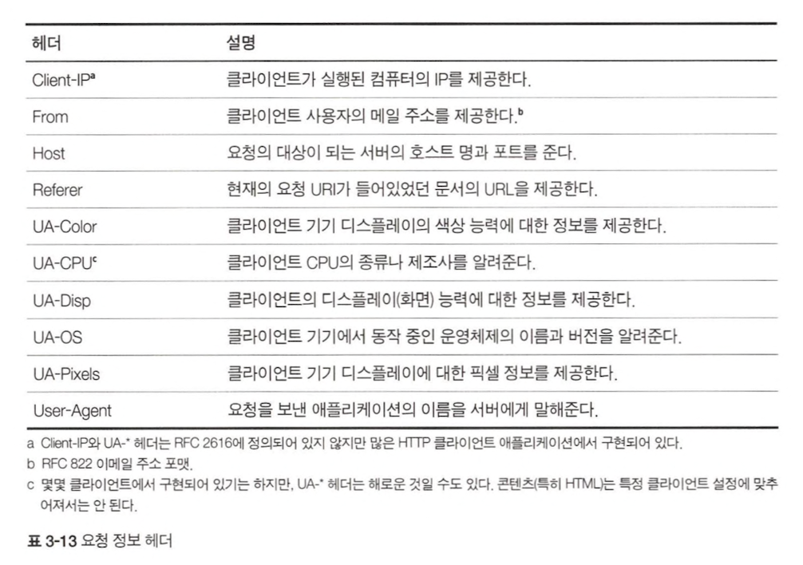
- Accept 관련 헤더
  - 서버에게 자신의 선호와 능력을 알려준다.
    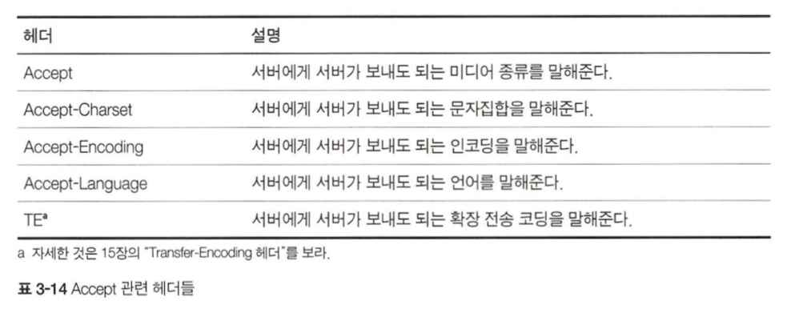
- 조건부 요청 헤더
  - 요청에 몇몇 제약을 넣는다.
    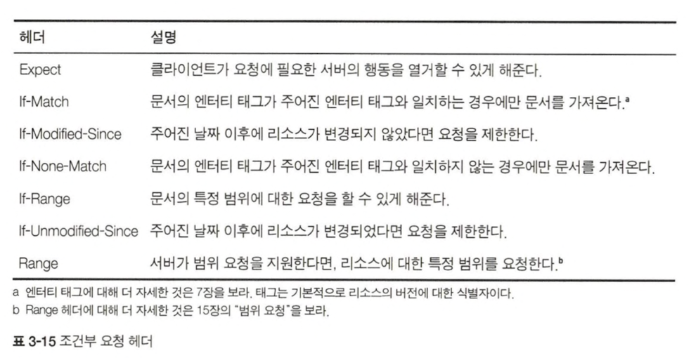
- 요청 보안 헤더
  - HTTP가 자체적으로 갖고 있는 요청을 위한 인증요구/응답 체계
    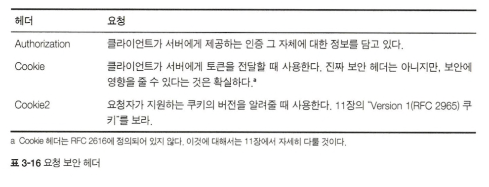
- 프락시 요청 헤더
  - 프락시의 기능을 돕기 위한 헤더
    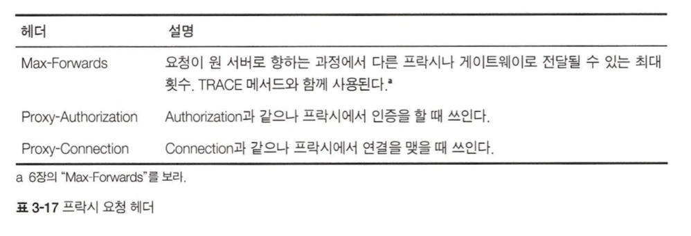

### 3.5.3 응답 헤더

- 응답 메시지에서만 의미를 갖는 헤더
- 누가 응답을 보내고 있는지, 응답자의 능력은 어떻게 되는지, 응답에 대한 특별한 설명 제공

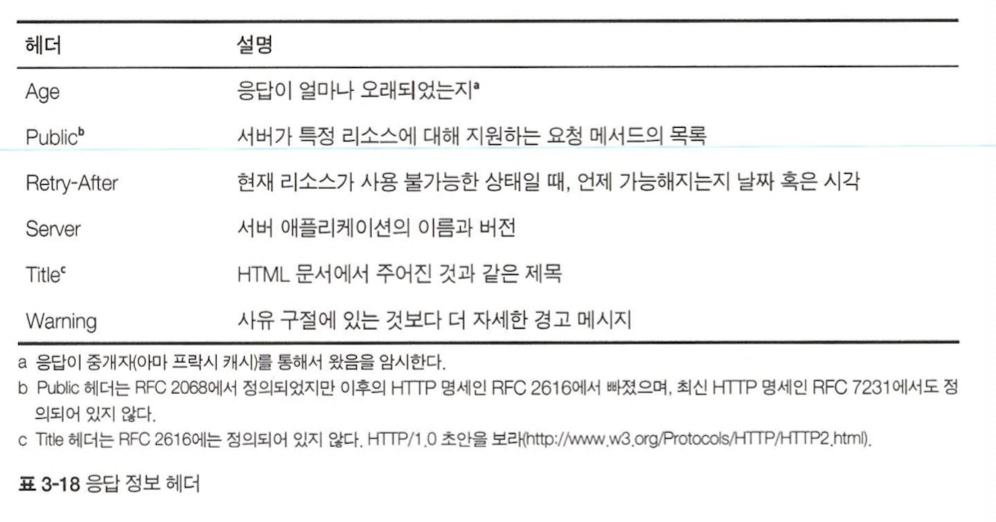

- 협상 헤더
  - 문서가 여러가지 표현이 가능한 상황이라면 어떤 표현을 택할 것인가에 대한 협상을 할 수 있도록 지원한다.
    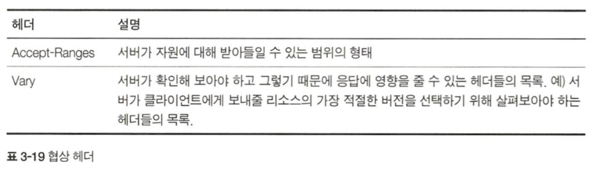
- 응답 보안 헤더
  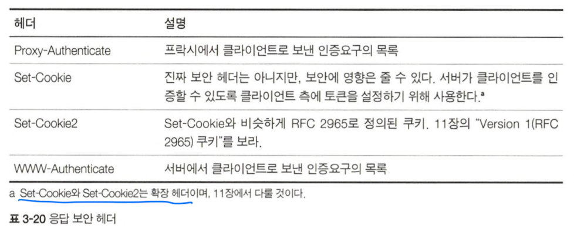

### 3.5.4 엔터티 헤더

- 요청과 응답 양쪽 모두에 나타날 수 있다.
- 엔터티의 타입, 리소스에 대해 유효한 메서드, 광범위한 정보 제공
- 수신자에게 자신이 다루고 있는 것이 무엇인지 말해준다.
  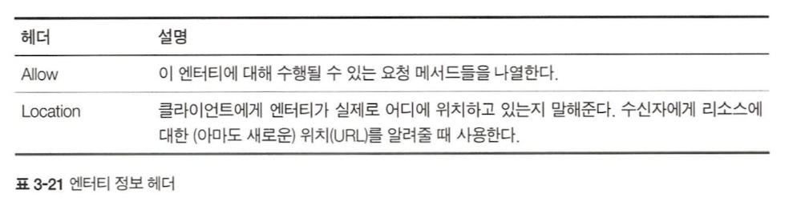
- 콘텐츠 헤더
  - 콘텐츠의 종류, 크기, 기타 콘텐츠를 처리할 때 유용하게 활용될 수 있는 것들
    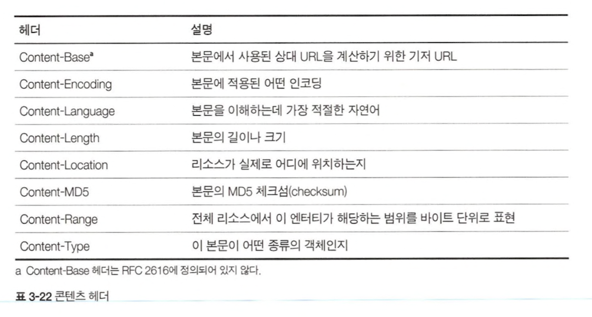
- 엔터티 캐싱 헤더
  - 엔터티 캐싱에 대한 정보를 제공
    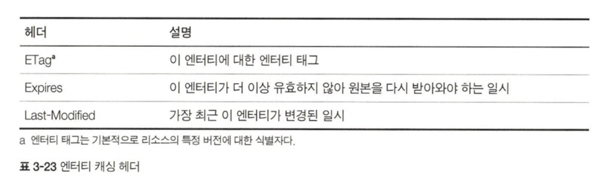
