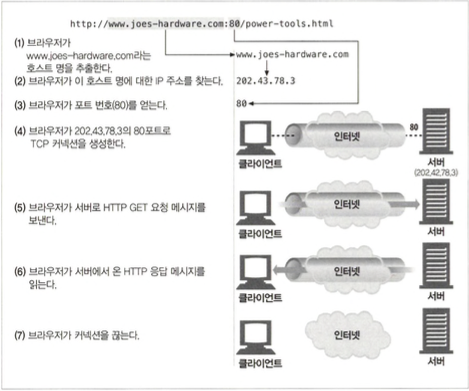
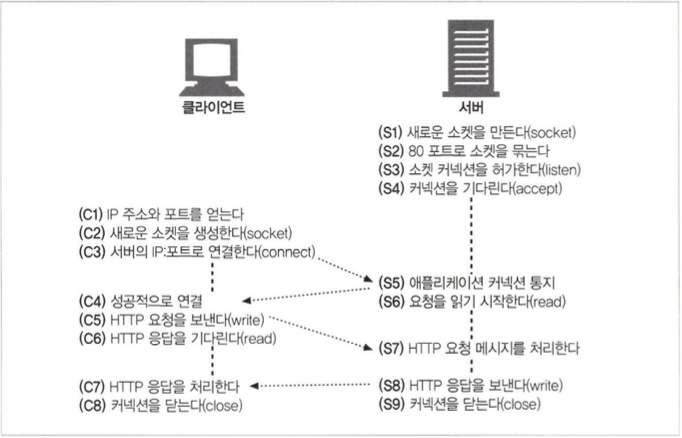
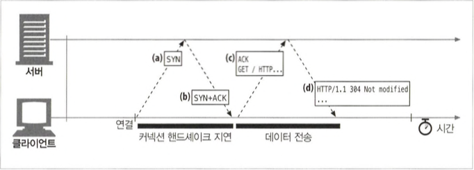

# 커넥션 관리

## 4.1 TCP 커넥션

- 모든 HTTP 통신은 TCP/IP를 통해 이루어집니다.
- 브라우저가 커넥션을 맺고 끊는 과정입니다.
  

### 4.1.1 신뢰할 수 있는 데이터 전송 통로인 TCP

- TCP 커넥션의 한쪽에 있는 바이트들은 반대쪽으로 순서 에 맞게 정확히 전달됩니다.

### 4.1.2 TCP 스트림은 세그먼트로 나뉘어 IP 패킷을 통해 전송된다

- TCP는 IP 패킷으로 통신합니다.
- HTTP는 ‘IP, TCP, HTTP’로 구성된 ‘프로토콜 스택’에서 최상위 계층입니다.
- HTTPS는 TLS 혹은 SSL이라 불리기도 하며 HTTP와 TCP 사이에 있는 암호화 계층입니다.
- HTTP가 메시지를 전송하고자 할 경우, 현재 연결되어 있는 TCP 커넥션을 통해서 메시지 데이터의 내용을 순서대로 보냅니다. TCP는 세그먼트라는 단위로 데이터 스트림을 잘게 나누고, 세그먼트를 IP 패킷이라고 불리는 봉투에 담아서 인터넷을 통해 데이터를 전달합니다.
- IP 패킷의 구성
  - IP 패킷 헤더(보통 20바이트)
  - TCP 세그먼트 헤더(보통 20바이트)
  - TCP데이터조각(0혹은그이상의바이트)

### 4.1.3 TCP 커넥션 유지하기

- TCP 커넥션은 4가지 값을 가지며 각 구성요소의 일부분은 같을 수 있으나 값이 모두 같을 수 없습니다.
  - 발신지 ip 주소
  - 발신지 포트
  - 수신지 ip 주소
  - 수신지 포트

### 4.1.4 TCP 소켓 프로그래밍

## 4.2 TCP의 성능에 대한 고려

### 4.2.1 HTTP 트랜잭션지연

- 지연 원인

  - 클라이언트는 URI에서 웹 서버의 IP 주소와 포트 번호를 알아내야하는데 최근에 방문한 적이 없다면 DNS 이름 분석(DNS resolution) 인프라를 사용하여 URI에 있는 호스트 명을 IP 주소로 변환하는데 수 십 초의 시간이 걸릴 수 있습니다.
  - 커넥션 설정 시간 핸드쉐이크 시간이라고도 불리며 클라이언트가 커넥션을 요청하고 회신을 기다리는 시간을 말합니다. 보통 1~2초지만 수백 개의 HTTP 트랜잭션이 만들어지면 소요시간은 크게 증가할 것입니다.
  - 커넥션이 맺어지면 TCP 파이프를 통해 전송하고 처리하는데 어플리케이션 복잡도에 따라 시간이 많이 소요됩니다.
  - HTTP 응답을 보내는 것 역시 시간이 소요됩니다.

### 4.2.2 성능 관련 중요 요소

- TCP커넥션의핸드셰이크설정
- 인터넷의 혼잡을 제어하기 위한 TCP의 느린 시작(slow-start)
- 데이터를 한데 모아 한 번에 전송하기 위한 네이글(nagle) 알고리즘
- TCP의 편승(piggyback) 확인응답(acknowledgment)을 위한 확인응답 지연 알고
  리즘
- TIME_WAIT지연과포트고갈

### 4.2.3 TCP 커넥션 핸드셰이크 지연

- 어떤 TCP 커넥션을 열든 커넥션을 맺기위해 IP 패킷을 교환합니다. 따라서 작은 크기의 데이터 전송에 커넥션이 사용된다면 HTTP 성능을 크게 저하시킬 수 있습니다.

- 커넥션 연결과정
  

SYN(synchronize), ACK(acknowledgement)

### 4.2.4 확인응답 지연

- 각 TCP 세그먼트에는 순번과 데이터 무결성 체크섬이 있습니다.
- TCP의 내부 알고리즘은 잘못 설계된 응용 프로그램으로부터 인터넷을 보호하도록 설계되었으므로 TCP 매개변수 수정은 주의해서 수행해야 합니다.
- 확인 응답 과정
  1. 수신자는 세그먼트를 성공적으로 수신하면 송신자에게 승인(ACK)을 보냅니다.
  2. 발신자가 일정 시간 내에 승인을 받지 못하면 패킷 손실 또는 오류로 간주하고 데이터를 재전송합니다.
  3. TCP는 동일한 방향으로 전송된 데이터 패킷에 대한 승인을 편승(piggyback)하여 네트워크 활용을 최적화합니다.
  4. TCP 스택은 승인 지연 알고리즘을 구현하여 편승 가능성을 높입니다.
  5. 확인 지연은 특정 시간(예: 0.1 ~ 0.2초) 동안 확인을 버퍼링하여 편승할 발신 데이터 패킷을 찾습니다.
  6. 일정 시간 내에 나가는 데이터 패킷이 발견되지 않으면 별도의 패킷으로 승인을 보냅니다.

### 4.2.5 TCP 느린 시작(slow start)

- TCP 커넥션은 시간이 지나면서 자체적으로 ‘튜닝’되어서, 처음에는 커넥션의 최대 속도를 제한하고 데이터가 성공적으로 전송됨에 따라서 속도 제한 을 높여나갑니다.

### 4.2.6 네이글(Nagle) 알고리즘과 TCP_NODELAY

- 네이글 알고리즘
  1. 전송 중인 세그먼트가 최대 크기(LAN에서 약 1,500바이트, 인터넷에서 수백 바이트)에 도달하면 즉시 전송됩니다.
  2. 다른 모든 패킷이 승인을 받은 경우 최대 크기보다 작은 패킷을 전송할 수 있습니다.
  3. 다른 패킷이 아직 전송 중이고 작은 크기의 데이터가 전송 대기 중인 경우 버퍼에 저장됩니다.
  4. 버퍼에 저장된 데이터는 확인 응답를 기다리는 패킷이 응답을 받거나 함께 전송할 수 있을 만큼의 패킷이 누적되면 전송됩니다.
- HTTP 스택에 TCP_NODELAY 파라미터 값을 설정하여 네이글 알고리즘을 비활성화도 가능합니다.

### 4.2.7 TIME_WAIT의 누적과 포트 고갈

- 2MSL은 패킷이 중복되고 TCP 데이터는 충돌을 막기위해 특정 커넥션이 생성되고 닫힌 다음, 그와 같 은 IP 주소와 포트 번호를 가지는 커넥션이 2분 이내에 또 생성되는 것을 막아줍니다.
- 일반적으로 발생하지는 않지만 스트레스테스트시 문제가 생김

## 4.3 HTTP 커넥션 관리

### 4.3.1 흔히 잘못 이해하는 Connection 헤더

- Connection 헤더에는 다음 세 가지 종류의 토큰이 전달될 수 있습니다.
  - HTTP 헤더 필드 명은, 이 커넥션에만 해당되는 헤더들을 나열합니다.
  - 임시적인 토큰 값은, 커넥션에 대한 비표준 옵션을 의미합니다.
  - close 값은, 커넥션이 작업 이 완료되면 종료되어야 함을 의미합니다.
- 홉별(hop-by-hop) 헤더
  - Connection 헤더에는 홉별헤더 명을 기술하는데, 이것은 헤더 보호하기라고 불리며 수신자는 Connection 헤더와 함께 메시지를 전달받으면, 송신자에게서 온 요청에 기술되어 있는 모든 옵션을 적용하고 다음 홉에 있는 메시지를 전달히기 전에 Connection 헤더와 Connection 헤더에 기술되 어 있던 모든 헤더를 삭제합니다.

\* 홉이란 요청 또는 응답이 클라이언트와 서버 사이를 통과하는 각 중간 네트워크 노드 또는 서버입니다.

### 4.3.2 순차적인 트랜잭션 처리에 의한 지연

- 동기적으로 커넥션을 맺으면 매우 비효울적입니다. 예를들어 3개의 이미를 불러오는 페이지를 랜더링할떄 html, image1, image2, image3 4번의 커넥션이 맺어지고 동기적으로 처리하게되면 굉장히 느리게 화면을 보게됩니다.
- 병렬(parallel) 커넥션
  여러 개의 TCP 커넥션을 통한 동시 HTTP 요청
- 지속(persistent) 커넥션
  커넥션을 맺고 끊는 데서 발생하는 지 연을 제거하기 위한 TCP 커넥션의 재활용
- 파이프라인(pipelined) 커넥션
  공유 TCP 커넥션을 통한 병렬 HTTP 요청
- 다중(m니tiplexed) 커넥션
  요청과 응답들에 대한 중재(실험적인 기술이다)
