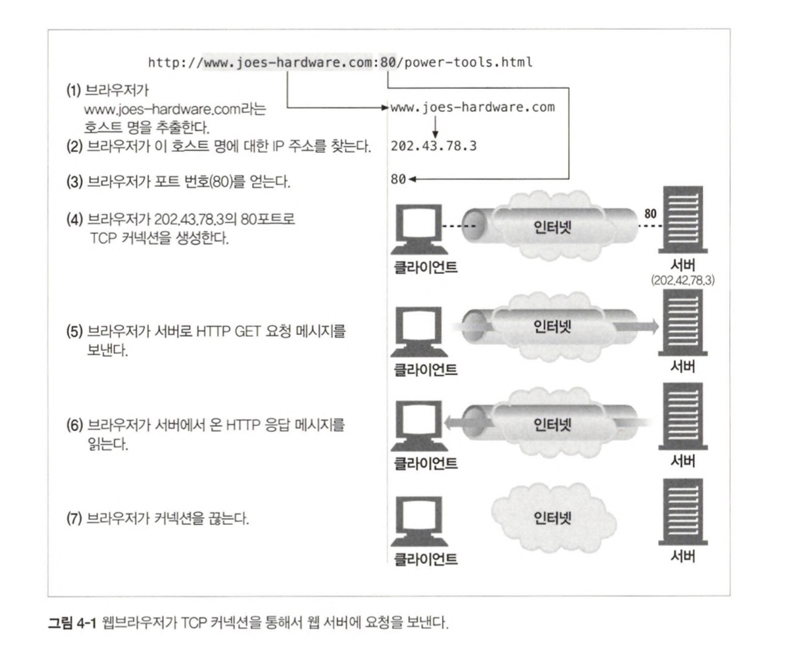
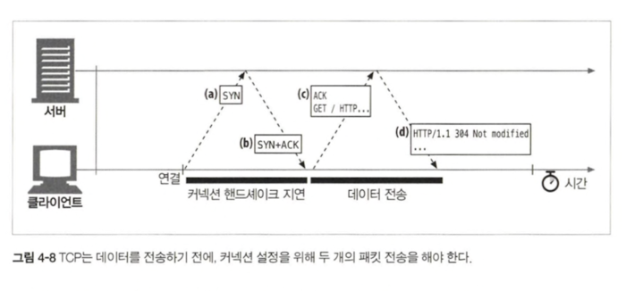
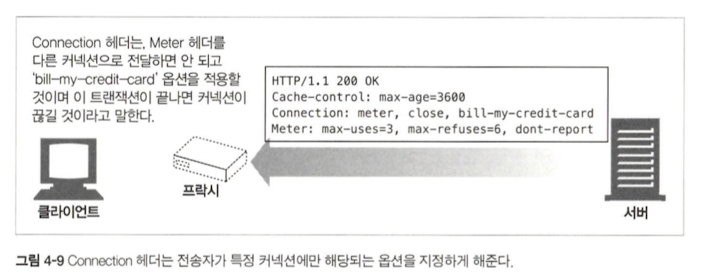

# 4장. 커넥션 관리

## 4.1 TCP 커넥션

- HTTP 통신은 지구상의 컴퓨터와 네트워크 장비에서 널리 쓰이고 있는 TCP/IP를 통해 이루어진다.
- 커넥션이 맺어지면 클라이언트와 서버 컴퓨터 간의 메시지들은 안전하게 전달된다.

### 4.1.1 신뢰할 수 있는 데이터 전송 통로인 TCP

- TCP는 HTTP에게 신뢰할 만한 통신 방식을 제공한다.

### 4.1.2 TCP 스트림은 세그먼트로 나뉘어 IP 패킷을 전송한다.

- TCP는 IP패킷이라고 불리는 작은 조각을 통해 데이터를 전송한다.
- HTTP 메시지 전송 과정
  1. TCP 세그먼트라는 단위로 데이터 스트림을 잘게 나눈다.
  2. 세그먼트를 IP 패킷이라고 불리는 봉투에 담아서 인터넷을 통해 데이터를 전달한다.
- IP 패킷의 구성요소
  - IP 패킷 헤더
  - TCP 세그먼트 헤더
  - TCP 데이터 조각
- IP 패킷 헤더는 발신자의 목적지 IP주소, 크기, 기타 플래그를 가진다.
- TCP 세그먼트 헤더는 TCP 포트 번호, TCP 제어 플래그, 데이터의 순서와 무결성을 검사하는 숫자 값을 포함한다.

### 4.1.3 TCP 커넥션 유지하기

- IP 주소는 해당 컴퓨터에 연결되고 포트 번호는 해당 애플리케이션으로 연결된다.
- TCP 커넥션은 네 가지 값으로 식별한다
  - 발신지 IP 주소, 발신지 포트, 수신지 IP 주소, 수신지 포트
- 서로 다른 두 개의 TCP 커넥션은 네 가지 주소 구성요소의 값이 모두 같을 수 없다.

### 4.1.4 TCP 소켓 프로그래밍

- 운영체제는 TCP 커넥션의 생성과 관련된 여러 기능을 제공한다.
- 소켓 API를 사용하면, TCP 종단 데이터 구조를 생성하고, 원격 서버의 TCP 종단에 그 종단 데이터 구조를 연결하여 데이터 스트림을 읽고 쓸 수 있다.
- TCP API는, 기본적인 네트워크 프로토콜의 핸드셰이킹, 그리고 TCP 데이터 스트림과 IP 패킷 간의 분할 및 재조립에 대한 모든 세부사항을 외부로부터 숨긴다.

## 4.2 TCP 성능에 대한 고려

- HTTP 트랜잭션의 성능은 그 아래 계층인 TCP 성능에 영향을 받는다.

### 4.2.1 HTTP 트랜잭션 지연

- 대부분의 HTTP 지연은 TCP 네트워크 지연 때문에 발생한다.
  1. 클라이언트는 URI에서 웹 서버의 IP 주소와 포트 번호를 알아내야 한다.
  2. 클라이언트는 TCP 커넥션 요청을 서버에게 보내고 서버가 커넥션 허가 응답을 회신하기를 기다린다.
  3. 커넥션이 맺어지면 클라이언트는 HTTP 요청을 새로 생성된 TCP 파이프를 통해 전송한다.
  4. 웹 서버가 HTTP 응답을 보내는 것 역시 시간이 소요된다.
- TCP 네트워크 지연은 하드웨어 성능, 네트워크와 서버의 전송 속도, 요청과 응답 메시지의 크기, 클라리언트와 서버 간의 거리, TCP 프로토콜의 기술적인 복잡성 등에 영향을 받는다.

### 4.2.2 성능 관련 중요 요소

고성능의 HTTP 소프트웨어를 개발하고 있다면, 성능 관련 중요 요소를 모두 이해해야 한다.

### 4.2.3 TCP 커넥션 핸드셰이크 지연

- 어떤 데이터를 전송하든 TCP 소프트웨어는 커넥션을 맺기 위한 조건을 맞추기 위해 연속으로 IP 패킷을 교환한다. 작은 크기의 데이터 전송에 커넥션이 사용된다면 이런 패킷 교환은 HTTP 성능을 저하시킨다.
  1. 클라이언트는 새로운 TCP 커넥션을 생성하기 위해 작은 TCP 패킷을 서버에게 보낸다.
  2. 서버가 그 커넥션을 받으면 몇 가지 커넥션 매개변수를 산출하고, 커넥션 요청이 받아들여졌음을 의미하는 'SYN', 'ACK' 플래그를 포함한 TCP 패킷을 클아이언트에게 보낸다.
  3. 클라이언트는 커넥션이 잘 맺어졌음을 알리기 위해서 서버에게 다시 확인응답 신호를 보낸다.
- 크기가 작은 HTTP 트랜잭션은 50% 이상의 시간을 TCP를 구성하는데 쓴다.

### 4.2.4 확인응답 지연

- TCP는 성공적인 데이터 전송을 보장하기 위해서 자체적인 확인 체계를 가진다.
  1. 각 세그먼트의 수신자는 세그먼트를 온전히 받으면 작은 확인응답 패킷을 송신자에게 반환한다.
  2. 송신자가 특정 시간 안에 확인응답 메시지를 받지 못하면 데이터를 다시 전송한다.
- TCP는 같은 방향으로 송출되는 데이터 패킷에 확인응답을 '편승'시킨다.
- 확인응답이 같은 방향으로 가는 데이터 패킷에 편승되는 경우를 늘리기 위해서, 많은 TCP 스택은 '확인응답지연' 알고리즘을 구현한다.
  - 송출한 확인응답을 짧은 시간(0.1~0.2초) 버퍼에 저장해두고, 확인응답을 편승시키기 위한 송출 데이터 패킷을 찾는다.
  - 일정 시간 안에 송출 데이터 패킷을 찾지 못하면 별도 패킷을 만들어 전송한다
- 막상 편승알 패킷을 찾으려고 하면 해당 방향으로 송춢될 패킷이 많지 않기 때문에, 확인응답 지연 알고리즘으로 인한 지연이 자주 발생한다.

### 4.2.5 TCP 느린 시작

- 처음에는 커넥션의 최대 속도를 제한하고 데이터가 성공적으로 전송됨에 따라서 속도제한을 높여나간다. (튜닝)이러한 과정을 '혼잡 윈도를 연다'라고 한다.
- 튜닝된 커넥션이 더 빠르기 때문에, HTTP에는 이미 존재하는 커넥션을 재사용하는 기능이 있다.

### 4.2.6 네이글 알고리즘과 TCP_NODELAY

- 작은 크기의 데이터를 포함한 많은 수의 패킷을 전송한다면 네트워크 성능은 크게 떨어진다.
- 네트워크 효율을 위해서 패킷을 전송하기 전에 많은 양의 TCP 데이터를 한 개의 덩어리로 합친다.
- 네이글 알고리즘
  - 세그먼트가 최대 크기가 되지 않으면 전송을 하지 않는다.
  - 다른 모든 패킷이 확인응답을 받았을 경우에는 최대 크기보다 작은 패킷의 전송을 허락한다.
  - 다른 패킷들이 아직 전송중이면 데이터는 버퍼에 저장된다.
  - 전송되고 나서 확인응답을 기다리던 패킷이 확인응답을 받았거나, 전송하기 충분할 만큼의 패킷이 쌓이면 데이터가 전송된다.
- 문제점
  - 크기가 작은 HTTP 메시지는 패킷을 채우지 못하기 때문에, 앞으로 생길지 생기지 않을지 모르는 데이터를 기다리며 지연된다.
  - 확인응답이 도착할 때까지 데이터를 전송을 멈추고 있는다. 확인응답 지연 알고리즘은 확인응답을 100~200밀리초 지연시킨다.

### 4.2.7 TIME_WAIT의 누적과 포트 고갈

- TIME_WAIT 포트 고갈은 성능 측정 시에 심각한 성능 저하를 발생시키지만, 보통 실제 상황에서는 문제를 발생시키지 않는다.
- TCP 커넥션의 종단에서 TCP 커넥션을 끊으면, 종단에서는 커넥션의 IP 주소와 포트 번호를 메모리의 작은 제어영역에 기록해 놓는다. 같은 주소와 포트 번호를 사용하는 새로운 TCP 커넥션이 일정 시간 동안에는 생성되지 않게 하기 위한 것이다. 이는 이전 커넥션과 관련된 패킷이 그 커넥션과 같은 주소와 포트 번호를 가지는 새로운 커넥션에 삽입되는 문제를 방지한다.

### 4.3 HTTP 커넥션 관리

### 4.3.1 흔히 잘못 이해하는 Connection 헤더

- HTTP Connection 헤더 필드는 커넥션 토큰을 쉼표로 구분하여 가지고 있으며, 그 값들은 다른 커넥션에 전달되지 않는다.
- Connection 헤더 값의 종류
  - HTTP 헤더 필드명 : 이 커넥션에만 해당되는 헤더 나열
  - 임시적인 토큰 값 : 커넥션에 대한 비표준 옵션
  - close : 커넥션이 작업이 완료되면 종료되어야 함

### 4.3.2 순차적인 트랜잭션 처리에 의한 지연

- 커넥션 관리가 제대로 이루어지지 않으면 TCP 성능이 매우 안 좋아질 수 있다.
- HTTP 커넥션의 성능을 향상 시킬 수 있는 기술들
  - 병렬 커넥션 : 여러 개의 TCP 커넥션을 통한 동시 HTTP 요청
  - 지속 커넥션 : 커넥션을 맺고 끊는 데서 발생하는 지연을 제거하기 위한 TCP 커넥션의 재활용
  - 파이프라인 커넥션 : 공유 TCP 커넥션을 통한 병렬 HTTP 요청
  - 다중 커넥션 : 요청과 응답들에 대한 중재
