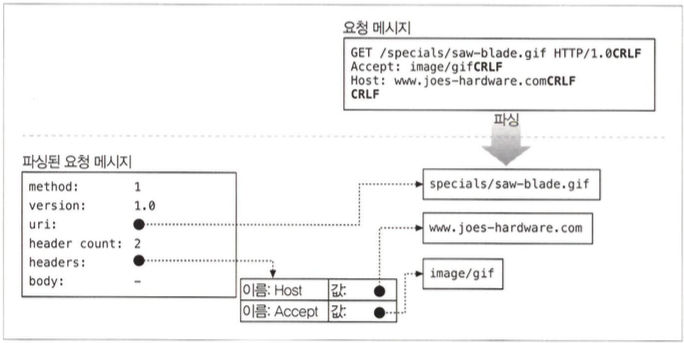
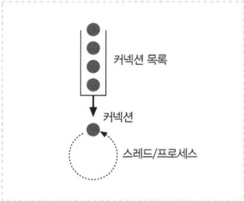
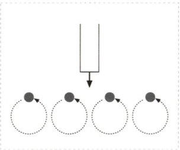
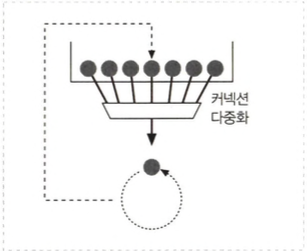
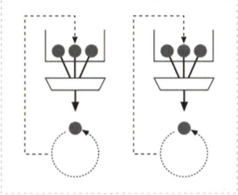

# 웹 서버

## 5.1 다채로운 웹 서버

- 모든 웹 서버는 리소스에 대한 HTTP 요청을 받아서 콘텐츠를 클라이언트에게 돌려줍니다.

### 5.1.1 웹 서버구현

### 5.1.2 다목적 소프트웨어 웹 서버

- 웹 서버 소프트웨어는 거의 모든 컴퓨터와 운영체제에서 동작합니다.

### 5.1.3 임베디드 웹 서버

- 일반 소비자용 제품에 내장될 목적으로 만들어진 작은 웹 서버입니다.

## 5.2 간단한 펄 웹 서버

## 5.3 진짜 웹 서버가 하는 일

1. 커넥션을 맺음
2. HTTP 요청을 받음
3. HTTP 요청을 처리
4. 리소스에 접근
5. HTTP 응답을 생성
6. HTTP 응답을 반환
7. 트랜잭션을 로그 기록

## 5.4 단계 1: 클라이언트 커넥션 수락

- 새로운 커넥션을 열거나 지속커넥션이 있다면 사욜할 수 있습니다.

### 5.4.1 새 커넥션 다루기

- 커넥션을 맺고 TCP 커넥션에서 IP 주소를 추출하여 커넥션 맞은편에 어떤 클라이언트가 있는지 확인할 수 있습니다.
- 어떤 커넥션이든 마음대로 거절하거나 즉시 닫을 수 있습니다.

### 5.4.2 클라이언트 호스트 명 식별

- 역방향 DNS(reverse DNS) 클라이언트의 IP 주 소를 클라이언트의 호스트 명으로 변환하도록 설정있고 접근제어와 로깅할 수도 있지만 웹 트랜잭션을 느리게할 수 있습니다.

### 5.4.3 ident를 통해 클라이언트 사용자 알아내기

- ident 프로토콜은 서버에게 어떤 사용자 이름이 HTTP 커넥션을 초기화했는지 찾아낼 수 있게 해줍니다.
- 만약 클라이 언트가 ident 프로토콜을 지원한다면, 클라이언트는 ident 결과를 위해 TCP 포트 113번을 listen합니다.
- idem는 조직 내부에서는 잘 사용할 수 있지만, 공공 인터넷에서는 다음을 포함한 여러 이유로 잘 동작하지 않습니다.
  - 많은 클라이언트 PC는 identd 신원확인 프로토콜 데몬 소프트웨어를 실행하지 않음
  - ident 프로토콜은 HTTP 트랜잭션을 지연
  - 방화벽이 ident 트래픽이 들어오는 것을 막음
  - ident 프로토콜은 안전하지 않고 조작하기 쉬움
  - 가상 IP 주소를 지원 미흡
  - 프라이버시 침해

## 5.5 단계 2:요청 메시지 수신

- 네트워크 커넥션에서 그 데이터를 읽어 들 이고 파싱하여 요청 메시지를 구성합니다.

### 5.5.1 메시지의 내부 표현

- 웹 서버는 요청 메시지를 쉽게 다룰 수 있도록 내부의 자료 구조에 저장합니다.

### 5.5.2 커넥션 입력/출력 처리 아키텍처

- 단일 스레드 웹 서버
  - 아키텍처는 구현하기 간단하지만 처리 도중에 모든 다른 커넥션은 무시
    
- 멀티프로세스와 멀티스레드 웹 서버
  - 많은 프로세스나 스레드는 너무 많은 메모리나 시스 템 리소스를 소비
    
- 다중 I/O 서버
  - 모든 커넥션은 동시에 그 활동을 감시당하고 커넥션의 상태가 바 뀌면 커넥션에 대해 작은 양의 처리가 수행을 합니다.
  - 스레드와 프로세스는 유휴 상태의 커넥션에 매여 기다리느라 리소스를 낭비하지 않습니다.
    
- 다중 멀티스레드 웹 서버
  - 여러 개의 스레드는 각각 열려있는 커넥션을 감시하고 각 커넥션에 대해 조금씩 작업을 수행
    

## 5.6 단계 3:요청 처리

## 5.7 단계 4: 리소스의 매핑과 접근

- HTML 페이지나 JPEG 이미지 같은 미리 만들어 진 콘텐츠를 제공합니다.

### 5.7.1 Docroot

- 일반적으로 웹 서버 파일 시스템의 특별한 폴더를 웹 콘텐츠를 위해 예약 해두고 이것을 문서 루트 혹은 docroot로 부릅니다.
- 서버는 상대적인 url이 docroot를 벗어나서 파일 시스템의 docroot 이외 부분이 노 출되는 일이 생기지 않도록 주의해야 합니다.
- 가상 호스팅된 docroot
  - 나의 웹 서버 위에서 두 개의 사이트가 완전히 분리된 콘텐츠를 갖 고호스팅 되도록할수 있습니다.
- 사용자 홈 디렉터리 docroots
  - 사용자들이 한 대의 웹 서버에서 각자의 개인웹 사이트를 만들 수 있도록 해주는 것입니다.

### 5.7.2 디렉터리 목록

- 사용자가 디렉터리 URI를 요청했을 때 기본 색인 파일이 없고 디렉터리 색인 기능이 켜져 있다면, 자동으로 그 디렉터리의 파일들을 크기, 변경 일 및 그 파일에 대한 링크와 함께 열거한 HTML 파일을 반환됩니다. 제공되면 안되는 콘텐츠까지 보여질수 있으므로 사용하지 않는것이 좋습니다.

### 5.7.3 동적 콘텐츠 리소스 매핑

### 5.7.4 서버사이드 인클루드(Server-Side Includes, SSI)

- 동적컨텐츠를 만드는 방법으로 변수 이름이나 내장된 스크립트가 될 수 있는 어떤 특별한 패턴있는지 검사하고 특별한 패턴은 변수 값이나 실행 가능한 스크립트의 출력 값으로 치환합니다.

### 5.7.5 접근 제어

- IP 주소에 근거하여 접근을 제어할 수 있고 혹은 리소스에 접근하기 위한 비밀번호를 물어볼 수도 있습니다.

## 5.8 단계 5:응답 만들기

- 청 메서드로 서술되는 동작을 수행한 뒤 응답 메시지를 반환합니다.

### 5.8.1 응답 엔티티

- Content-Type 헤더
- Content-Length 헤더
- 실제 응답 본문의 내용

### 5.8.2 MIME 타입 결정하기

- mime.types : 파일 이름의 확장자를 사용할 수 있습니다.
- 매직 타이핑(Magic typing) : 파일의 내용을 검사해서 알려진 패턴에 대한 테이블(매직 파일)에 해당하는 패턴이 있는지 찾아 볼 수 있습니다.
- 유형 명시(Explicit typing) : 웹 서버를 설정할 수 있습니다.
- 유형 협상(Type negotiation) : 사용자와의 협상 과정을 통해 사용하기 가장 좋은 형식을 판별할 것인지의 여부도 설정할 수 있습니다.

### 5.8.3 리다이렉션

- 301 Moved Pennanently : 영구히 리소스가 옮겨진 경우
- 303 See Other, 307 Temporary Redirect : 임시로 리소스가 옮겨진 경우 / URL 증강 / 부하 균형 / 친밀한 다른 서버가 있을 때
- 디렉터리 이름 정규화 : '/'을 빠뜨렸다면 대부분의 웹 서버는 상대경로가 정상적으로 동작할 수 있도록 클라이언트를 슬래 시를 추가한 U히로 리다이렉트합니다.

## 5.9 단계 6:응답 보내기

## 5.10 단계 7:로깅
