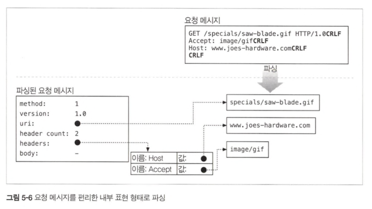
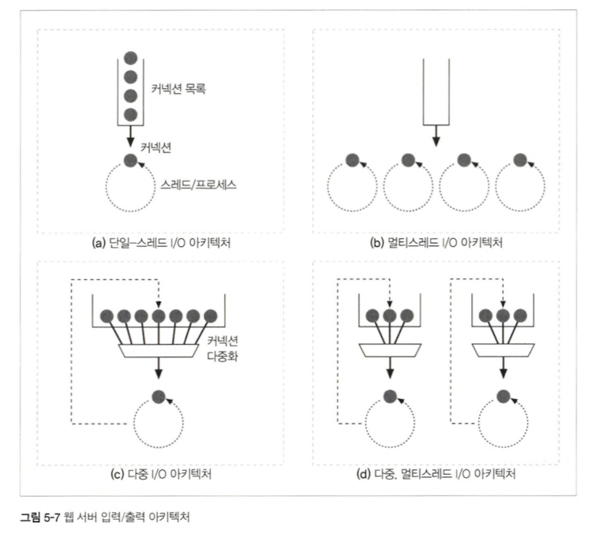

# 5 웹 서버

## 5.1 다채로운 웹 서버

### 5.1.1 웹 서버 구현

- HTTP 프로토콜을 구현
- 웹 리소스를 관리
- 웹 서버 관리
- TCP 커넥션 관리에 대한 책임을 운영체제와 나눠 갖음

### 5.1.2 다목적 소프트웨어 웹 서버

- 거의 모든 컴퓨터와 운영체제에서 동작

### 5.1.3 임베디드 웹 서버

- 일반 소비자용 제품에 내장될 목적으로 만들어진 작은 웹 서버(프린터나 가전제품)

## 5.2 간단한 펄 웹 서버

- 펄 웹 서버 프로그램은 클라이언트와 프락시 간의 상호작용 테스트에 유용한 진단 툴
- HTTP 디버깅을 위해 사용
- 펄 서버 프로그램은 클라이언트에게 돌려줄 서버 응답에 들어갈 내용을 직접 타이핑해 넣을 수 있게 해준다.

## 5.3 진짜 웹서버가 하는 일

1. 커넥션을 맺는다 一 클라이언트의 접속을 받아들이거나, 원치 않는 클라이언트라면 닫는다.
2. 요청을 받는다 一 HTTP 요청 메시지를 네트워크로부터 읽어들인다.
3. 요청을 처리한다 — 요청 메시지를 해석하고 행동을 취한다.
4. 리소스에 접근한다 -- 메시지에서 지정한 리소스에 접근한다
5. 응답을 만든다 一 올바른 헤더를 포함한 HTTP 응답 메시지를 생성한다.
6. 응답을 보낸다 一 응답을 클라이언트에게 돌려준다.
7. 트랜잭션을 로그로 남긴다 一 로그파일에 트랜잭션 완료에 대한 기록을 남긴다.

## 5.4 단계1 : 클라이언트 커넥션 수락

### 5.4.1 새 커넥션 다루기

- 클라이언트가 웹 서버에 TCP 커넥션을 요청하면, 웹 서버는 그 커넥션을 맺고 TCP커넥션에서 IP주소를 추출하여 커넥션 맞은편에 어떤 클라이언트가 있는지 확인
- 웹 서버는 어떤 커넥션이든 판단하여 거절하거나 닫을 수 있다

### 5.4.2 클라이언트 호스트 식별

- 웹 서버는 역방향 DNS를 사용해 클라이언트의 IP주소를 호스트 명으로 변환하도록 설정되어 있다
- 대용량 웹 서버는 트랜잭션을 느려지게 하지 않기 위해 호스트명 분석을 꺼두거나 특정 콘텐츠에 대해서만 켜놓는다
- 만약 클라이언트가 ident 프로토콜을 지원한다면, 클라이언트는 ident 결과를 위해 TCP 포트 113번을 listen한다
- 공공 인터넷에서는 여러 이유로 잘 동작하지 않으며, 보통 ident정보가 없기 때문에 일반 로그 포맷 로그파일의 두번째 필드는 하이픈(-)으로 채워진다

## 5.5 단계2 : 요청 메시지 수신

- 커넥션에 데이터가 도착하면, 웹 서버는 네트워크 커넥션에서 그 데이터를 읽어 들이고 파싱하여 요청 메시지를 구성한다
- 요청 메시지 파싱 : 각 값은 스페이스 한 개로 분리되어 있으며, 요청줄은 캐리지 리턴 줄바꿈(CRLF)문자열로 끝난다

### 5.5.1 메시지의 내부 표현

### 5.5.2 커넥션 입력/출력 처리 아키텍쳐

## 5.6 단계 3: 요청 처리

## 5.7 단계 4: 리소스의 매핑과 접근

### 5.7.1 Docroot

- 리소스 매핑의 가장 단순한 형태
- 웹 서버는 요청 메시지에서 URL을 가져와 문서 루트(혹은 docroot) 뒤에 붙인다.
- 웹 콘텐츠가 들어간 웹 서버 파일 시스템의 특정 폴더를 문서 루트 혹은 docroot라고 한다
- 문서 루트의 설정 DocumentRoot /usr/local/httpd/files
- 서버는 상대 url이 docroot를 벗어나서 docroot 이외 부분이 노출되는 일이 생기지 않도록 해야한다

### 5.7.2 디렉터리 목록

- 사용자가 어떤 디렉터리에 대한 URL을 요청했는데, 그 디렉터리가 index.html이란 이름을 가진 파일을 가지고 있다면, 서버는 그 파일의 콘텐츠를 반환한다.
- 아파치 웹 서버에서, DirectoryIndex설정 지시자를 사용해서 기본 디렉터리 파일로 사용될 파일 이름의 집합을 설정할 수 있다.
- 만약 기본 색인파일(ex.index.html)이 없고 디렉토리 색인 기능이 켜져 있다면, 디렉터리의 정보와 링크와 함께 열거된 HTML파일을 반환한다.

### 5.7.3 동적 콘텐츠 리소스 매핑

- 아파치의 설정 지시자
- 아파치의 경우 URL의 경로명이 실행 가능한 프로그램이 위치한 디렉토리로 매핑되도록 하는 기능을 제공한다
- 어떤 리소스가 동적 리소스라면, 서버는 그에 대한 동적 콘텐츠 생성 프로그램이 어디에있고 어떻게 그 프로그램을 실행하는지 알려줄 수 있어야 한다.

### 5.7.4 서버사이드 인클루드

### 5.7.5 접근 제어

- 클라이언트 IP 주소에 근거하여 접근을 제어할 수 있고 혹은 리소스에 접근하기 위한 비밀번호를 물어볼 수도 있다.

## 5.8 단계 5: 응답 만들기

### 5.8.1 응답 엔터티

### 5.8.2 MIME 타입 결정하기

- MIME 타입과 리소스를 연결하는 여러가지 방법 - mime.types, 매직 타이핑, 유형 명시, 유형 협상

## 5.9 단계 6: 응답 보내기

## 5.10 단계7: 로깅

- 트랜잭션이 완료되었을 때, 서버는 트랜잭션이 어떻게 수행되었는지에 대한 로그를 로그파일에 기록한다.
- 대부분의 웹 서버는 로깅에 대한 여러가지설정 양식을 제공한다
