# 프락시

- 클라이언트와 서버 사이에 위치하여 그들 사 이의 HTTP 메시지를 정리하는 중개인처럼 동작합니다.

## 6.1 웹중개자

### 6.1.1 개인프락시와 공유 프락시

- 하나의 클라이언트만을 위한 프락시를 개인 프락시

- 공용 프락시

  - 여러 클라이언트가 함께 사용
  - 대부분의 프락시는 공용
  - 사용자가 많을수록 유리

- 개인 프락시

  - 하나의 클라이언트만을 위한 프락시
  - 브라우저의 기능을 확장하거나 성능을 개선
  - 무료 ISP 서비스를 위한 광고를 운영

  <span style="color:gray">ISP : 인터넷 서비스 공급자 </span>

### 6.1.2 프락시 대 게이트웨이

- 프락시는 같은 프로토콜을 사용하는 둘 이상의 애플리케이션을 연결
- 게이트웨이는 서로 다른 프로토콜을 사용하는 둘 이상을 연결

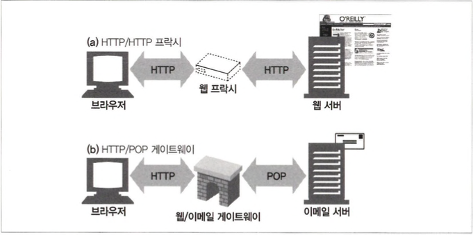

- 브라우저와 서버는 다른 버전의 HTTP를 구현하기 때문에, 프락시는 때때로 약간의 프로토콜 변환을 하기도 합니다.

## 6.2 왜 프락시를 사용하는가?

- 보안 개선
- 성능 향상
- 비용 절약

- 어린이 필터
  - 어린이들에게 교육 사이트를 제공하는 경우 성인 콘텐츠를 차단하려고 필터링 프락시를 사용할 수 있습니다.
- 문서 접근 제어자
  - 단일한 접근 제어 전략을 구현 하고 감사 추적하기 사용할 수 있습니다.
  - 각기 다른 조직에서 관리되는 다양한 종류의 수많은 웹 서버들에 대한 접근 제어 를 수시로 갱신할 필요 없이, 중앙 프락시 서버에서 접근 제어를 설정할 수 있습니다.
- 보안 방화벽
  - 들어오거나 나가는 응용 레벨 프로토콜의 흐름을 네트워크 의 한 지점에서 통제합니다.
- 웹 캐시
  - 문서의 로컬 사본을 관리하고 해당 문서에 대한 요청이 오면 빠르게 제공합니다.
- 대리 프락시
  - 진짜 웹 서버 요청을 받지만 웹 서버와는 달리 요청 받은 콘 텐츠의 위치를 찾아내기 위해 다른 서버와 커뮤니케이션합니다.
- 콘텐츠 라우터
  - 인터넷 트래픽 조건과 콘텐츠의 종류에 따라 요청을 특정 웹 서버로 유도하는 콘텐츠 라우터로 사용할 수 있습니다.
- 트랜스코더
  - 콘텐츠를 클라이언트에게 전달하기 전에 본문 포맷을 수정할 수 있습니다. 데이터의 표현 방식을 자연스럽게 변환하는 것을 트랜스코딩이라고 합니다.
  - 크기를 줄이기 위해 자신을 거쳐 가는 GIF 이미지를 JPG 이 미지로 변환하거나, 한국어 텍스트를 스페인어 텍스트로 변환할 수 있습니다.
- 익명화 프락시
  - HTTP 메시지에서 신원을 식별할 수 있는 특성들을 적극적으로 제거함으로써 개인 정보 보호와 익명성 보장에 기여합니다.

## 6.3 프락시는 어디에 있는가?

### 6.3.1 프락시 서버 배치

- 출구(Egress) 프락시
  - 로컬 네트워크의 출구에 넣어서 악의적인 해커들을 막는 방화벽을 제공하거나 인터넷 요금을 절약하고 인터넷 트래픽의 성능을 개선할 수 있습니다.
    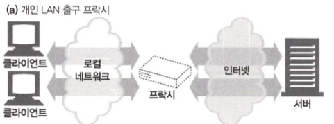
- 접근(입구)프락시
  - ISP 접근 지점에 위치하여 뚜日는 사용자들의 다운로드 속도를 개선하고 인터넷 대역폭 비용을 줄이기 위해 캐시 프락시를 사용해 많이 찾 는 문서들의 사본을 저장합니다.
    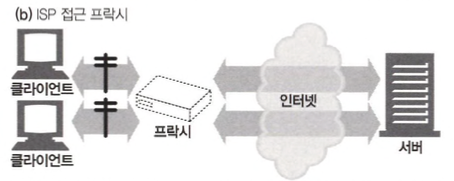
- 대리 프락시(리버스 프락시)
  - 가장 끝에 있는 웹 서버들의 바로 앞에 위치하여 웹 서버로 향하는 모 든 요청을 처리하고 필요할 때만 웹 서버에게 자원을 요청할 수 있습니다.
  - 보안 기능을 추가하거나 빠른 웹 서버 캐시를 느린 웹 서버의 앞에 놓음으로써 성능을 개선할 수도 있습니다.
    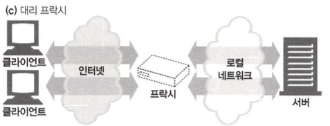
- 네트워크 교환 프락시
  - 인터넷 피어링 교환 지점들에 두어 캐시를 이용해 인터넷 교차로의 혼잡을 완화하고 트래픽 흐름을 감시할 수 있습니다.
    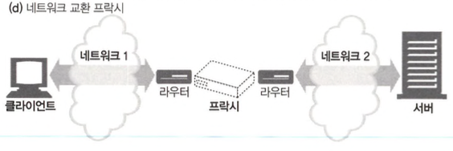

### 6.3.2 프락시 계층

- 프락시 서버들은 부모와 자식의 관계를 갖으며, 다음번 인바운드 프락시 (서버 에 가까운 쪽)를 부모라고 부르고 다음번 아웃바운드 프락시(클라이언트 가까운 쪽)는 자식이라고 부릅니다.

  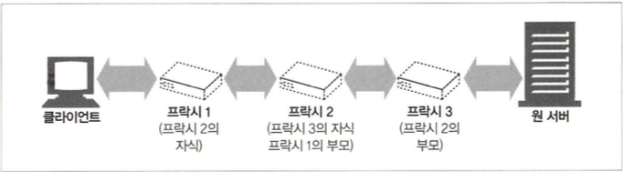

- 프락시 계층 콘텐츠 라우팅
  - 계층이 반드시 정적이어야 하는 것은 아닙니다. 부하 균형, 지리적 인접성에 근거한 라우팅, 프로토콜/타입 라우팅, 유료 서비스 가입자를 위한 라우팅 등의 이유로 동적 계층 라우팅이 가능합니다.
    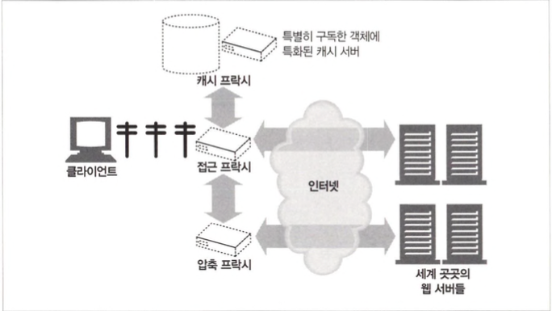

### 6.3.3 어떻게 프락시가 트래픽을 처리하는가

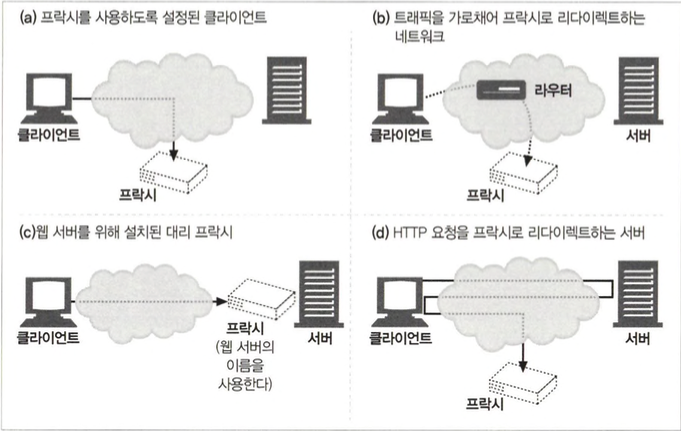

- 클라이언트를 수정한다
- 네트워크를 수정한다(인터셉트 프락시)
- DNS 이름공간을 수정한다
- 웹 서버를 수정한다

## 6.4 클라이언트 프락시 설정

- 수동 설정
- 브라우저 기본 설정
- 프락시 자동 설정(Proxy auto-configuration, PAC)
  - 자바스크립트 프락시 자동 설정(PAC) 파일에 대한 URI를 제공
- WPAD 프락시 발견
  - 대부분의 브라우저는 자동설정 파일을 다운받을 수 있는 웹 프락시 자동발견 프로토콜(Web Proxy Autodiscovery Protocol, WPAD)을 제공합니다.

### 6.4.1 클라이언트 프락시 설정: 수동

- 구글 크롬과 마이크로소프트 인터넷 익스플로러 둘 모두 간편하게 프락시 설정을 할 수 있도록 지원합니다.

### 6.4.2 클라이언트 프락시 설정: PAC 파일

```js
function FindProxyForURL(url, host) {
  if (url.substring(0, 5) == "http:") {
    return "PROXY http-proxy.mydomain.com:8080";
  }
  if (url.substring(0, 4) == "ftp:") {
    return "PROXY ftp-proxy.mydomain.com:8080";
  }
  return "DIRECT";
}
```

### 6.4.3 클라이언트 프락시 설정: WPAD

- PAC URI를 찾기 위해 WPAD를 사용
- 주어진 URI에서 PAC파일을 가져옴
- 프락시 서버를 알아내기 위해 PAC 파일을 실행
- 알아낸 프락시 서버를 이용해서 요청을 처리
- WPAD는 올바른 PAC 파일을 알아내기 위한 리소스 발견 기법
  - 동적 호스트 발견 규약(DHCP)
  - 서비스 위치 규약(SLP)
  - DNS 잘 알려진 호스트명
  - DNS SRV 레코드
  - DNS TXT 레코드 안의 서비스 URI

## 6.5 프락시 요청의 미묘한 특징들

### 6.5.1 프락시 URI는 서버 URI와 다르다

- 클라이언트 -> 서버

```
GET /index.html HTTP/1.0
User-Agent: SuperBrowservl.3
```

- 클라이언트 -> 프락시

```
GET http://www.marys-antiques.com/index.html HTTP/1.0
User-Agent: SuperBrowser vl.3
```

- 클라이언트가 프락시 대신 서버로 요청을 보내면 요청의 URI가 달라집니다.
- 원래의 HTTP 설계에서에서 1:1 통신이어서 가상 호스트팅이나 프락시에 대비가 되어있지 않아서 입니다.

### 6.5.2 가상 호스팅에서 일어나는 같은 문제

- 요청 메시지가 완전한 URI를 갖도록 함으로써 이 문제를 해결됨

### 6.5.3 인터셉트 프락시는 부분 URI룔 받는다

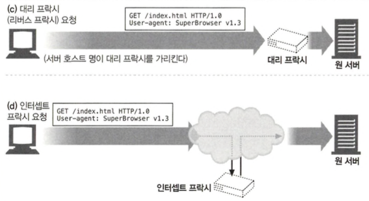

- 클라이언트는 웹 서버와 대화하고 있다고 생각하고 완전한 URI를 보내지 않을 것입니다.

### 6.5.4 프락시는 프락시 요청과 서버 요청을 모두 다룰 수 있다

- 완전 URI와 부분 URI를 사용하는 규칙
  - 완전한 URI가 주어졌다면, 프락시는 그것을 사용
  - 부분 URI가 주어졌고 Host 헤더가 있다면, Host 헤더를 이용해 원 서버의 이름과 포트 번호를 알아내야 함
  - 부분 URI가 주어졌으나 Host 헤더가 없다면, 다음의 방법으로 원 서버를 알아내 야 합니다.
    - 프락시가 원 서버를 대신하는 대리 프락시라면, 프락시에 실제 서버의 주소와 포트 번호가 설정되어 있을 수 있습니다.
    - 이전에 어떤 인터셉트 프락시가 가로챘던 트래픽을 받았고, 그 인터셉트 프락시가 원 IP 주소와 포트번호를 사용할 수 있도록 해두었다면, 그 IP 주소와 포트번호를 사용할 수 있습니다.
    - 모두 실패한다면 브라우저 업데이트를 하라는 에러 메시지를 출력해야 합니다.

### 6.5.5 전송 중 URI 변경

- URI를 변경하면 예상치 못한 오류가 발생하기에 지양해야합니다.
- HTTP 명세는 일반적인 인터셉트 프락시가 URI를 전달할 때 절대 경로를 고쳐 쓰는 것을 금지합니다.

### 6.5.6 URI 클라이언트 자동확장과 호스트명 분석(Hostname Res이ution)

- 일반적인 웹 사이트 이름의 가운데 부분만 입력했다면, 많은 브라우저는 ‘www.’ 접두사를 붙이고 ‘.com’ 접미사를 붙입니다.
- 해석할 수 없는 URI를 서드파티 사이트로 넘겨서 오타 교정하고 URI를 제시합니다.
- DNS는 사용자가 호스트 명의 앞부분만 입 력하면 자동으로 도메인을 검색하도록 설정됩니다.

### 6.5.7 프락시 없는 URI 분석(URI Resolution)

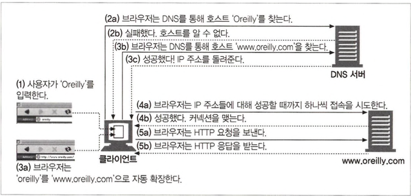

### 6.5.8 명시적인 프락시를 사용할 때의 URI 분석

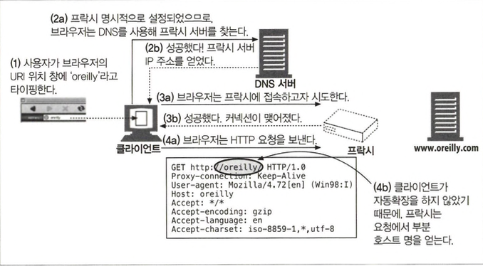

### 6.5.9 인터셉트 프락시를 이용한 URI 분석

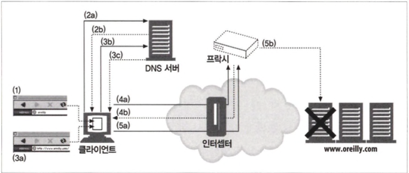

- 단계 1에서 사용자는 브라우저의 URI 위치 창에 ‘oreilly’라고 타이핑
- 단계 2a 에서 브라우저는 호스트 ‘oreilly’를 DNS를 통해 찾아보지만, 단계 2b에서 DNS 서버는 실패하고 그 호스트는 알 수 없다고 응답
- 단계 3a에서 브라우저는 ‘oreilly’를 ‘www.oreilly.com’으로 변환하는 자동확장을
- 단계 3b에서 브라우저는 DNS를 통해 호스트 ‘www.oreilly.com’를 찾음 이때, 단계 3c에서 DNS 서버는 성공하고 IP 주소를 브라우저에게 반환
- 단계 4a에서 클라이언트는 이미 성공적으로 호스트 명을 분석하였고 IP 주소의 목록을 갖고 요청 그러나 인터셉트 프락시에서 첫 번째 접속 시도는 원 서버가 아닌 프락시 서버에 의해 종료 클라이언트는 성공적으로 웹 서버와 대화했다고 믿지만, 웹 서버는 다운
- 프락시가 최종적으로 진짜 원 서버와 상호작용할 준비가 되었을 때(단계 5b), 프락시는 그 IP 주소가 실제로는 다운된 서버를 가리키고 있음을 알게 됨

- 라우저가 명시적인 프락시를 사 용하도록 설정되어 있는 경우의 장애 허용은 프락시에 달려있기 때문에 프락시에서 장애 허용을 컨트롤해야합니다.

## 6.6 메시지 추적

### 6.6.1 Via 헤더

- 메시지가 지나는 각 중간 노드(프락시나 게이트웨이)의 정보를 나열
  ```
  GET /index.html HTTP/1.0
  Accept: text/html
  Host: www.joes-hardware.com
  Via: 1.1 proxy-62.irenes-isp.net, 1.0 cache.joes-hardware.com
  ```
- Via 문법

  ```
  Via = "Via" ( waypoint ) [", " ( waypoint )...]
  waypoint = ( received-protocol received-by [ comment ] )
  received-protocol = [ protocol-name ]
  protocol-version received-by = ( host [ port ] ) | pseudonym
  ```

  - 프로토콜 이름(선택. 기본은 HTTP), 프로토콜 버전(필수), 노드 이름(필수, 가명으로 대체가능), 코멘트(선택)의 최대 4개의 구성요소를 담을 수 있습니다.
  - 요청 메시지와 응답 메시지 모두 프락시를 지나므로 둘 모두 Via 헤더를 가집니다.
  - Via와 게이트웨이
    - Via 헤더는 프로토콜 변환을 기록하므로 HTTP 애플리케이션은 프락시 연쇄에서 프로토콜 능력과 변환이 있었는지를 알아챌 수 있습니다.
  - Server 헤더와 Via 헤더
    - Server 응답 헤더 필드는 원 서버 에 의해 사용되는 소프트웨어를 알려주는데 프락시는 이를 수정해서는 안되고 Via 항목을 추가해야 합니다.
  - Via가 개인정보 보호와 보안에 미치는 영향
    - 원 서버를 노출시키는 것은 공격을 받을 수 있기에 via 를 가명으로 사용할 수 있습니다.

### 6.6.2 TRACE 메서드

- Max-Foiwards 헤더 필드로 전달될 홉의 횟수를 제한할 수 있습니다.

## 6.7 프락시 인증

- 407 Proxy Authorization Required 상태 코드를 어떻게 그러한 자격을 제출할 수 있는지 설명해주는 Proxy-Authenticate 헤더 필드와 함께 반환
- 클라이언트는 407 응답을 받게 되면, 로컬 데이터베이스를 확인해서든 사용자에 게 물어봐서든 요구되는 자격을 수집
- 자격을 획득하면, 클라이 언트는 요구되는 자격을 Proxy-Authorization 헤더 필드 에 담아서 재요청
- 자격이 유효하다면, 프락시는 원 요청을 연쇄를 따라 통과

## 6.8 프락시 상호운용성

### 6.8.1 지원하지 않는 헤더와 메서드 다루기

- 프락시는 이해할 수 없는 헤더 필드는 반 드시 그대로 전달해야하며 순서도 유지해야합니다.

### 6.8.2 OPTIONS: 어떤 기능을 지원하는지 알아보기

- 서버나 웹 서버의 특정 리소스가 어떤 기능을 지원하는 지 클라이언트 혹은 프락시가 알아볼 수 있게 해줍니다.

### 6.8.3 Allow 헤더

- 요청 URI에 의해 식별되는 자원에 대해 지원되는 메서드을 나열한 것입니다.
