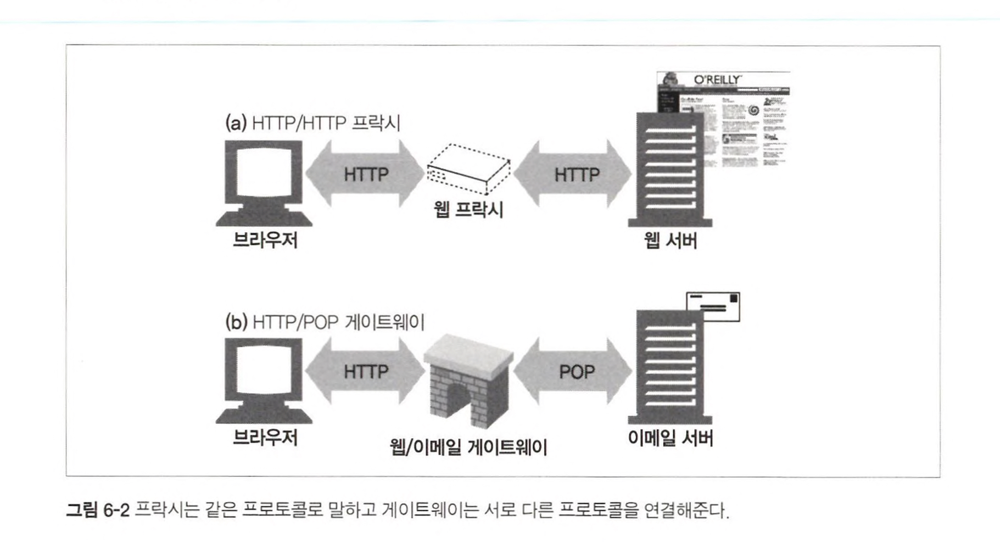

# 6장. 프락시

프락시는 클라이언트와 서버 사이에 위치하며, HTTP 메시지를 정리하는 중개인 역할을 한다.

## 6.1 웹 중개자

- 웹 프락시 서버는 클라이언트의 입장에서 트랜잭션을 수행하는 중개인이다.
- 웹 프락시는 서버의 역할과 클라이언트의 역할을 모두 수행한다.
  

### 6.1.1 개인 프락시와 공유 프락시

- 개인 프락시 : 하나의 클라이언트만을 위한 프락시
  - 개인 프락시는 흔하지는 않지만 꾸준히 사용되고 있다.
- 공용 프락시 : 여러 클라이언트가 함께 사용하는 프락시
  - 대부분의 프락시는 공용 프락시이다.

### 6.1.2 프락시 대 게이트웨이

- 프락시는 같은 프로토콜을 사용하는 둘 이상의 애플리케이션을 연결한다.
- 게이트웨이는 서로 다른 프로토콜을 사용하는 둘 이상을 연결한다.
- 프락시와 게이트웨이의 차이점은 모호하며, 때로는 호환성을 위해 약간의 프로토콜 변환을 하기도 한다.
  

## 6.2 왜 프락시를 사용하는가?

- 프락시는 보안을 개선하고, 성능을 높여주며, 비용을 절약한다.
- 프락시는 여러 유용한 웹서비스를 구현하기 위해 트래픽을 감시하고 수정할 수 있다.
- 프락시 사용 예시
  - 부적절 사이트 필터링
  - 문서 접근 제어자 (예: 기업용 방화벽)
  - 보안 방화벽 (예: 바이러스 제거)
  - 웹 캐싱
  - 대리 프락시 (리버스 프락시)
  - 콘텐츠 라우터 (예: 사용자 맞춤 서비스 제공)
  - 트랜스코더 (예: 번역, 압축, 텍스트 크기 조절 등등)
- 익명화 프락시 (HTTP 메시지에서 개인정보를 제거한다)

## 6.3 프락시는 어디에 있는가?

### 6.3.1 프락시 서버 배치

- 출구 프락시 : 로컬 네트워크의 출구에 위치한다. (성인사이트 필터링, 해킹 방화벽)
- 접근(입구) 프락시 : ISP의 접근 지점에 위치한다. (다운로드 속도 개선, 캐시 프락시)
- 대리 프락시 : 웹 서버들의 바로 앞에 위치한다. (웹 서버에 보안기능 추가, 웹 서버 캐싱)
- 네트워크 교환 프락시 : 네트워크 사이의 인터넷 피어링 교환 지점에 놓인다.
  

### 6.3.2 프락시 계층

- 프락시는 프락시 계층이라고 불리는 연쇄를 구성할 수 있다. (여러 프락시가 배치될 수 있다)
- 프락시 계층에서 프락시는 서버와 가까운 쪽을 부모라고 부르고, 클라이언트와 가까운 쪽을 자식이라고 부른다.
- 프락시 계층 콘텐츠 라우팅
  - 동적 부모 선택 : 프락시 서버는 여러 가지 판단 근거에 의해 메시지를 다양하고 유동적인 프락시 서버와 원 서버들의 집합에게 보낼 수 있다. (예: 캐시 서버로, 압축 프락시로)
    - 부하 균형 : 부하를 분산하기 위해 적절한 부모 프락시를 고른다.
    - 지리적 안정성에 근거한 라우팅 : 원 서버의 지역을 담당하는 부모 선택
    - 프로토콜/타입 라우팅 : URI에 근거하여 다른 부모나 원 서버로 라우팅.(특정 종류의 URI을 갖고 있는 경우, 특별한 프락시 서버로 보내져 특별한 프로토콜로 처리)
    - 유료 서비스 가입자를 위한 라우팅

### 6.3.3 어떻게 프락시가 트래픽을 처리하는가

- 클라이언트 트래픽이 프락시로 가도록 만드는 방법 4가지
  - 클라이언트를 수정한다. (예: 브라우저에서 프락시 설정 변경)
  - 스위칭 장치와 라우팅 장치를 사용하여 요청을 가로챈다. (인터셉트 프락시)
  - DNS 네임스페이스를 수정한다.
  - 웹 서버를 수정한다. (리다이렉션 상태코드를 사용하여 클라이언트를 프락시로 리다이렉션 함)

## 6.4 클라이언트 프락시 설정

- 수동 설정 : 사용자가 직접 수정한다.
- 브라우저 기본 설정
- 프락시 자동 설정(Proxy auto-configuration, PAC) : 자바스크립트 파일을 실행하여 프락시 설정을 수정한다.
- WPAD 프락시 발견 : 자동설정 파일을 다운받을 수 있는 "설정 서버"를 자동으로 찾아주는 웹 프락시 자동발견 프로토콜 제공(Web Proxy Autodiscovery Protocol, WPAD)

### 6.4.1 클라이언트 프락시 설정: 수동

브라우저마다의 설정방법을 참고하여 프락시를 수동으로 설정한다.

### 6.4.2 클라이언트 프락시 설정: PAC 파일

- 자바스크립트 PAC 파일의 URI를 브라우저에 설정하여 매 접근마다 적절한 프락시 서버를 찾도록 한다.
- PAC 파일의 MIME 타입은 'application/x-ns-proxy-autoconfig' 이다.
- 각 PAC 파일은 반드시 적절한 프록시 서버를 찾아주는 FindProxyForUrl(url,host) 함수를 정의해야 한다.
  
  

### 6.4.3 클라이언트 프락시 설정: WPAD

WPAD는 여러 발견 메커니즘들의 상승 전략을 이용해 브라우저에게 알맞는 PAC 파일을 찾아준다.

- PAC URI를 찾기 위해 WPAD를 사용한다.
- 주어진 URI에서 PAC 파일을 가져온다.
- 프락시 서버를 알아내기 위해 PAC 파일을 실행한다.
- 알아낸 프락시 서버를 이용해서 요청을 처리한다.

WPAD는 올바른 PAC 파일을 찾아내기 위해 일련의 리소스 발견 기법을 사용한다.

- 동적 호스트 발견 규약(DHCP)
- 서비스 위치 규약(SLP)
- DNS 잘 알려진 호스트 명
- DNS SRV 레코드
- DNS TXT 레코드 안의 서비스 URI

## 6.5 프락시 요청의 미묘한 특징들

### 6.5.1 프락시 URI는 서버 URI와 다르다.

- 프락시는 목적지 서버와 커넥션을 맺어야 하기 때문에, 그 서버의 이름을 알 필요가 있다.
- 프락시 기반 게이트웨이는 FTP 리소스나 혹은 그 외의 스킴과 연결하기 위해 URI의 스킴을 알 필요가 있다.
- 단일 서버는 자신의 호스트 명과 포트번호를 이미 알고 있다.
- 따라서 아래와 같은 형식으로 요청을 보낸다.
  - 클라이언트가 웹 서버로 요청을 보낼 때는 부분 URI를 보낸다.
  - 클라이언트가 프락시로 요청을 보낼 때는 완전한 URI를 보낸다.
- 클라이언트의 설정에 따라 나뉘기도 한다.
  - 클라이언트가 프락시를 사용하지 않는 경우 : 부분 URI 전송
  - 클라이언트가 프락시를 사용하는 경우 : 완전한 URI 전송

### 6.5.2 가상 호스팅에서 일어나는 같은 문제

가상으로 호스팅 되는 웹 서버는 여러 웹 사이트가 같은 물리적 웹 서버를 공유한다. 따라서 요청 하나가 부분 URI로 올 경우, 가상으로 호스팅 되는 웹 서버는 그 요청이 접근하고자 하는 웹 사이트의 호스트 명을 알 필요가 있다.

- 해결 방법 : 가상으로 호스팅 되는 웹 서버는 호스트와 포트에 대한 정보가 담겨 있는 HOST 헤더를 요구한다.

### 6.5.3 인터셉트 프락시는 부분 URI를 받는다

- 클라이언트가 볼 수 없는 프락시의 경우(대리 프락시, 인터셉트 프락시), 클라이언트는 자신이 웹 서버와 대화하고 있다고 생각하고 부분 URI를 보낼 것이다.
  - 대리 프락시 : 원 서버의 호스트 명과 아이피 주소를 사용하여 원 서버를 대신함
  - 인터셉트 프락시 : 클라이언트의 요청을 가로채 캐시된 응답을 돌려주는 등의 일을 함

### 6.5.4 프락시는 프락시 요청과 서버 요청을 모두 다룰 수 있다.

트래픽이 프락시 서버로 리다이렉트 될 수 있는 여러 가지 방법이 존재하기 때문에, 다목적 프락시 서버는 요청 메시지의 완전한 URI와 부분 URI를 모두 지원해야 한다.

완전 URI와 부분 URI를 사용하는 규칙은 다음과 같다.

- 완전한 URI가 주어졌다면, 프락시는 그것을 사용해야 한다.
- 부분 URI가 주어졌고 Host 헤더가 있다면, Host 헤더를 이용해 원 서버의 이름과 포트 번호를 알아내야 한다.
- 부분 URI가 주어졌으나 Host 헤더가 없다면, 다음의 방법으로 원 서버를 알아내야 한다.
  - 프락시가 원 서버를 대신하는 대리 프락시라면, 프락시에 실제 서버의 주소와 포트 번호가 설정되어 있을 수 있다.
  - 이전에 어떤 인터셉트 프락시가 가로챘던 트래픽을 받았고, 그 인터셉트 프락시가 원 IP 주소와 포트번호를 사용할 수 있도록 해두었다면, 그 IP 주소와 포트번호를 사용할 수 있다.
  - 모두 실패했다면, 프락시는 원 서버를 알아낼 수 있는 충분한 정보를 갖고 있지 못한 것이므로 반드시 에러 메시지를 반환해야 한다.

### 6.5.5 전송 중 URI 변경

프락시 서버는 요청 URI의 변경에 매우 신경을 써야 한다. 무해해 보이는 사소한 URI 변경이라도 다운스트림 서버와 상호운용성 문제를 일으킬 수 있다.

### 6.5.6 URI 클라이언트 자동확장과 호스트 명 분석(Hostname Resolution)

브라우저는 프락시의 존재 여부에 따라 요청 URI를 다르게 분석한다. 프락시가 없다면 사용자가 타이핑한 URI를 가지고 그에 대응하는 IP주소를 찾는다.

만약 호스트가 발견되지 않는다면, 많은 브라우저는 다음과 같이 몇 가지 시도를 한다.

- 일반적인 웹 사이트 이름의 가운데 부분만 입력했다면, 많은 브라우저는 'www.'접두사를 붙이고 '.com'접미사를 붙인다.
- 몇몇 브라우저는 해석할 수 없는 URI를 서드파티 사이트로 넘기기도 한다. 이 사이트는 오타 교정을 유도한다.
- 대부분의 시스템에서 DNS는 사용자가 호스트 명의 앞부분만 입력하면 자동으로 도메인을 검색한다. 예를 들어 'naver.com' 이라는 도메인에 있을 때 'blog'를 입력한다면, 자동으로 'blog.naver.com'을 검색한다.

### 6.5.7 프락시 없는 URI 분석(URI Resolution)

### 6.5.8 명시적인 프락시를 사용할 때의 URI 분석

명시적인 프락시를 사용할 경우, *6.5.7*과 같은 확장을 수행할 수 없다.

### 6.5.9 인터셉트 프락시를 이용한 URI 분석

## 6.6 메시지 추적

오늘날, 웹 요청이 클라이언트에서 서버로 향하는 도중에 둘 이상의 프락시를 지나게 되는 것은 드문 일이 아니다.

프락시가 점점 더 흔해지면서, 프락시를 넘나드는 메시지으 흐름을 추적하고 문제점을 찾아내는 것도 중요한 일이 되었다.

### 6.6.1 Via 헤더

Via 헤더 필드는 메시지가 지나는 각 중간 노드의 정보를 나열한다. 메시지가 또 다른 노드를 지날 때마다, 중간 노드는 Via 목록의 끝에 반드시 추가되어야 한다.

- Via 문법
  - 프로토콜 이름 : 중개자가 받은 프로토콜. 만약 프로토콜이 HTTP라면 프로토콜 이름은 없어도 된다
  - 프로토콜 버전 : 수신한 메시지의 버전. 버전의 포맷은 프로토콜에 달려있다
  - 노드 이름 : 중개자의 호스트와 포트 번호
  - 노드 코멘트 : 중개자 노드를 서술하는 선택적인 코멘트
- Via요청과 응답 경로
  - 응답 Via는 보통 요청 Via의 반대다
- Via와 게이트웨이
  - HTTP/FTP 게이트웨이는 받은 프로토콜에 대한 로그를 남기면서 Via헤더를 생성한다
- Server헤더와 Via헤더
  - 응답 메시지가 프락시를 통과할 때, 프락시는 Server 헤더를 수정해서는 안 된다
  - Server 응답 헤더 필드는 원 서버에 의해 사용되는 소프트웨어를 알려준다
- Via가 개인정보 보호와 보안에 미치는 영향
  - 명시적으로 이 동작이 켜져 있지 않은 이상, 프락시 서버는 방화벽 뒤에 숨어있는 호스트의 이름과 포트를 전달해서는 안 된다. 악의적인 집단에 의해 이용될 수 있기 때문에다.
  - 만약 Via 노드의 이름 전달이 가능하지 않다면, 프락시는 호스트 명을 적당한 가명으로 교체해야 한다. 하지만 그렇다고 하더라도, 프락시는 각 프락시 서버에 대한 Via 경유지 항목을 유지하려 노력해야 한다.
  - 여러 경유지들이 모두 같은 조직의 통제하에 있고 이미 가명으로 교체되지 않은 이상 프락시는 그들에 대한 항목들을 하나로 합쳐서는 안된다.

### 6.6.2 TRACE 메서드

HTTP/1.1의 TRACE 메서드는 요청 메시지를 프락시의 연쇄를 따라가면서 어떤 프락시를 지나가고 어떻게 각 프락시가 요청 메시지를 수정하는지 관찰/추적할 수 있도록 한다.

TRACE 요청이 목적지 서버에 도착했을 때, 서버는 전체 요청 메시지를 HTTP 응답 메시지의 본문에 포함시켜 송신자에게 그대로 돌려보낸다.

Max-Forwards 헤더는 최대로 전달될 수 있는 프락시 홉의 개수를 제한할 수 있다.

## 6.7 프락시 인증

프락시는 접근 제어 장치로서 제공될 수 있다. HTTP는 사용자가 유효한 접근 권한 자격을 프락시에 제출하지 않는 한 콘텐츠에 대한 요청을 차단하는 *프락시 인증*이라는 메커니즘을 정의하고 있다.

- 제한된 콘텐츠에 대한 요청이 프락시에 도착
- 접근자격을 요구하는 407 Proxy Authorization Required 상태 코드와 증명 방법을 설명하는 Proxy-Authenticate 헤더 반환
- 클라이언트는 요구되는 자격을 수집하고 Proxy-Authorization 헤더에 담아서 다시 요청
- 자격이 유효하다면 프록시는 요청을 통과시키고, 유효하지 않다면 407 응답 반환

위 과정은 인증에 참여하는 프락시가 프락시 연쇄상에 여러개 존재할때는 일반적으로 잘 동작하지 않는다.

## 6.8 프락시 상호운용성

프락시 서버는 서로 다른 프로토콜을 구현했을 수도 있고 골치 아프게 이상한 동작을 할 수도 있는 클라이언트와 서버 사이를 중개해야 한다.

### 6.8.1 지원하지 않는 헤더와 메서드 다루기

- 프락시 서버는 넘어오는 헤더 필드들을 모두 이해하지 못할 수도 있다.
- 프락시는 이해할 수 없는 헤더 필드는 반드시 그대로 전달해야 한다.
- 같은 이름의 헤더 필드가 여러개 있는 경우에는 그들의 상대적인 순서도 반드시 유지해야 한다.

### 6.8.2 OPTIONS: 어떤 기능을 지원하는지 알아보기

서로 다른 기능 수준의 서버와 프락시가 더 쉽게 상호작용할 수 있도록 클라이언트는 OPTIONS를 이용해 서버의 능력을 먼저 알아낼 수 있다.

OPTIONS 요청의 URI가 \* 이라면, 서버 전체 리소스의 능력에 대해 묻는 것이다.

OPTIONS 요청의 URI가 특정 리소스라면, 해당 리소스의 능력에 대해 묻는 것이다.

성공한다면, 서버에 의해 어떤 메서드가 지원되는지 서술하는 Allow 헤더를 반환한다.

### 6.8.3 Allow 헤더

Allow 엔터티 헤더 필드는 요청 URI에 의해 식별되는 자원에 대해 지원되는 메서드들이나 서버가 지원하는 모든 메서드를 열거한다.

또한 새 리소스가 지원했으면 하는 메서드를 추천하기 위해 요청 헤더로 사용될 수 있다. 서버는 추천받은 모든 메서드를 모두 지원해야 할 의무는 없고, 그 요청에 대한 응답에는 실제로 지원하는 메서드들을 열거하는 Allow 헤더를 포함시켜야 한다.

🤮🤮🤮🤮🤮🤮
