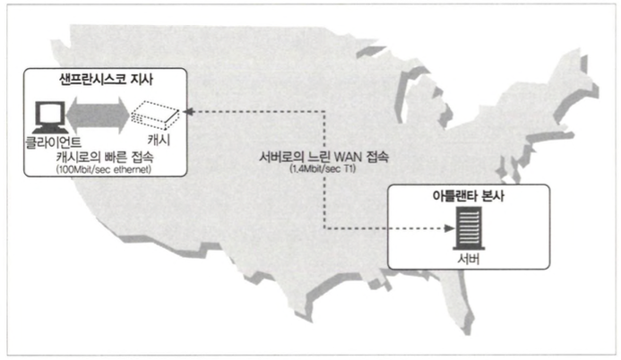
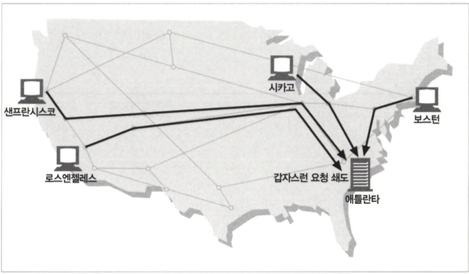
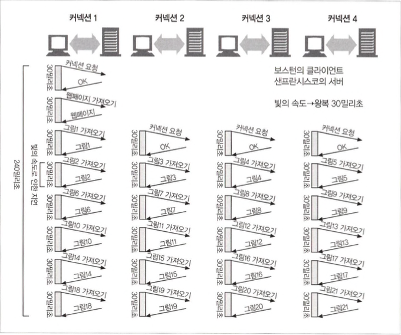
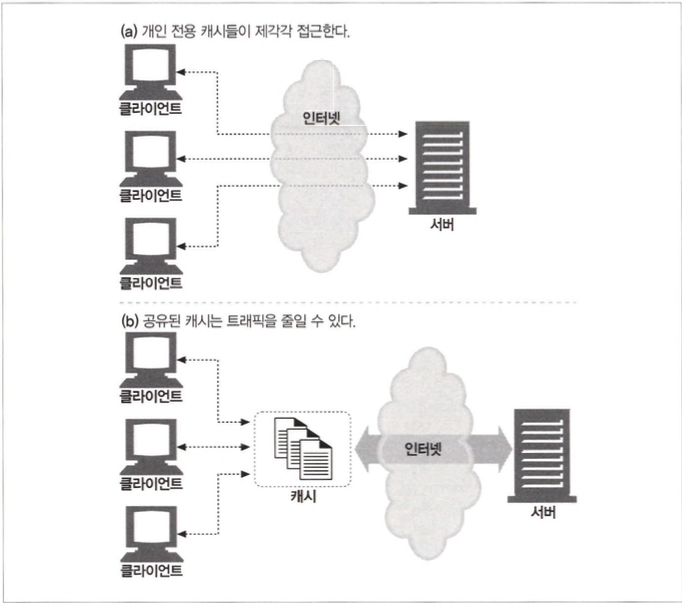
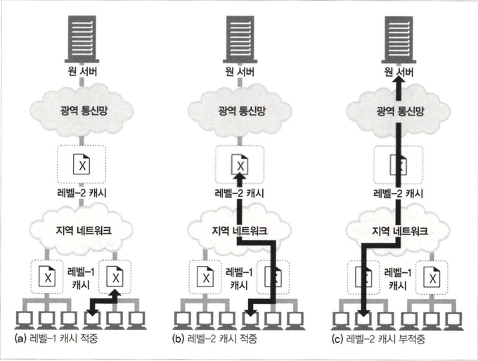
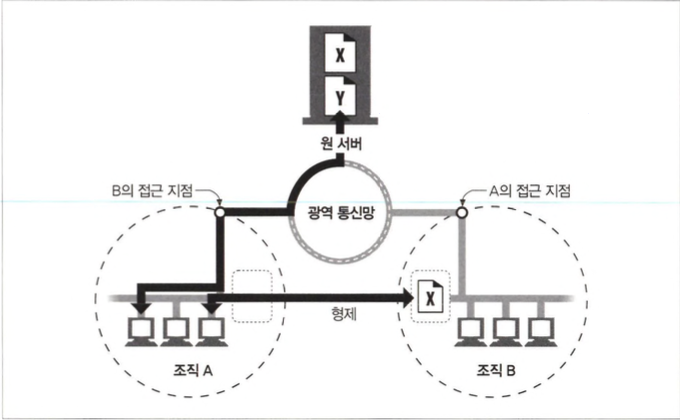
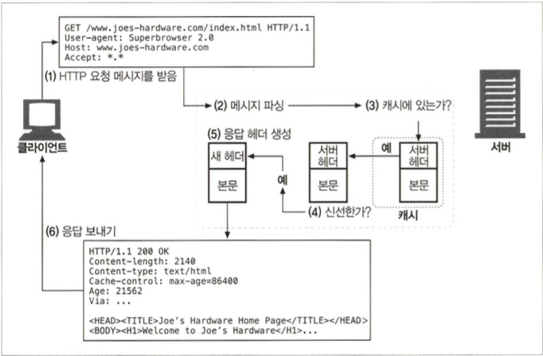
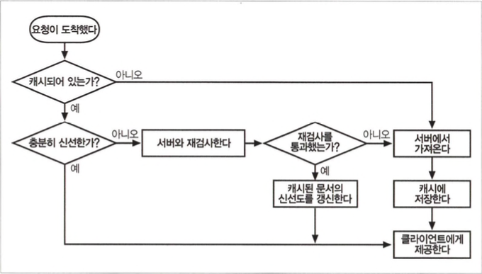

# 캐시

- 자주 쓰이는 문서의 사본을 자동으로 보관하는 HTTP 장치

- 캐시의 장점
  - 불필요한 데이터 전송을 줄여서 네트워크 요금으로 인한 비용 절감
  - 네트워크 병목 감소
  - 서버 부하 감소
  - 거리로 인한 지연 감소

## 7.1 불필요한 데이터 전송

## 7.2 대역폭 병목



## 7.3 갑작스런 요청 쇄도(Flash Crowds)



## 7.4 거리로 인한 지연



## 7.5 적중과 부적중

- 요청 도착시 캐시가 있다면 캐시 적중(cache hit), 없다면 캐시 부적중(cache miss)

### 7.5.1 재검사(Revalidation)

- 캐시 재검사 적중은 캐시가 있지만 캐시 데이터가 최신 상태인지 확인합니다. 데이터가 최신 상태면 `304 Not Modified`를 리턴합니다. 캐시 적중보다는 느리지만 캐시 부적중보다는 빠릅니다.
- If-Modified-Since 헤더를 추가하여 GEP 요청을 하면 사용할 수 있습니다.
- 캐시 재검사에서 서버 객체가 삭제되면 `404 Not Found` 리턴

### 7.5.2 적중률

- 캐시가 요청을 처리하는 비율
- 40%라면 괜찮은 웹 캐시

### 7.5.3 바이트 적중률

- 캐시를 통해 제공된 모든 바이트의 비율을 표현합니다.
- 바이트 단위 적중률의 개선은 대 역폭 절약을 최적화하는 것입니다.

### 7.5.4 적중과 부적중의 구별

- 클라이언트는 응답헤더를 살펴보면 Date 헤더 값을 현재 시각과 비교하여 응답의 생성일이 더 오래되었다면 캐시라는걸 알 수 있습니다. 혹은 Age 헤더를 사용하면 알 수 있습니다.

## 7.6 캐시 토폴로지

- 캐시는 한 명의 사용자에게만(전용 캐시) 할당될 수도 있고 반대로 수천 명의 사용자들(공용 캐시) 간에 공유될 수도 있습니다.

### 7.6.1 개인전용 캐시

- 개인용 컴퓨터의 디스크와 메모리에 캐시해 놓고, 사용자가 캐 시 사이즈와 설정을 수정할 수 있도록 허용합니다.

### 7.6.2 공용 프락시 캐시

- 공유된 프락시 서버은 로컬 캐시에서 문서를 제공하거나, 혹은 사용자의 입장에서 서버에 접근합니다.



### 7.6.3 프락시 캐시 계층들



- 캐시 계층이 깊다면 요청은 캐시의 긴 연쇄를 따라가게 될 것이고 프락시 연쇄가 길어질수록 각 중간 프락시는 현저한 성능 저하가 발생합니다.

### 7.6.4 캐시망, 콘텐츠 라우팅, 피어링

- 캐시망의 프락시 캐시는 어떤 부모 캐시와 대화할 것인지, 아니면 요청이 캐시를 완전히 우회해서 원 서버로 바로 가도록 할 것인지 동적으로 설정할 수 있습니다.

- 캐시망 안에서의 콘텐츠 라우팅을 위해 설계된 캐시가 할 수 있는 것
  - URL에 근거하여, 부모 캐시와 원 서버 중 하나를 동적 선택
  - URL에 근거하여 특정 부모 캐시를 동적 선택
  - 부모 캐시에게 가기 전에, 캐시된 사본을 로컬에서 검색
  - 다른 캐시들이 그들의 캐시된 콘텐츠에 부분적으로 접근할 수 있도록 허용하되, 그들의 캐시를 통한 인터넷 트랜짓(Internet transit)은 불가
- 선택적인 피어링을 지원 하는 캐시는 형제 캐시라고 불리며 HTTP는 형제 캐시를 지원하지 않아서 인터넷 캐시 프로토콜(ICP)이나 하이퍼텍스트 캐시 프로토콜 (HTCP)같은 프로토콜을 이용해 HTTP를 확장했습니다.

<span style="color:gray">인터넷 트랜짓(Internet transit): 트래픽이 다른 네트워크로 건너감</span>
<span style="color:gray">인터넷 캐시 프로토콜(ICP) : ICP는 캐시 간 통신을 위해 설계된 경량 프로토콜</span>
<span style="color:gray">HTCP(Hypertext Cache Protocol) : 캐시 간 통신을 가능하게 하는 또 다른 프로토콜</span>



## 7.7 캐시 처리 단계



### 7. 7.1 단계 1:요청 받기

- 네트워크로부터 도착한 요청 메시지를 읽음

### 7. 7.2 단계 2: 파싱

- 메시지를 파싱하여 URL과 헤더들을 추출

### 7.7 .3 단계 3:검색

- 로컬 복사본이 있는지 검사하고, 사본이 없다면 사본을 받아서 로컬에 저장
- 캐시된 객체는 또한 객체가 얼마나 오랫동안 캐시에 머무르고 있었는지를 알려주는 기록이나 얼마나 자주 사용되었는 지 등에 대한 몇몇 메타데이터를 포함

### 7.7 .3 단계 4. 신선도 검사

- 캐시된 사본이 충분히 신선한지 검사하고, 신선하지 않다면 변경사항이 있는지 서버에게 요청

### 7.7 .3 단계 5. 응답 생성

- 새로운 헤더와 캐시된 본문으로 응답 메시지를 생성
- Date 헤더는 그 객체 가 원 서버에서 최초로 생겨난 일시를 표현하는 것이기에 수정해서는 안됩니다.

### 7.7 .3 단계 6. 전송

- 네트워크를 통해 응답을 클라이언트에게 반환

### 7.7 .3 단계 7. 로깅

- 선택적으로 로그파일에 트랜잭션에 대해 서술한 로그 생성
- 가장 많이 쓰이는 캐시 로그 포맷은 스퀴드 로그 포맷과 넷스케이프 확장 공용 로그 포맷이고 커스텀 로그도 허용(21장에서 자세히 배움)

### 7.7.8 캐시 처리 플로 차트



## 7.8 사본을 신선하게 유지하기

### 7.8.1 문서 만료

- HTTP는 Cache-Control Expires라는 특별한 헤더들을 이용해서 원 서버가 각 문서 에 유효기간을 붙일 수 있게 해줍니다.

### 7.8.2 유효기간과 나이

- HTTP/1.0+ Expires나 HTTP/1.1 Cache-Control: max-age 응답 헤더를 이용해서 유효기간을 명시할 수 있습니다.

### 7.8.3 서버 재검사

- 캐시는 문서의 신선도를 매 요청마다 검증할 필요가 없고 문서가 만료되었을 때 한 번만 서버와 재검사하면 됩니다.
- 캐시는 ‘충분히 신선한’ 캐시된 사본, 원 서버와 재검사되었기에 충분히 신선하다고 확신할 수 있는 캐시된 사본, 재검사 해야하는 원 서버가 다운된 경우 에러 메시지, 캐시가 부정확하다면 경고 메시지가 부착된 캐시된 사본을 반환합니다.

### 7.8.4 조건부 메서드와의 재검사

- HTTP는 다섯 가지 조건부 요청 헤더를 정의하는데 캐시 재검사를 할 때 가장 유용한 `If-Modified-Since`, `If-None-Match` 입니다.

### 7.8.5 If-Modified-Since: 날짜 재검사

- 특정 날짜 이후로 변경된 경우에만 요청한 본문합니다. 날짜가 변경되지 않았다면 `304 Not Modified`와 캐시된 본문을 반환합니다.

### 7.8.6 If-None-Match: 엔터티 태그 재검사

- 일정 시간 간격으로 다시 쓰여지지만 실제로는 같은 데이터를 포함하고 있거나 전 세계의 캐시들이 그 데이터를 다시 읽어들이기엔 사소(철자나 주석 의 변경)한 것일 때 혹은 최근 변경 일시를 정확하게 판별 할 수 없을때 태그를 사용하여 재검사합니다.
- 여러 개의 사본을 갖고 있는 경우, 서버에게 알리기 위해 하나의 If-None-Match 헤더에 여러 개의 엔터티 태그를 포함시킬 수 있습니다.

### 7.8.7 약한 검사기와 강한 검사기

- 약한 검사기 : 비록 콘텐츠가 조금 변경되었더라도 “그 정도면 같은 것”이라고 서버가 주장(HTTP/1.1 지원)
- 강한 검사기 : 콘텐츠가 바뀔 때마다 변경

### 7.8.8 언제 엔터티 태그를 사용하고 언제 Last-Modified 일시를 사용하는가

- 엔터티 태그와 최근 변경 일시가 모두 사용 가능하다면 사용하고 캐시나 서버가 If-Modified-Since와 엔터티 태그 조건부 헤더를 모두 받았다면, 요청의 모든 조건부 헤더 필드의 조건에 부합되지 않는 한 304 Not Modified 응답을 반환해서는 안됩니다.

## 7.9 캐시 제어

### 7.9.1 no-cache와 no-store 응답 헤더

- no-store 표시된 응답은 캐시가 그 응답의 사본을 만드는 것을 금지합니다. 다만 서버와 재검사를 하지 않고서는 캐시에서 클라이언트로 제공될 수 없을 뿐
- no-cache 헤더는 캐시를 하지 않는 것으로 HTTP/1.0+ 부터는 `Cache-Control: no- cache` 이고 HTTP/1.0은 `Pragma: no-cache`입니다.

### 7.9.2 Max-Age 응답 헤더

- 캐시가 매 접근마다 문서를 캐시하지 않거나 혹은 매 접근마다 리프레시 하도록 요청할 수 있습니다.

### 7.9.3 Expires 응답 헤더(deprecated)

### 7.9.4 Must-Revalidate 응답 헤더

- 신선하지 않은 사본을 원 서버와의 최초의 재검사 없이는 제공해서는 안 됨을 의미합니다.

### 7.9.5 휴리스틱 만료

- Cache-Control: max-age 헤더나 Expires 헤더 중 어느 것도 포함하지 않고 있다면, 캐시는 경험적인 방법으로(heuristic) 최대 나이를 계산합니다.
- 대표적으로 LM 인자 알고리즘을 사용하고 LM 알고리즘은 최근 변경 일시를 통해 문서가 얼마나 자주 바뀌는지에 따라 캐시합니다.

### 7.9.6 클라이언트 신선도 제약

- `Cache-Control: max-stale = <s>` : 신선하지 않은 문서라도 자유롭게 제공할 수 있습니다.
- `Cache-Control: min-fresh = <s>` : 클라이언트는 지금으로부터 적어도〈S〉초 후까지 신선한 문서만을 받습니다.
- `Cache-Control: only-if-cached` : 클라이언트는 캐시에 들어있는 사본만 받습니다.

### 7.9.7 주의할 점

- Expires 응답 헤더(deprecated)에 대한 내용 사용하지 않을 것을 권고

## 7.10 캐시 제어 설정

### 7.10.1 아파치로 HTTP 헤더 제어하기

- `mod_expires` : 모듈은 적절한 만료 날짜가 담긴 Expires 헤더를 자동으로 생성하는 프로그램 로직을 제공
- `mod_cern_meta` : 모듈은 HTTP 헤더들의 파일을 특정 객체와 연결

### 7.10.2 HTTP-EQUIV를 통한 HTML 캐시 제어

- 서버의 부하를 가중시키고, 설정값이 정적이고, HTML을 제외한 다른 타입의 파일은 지원하지 않기 때문에 지원하는 웹 서버나 프락시는 거의 없습니다.

## 7.11 자세한알고리즘

### 7.11.1 나이와신선도수명

- `$충분히_신선한가= ($나이< $신선도_수명);`

### 7.11.2 나이 계산

- 응답이 서버에서 생성되었을 때 부터 지금까지의 총 시간

```
$겉보기_나이= max(0, $응답을_받은_시각-$Date_헤더값);
$보정된_ 겉보기_ 나이 = max($겉보기_ 나이, $Age_헤더값);
$응답_지연_추정값 = ($응답올_받은_시각 - $요청을_보낸_시각) ;
$문서가_우리의_캐시에_도착했을_때의_나이 = $보정된_겉보기_나이 + $응답_지연_추정값;
$사본이_우리의_캐시에_머무른_시간 = $현재_시각 - $응답을_받은_시각;

$나이 = $문서가_우리의_캐시에_도착했올_때의_나이 + $사본이_우리의_캐시에_머무른_시간;
```

- http는 클록스큐를 보정하기 떄문에 `$나이 = $문서가_우리의_캐시에_도착했올_때의_나이 + $사본이_ 우리의_ 캐시에_ 머무른_ 시간;`이 기본계산입니다.
  <span style="color=gray">클록스큐 : HTTP 요청 및 응답을 처리할 때 클라이언트와 서버 간의 시간 차이</span>
- 겉보기 나이는 Date 헤더에 기반합니다.

### 7.11.3 완전한 나이 계산 알고리즘

### 7.11.4 신선도 수명 계산

### 7.11.5 완전한 서버 신선도 알고리즘

## 7.12 캐시와 광고

### 7.12.1 광고 회사의 딜레마

- 캐싱이 완벽하게 동작한다면 원 서버는 HTTP 접근을 전혀 수신하지 않게 되고 접근 횟수에 따라 돈을 벌고 있는 광고라면 수익성의 문제가 생깁니다.

### 7.12.2 퍼블리셔의 응답

- 광고를 CGI 게이트웨이를 통해 제공하고 매 접근마다 광고 URL을 고쳐써서 광고를 노출 시킵니다.

### 7.12.3 로그 마이그레이션

- 이상적인 해결책 하나는 서버로 요청이 가지 않도록 하는 것으로 모든 적중 로그를 유지할 수 있지만 광고 수익을 교정해주는 지원 인프라를 개발되지 않는다면 쉽지 않을 것입니다.

### 7.12.4 적중 측정과 사용량 제한

- 캐시 적중 횟수를 정기적으로 서버에게 돌려주는 Meter라고 하는 헤더를 추가할 수 있습니다.
