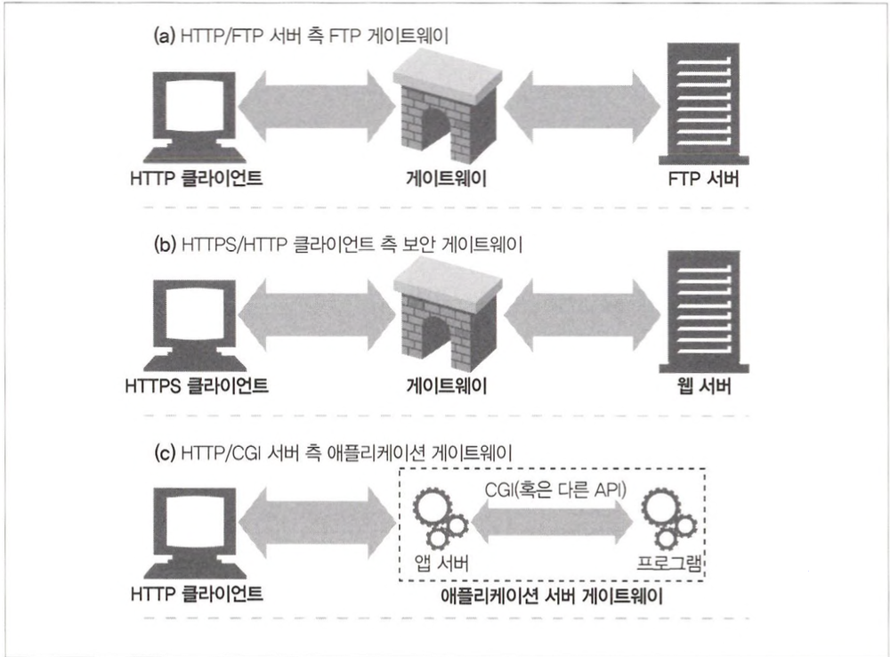
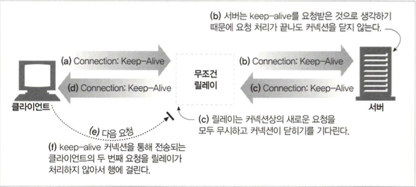

# 통합점: 게이트웨이, 터널, 릴레이

## 8.1 게이트웨이

- 게이트웨이는 리소스와 애플리케이션을 연결하는 역할을 합니다.

- HTTP 트래픽을 다른 프로토콜로 자동으로 변환하여, HTTP 클라이언트가 다른 프로토콜을 알 필요 없이 서버에 접속할 수 있게 해줍니다.

### 8.1.1 클라이언트 측 게이트웨이와 서버 측 게이트웨이

- 게이트웨이는 `<클라이언트 프로토콜>/<서버 프로토콜>` `/`을 사용하여 구분합니다.

## 8.2 프로토콜 게이트웨이

- 브라우저에 명시적으로 게이트웨이를 설정하여 자연스럽게 트래픽이 게이트웨이를 거쳐 가게 하거나, 게이트웨이를 대리 서버(리버스 프락시)로 설정할 수도 있습니다.

### 8.2.1 HTTP/\*:서버 측웹게이트웨이

- USER와 PASS 명령을 보내서 서버에 로그인
- 서버에서 적절한 디렉터리로 변경하기 위해 CWD(Current Working Directory) 명령 실행
- 다운로드 형식을 ASCII(아스키코드)로 설정
- MDTM(Modified Date/Time)으로 문서의 최근 수정 시간을 가져옴
- PASV로 서버에게 수동형 데이터 검색
- RETR3로 객체를 검색한다.
- 제어 채널에서 반환된 포트로 FTP 서버에 데이터 커넥션을 맺는다. 데이터 채널이 열리는 대로, 객체가 게이트웨이로 전송된다.

> PASV : FTP 수동모드
> RETR3 : FTP에서 파일을 서버로부터 다운로드하는 명령

### 8.2.2 HTTP/HTTPS:서버 측 보안 게이트웨이

- 웹 요청을 암호화함으로써 개인 정보 보호와 보안을 제공하는 데 게이트웨이를 사용할 수 있습니다. (HTTP/HTTPS 인바운드 보안 게이트웨이 사용)

### 8.2.3 HTTPS/HTTP:클라이언트 측 보안 가속 게이트웨이

- 보안 HTTPS 트래픽을 받아서 복호화하고, 웹 서버로 보낼 일반 HTTP 요청할 수 도 있습니다.
- 암호화하지 않은 트래픽을 전송하기 때문에 게이트웨이와 원 서버 간에 있는 네트워크가 안전한지 확인을 해야합니다.

## 8.3 리소스 게이트웨이

### 8.3.1 공용 게이트웨이 인터페이스(CGI)

- 최초의 서버 확장이자 지금까지도 가장 널리 쓰이는 서버 확장입니다.
- 웹에서 동적인 HTML, 신용카드 처리, 데이터베이스 질의 등을 제공하는 데 사용합니다.
- CGI 요청마다 새로운 프로세스를 만드는 데 따르는 부하가 꽤 크고, 이를 사용하는 서버의 성능을 제한하며 서버 장비에 부담주기 때문에 Fast CGI가 개발되었습니다. GCI와 유사하지만, 데몬으로 동작함으로써 요청마다 새로운 프로세스를 만들고 제거합니다.

### 8.3.2 서버 확장 API

## 8.4 애플리케이션 인터페이스와 웹 서비스

- 웹 서비스는 SOAP(Simple Object Access Protocol)을 통해 XML을 사용하여 정보를 교환합니다.

## 8.5 터널

- 웹 터널은 HTTP 프로토콜을 지원하지 않는 애플리케이션에 HTTP 애플리케이션을 사용해 접근하는 방법을 제공합니다.
- 웹 터널을 사용하는 이유는 HTTP 커넥션 안에 HTTP가 아닌 트래픽을 얹기 위해서입니다. 따라서 웹 트래픽만을 허락하는 방화벽이 있더라도 HTTP가 아닌 트래픽을 전송할 수 있습니다.

### 8.5.1 CONNECT로 HTTP 터널 커넥션 맺기

- HTTP의 CONNECT 메서드는 터널 게이트웨이가 임의의 목적 서버와 포트에 TCP 커넥션을 맺고 클라이언트와 서버 간에 오는 데이터를 무조건 전달하기를 요청합니다.

### 8.5.2 데이터 터널링, 시간, 커넥션 관리

- 터널을 통해 전달되는 데이터는 게이트웨이에서 볼 수 없습니다.

### 8.5.3 SSL 터널링

- 웹 터널은 원래 방화벽을 통해서 암호화된 SSL 트래픽을 전달하려고 개발되었고 터널을 사용하면 SSL 트래픽을 HTTP 커넥션으로 전송하여 80 포트의 HTTP만을 허용하는 방화벽을 통과 시킬 수 있습니다.
- 악의적인 트래픽이 사내로 유입되는 경로가 될 수도 있기에 주의를 요함

### 8.5.4 SSL 터널링 vs HTTP/HTTPS 게이트웨이

- HTTP/HTTPS 게이트웨이는 SSL을 지원하는 게이트를 구현이 필요하지만 SSL터널링을 사용하면 프락시에 SSL을 구현할 필요가 없습니다.

### 8.5.5 터널 인증

- 프락시 인증 기능을 사용하면 클라이언트가 터널을 사용할 수 있는 권한을 검사하는 용도로 터널에서 사용 할 수 있습니다.

### 8.5.6 터널 보안에 대한 고려사항들

- 게이트웨이는 HTTPS 전용 포트인 443 같이 잘 알려진 특정 포트만을 터널링할 수 있게 허용해야합니다.

## 8.6 릴레이

- HTTP 릴레이는 HTTP 명세를 완전히 준수하지는 않는 간단한 HTTP 프락시입니다.
- 단순 필터링이나 진단 혹은 콘텐츠 변환을 목적으로 트래픽을 전달하는 간단한 프락시입니다.
- 상호 운용 문제를 가지고 있기 때문에 주의해서 배포해야합니다.(맹목적 릴레이가 Connection 헤더를 제대로 처리하지 못해서 keep-alive 커넥션이 행(hang)에 걸리는 것)

