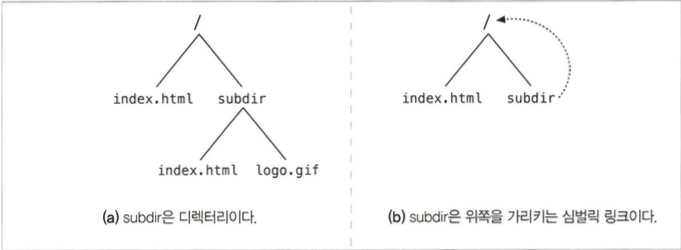
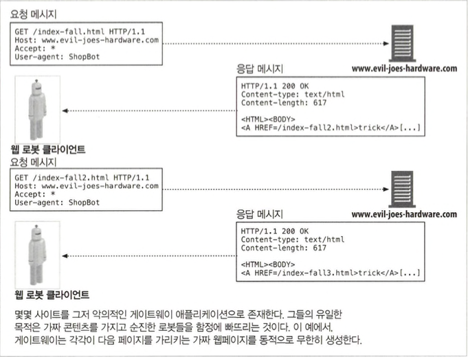
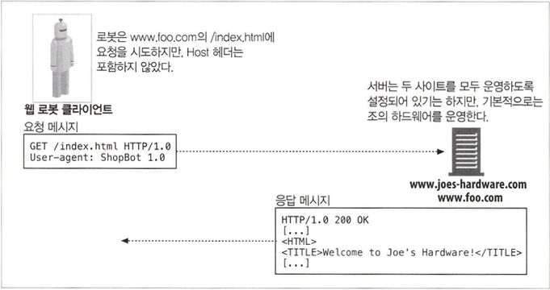
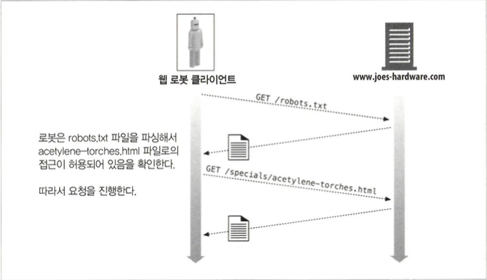
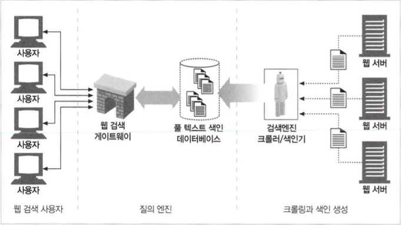
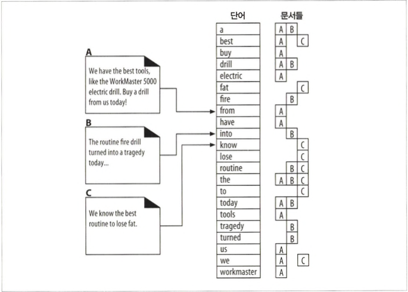

# 웹 로봇

- 웹 로봇은 사람과의 상호작용 없이 연속된 웹 트랜잭션들을 자동으로 수행하는 소프트웨어 프로그램으로 ‘크롤러’, ‘스파이더’, ‘웜’, ‘봇’ 등 각양각 색의 이름불립니다.

## 9.1 크롤러와 크롤링

- 웹 크롤러는, 먼저 웹페이지를 한 개 가져오고, 그 다음 그 페이지가 가리키는 모든 웹페이지를 가져오고, 다시 그 페이지들이 가리키는 모든 웹페이지들을 가져오는, 이러한 일을 재귀적으로 반복하는 방식으로 웹을 순회하는 로봇입니다.
- HTML 하이퍼링크 들로 만들어진 웹을 따라 기어다니기(crawl) 하기 때문에 크롤러 혹은 스파이더라고 부릅니다.

### 9.1.1 어디에서 시작하는가: ‘루트 집합’

- 크롤러가 방문을 시작하는 URL들의 초기 집합은 루트 집합(root set)이라고 부릅니다.
- 일반적으로 좋은 루트 집합은 크고 인기 있는 웹 사이트(http://www. yahoo.com 등)입니다.

### 9.1.2 링크 추출과 상대 링크 정상화

- 크롤러들은 간단한 HTML 파싱을 해서 이들 링 크들을 추출하고 상대 링크를 절대 링크로 변환할 필요가 있습니다.(2.상대 URL에 다룰 예정)

### 9.1.3 순환 피하기

- 루프나 순환에 빠지지 않도록 매우 조심해야합니다.

### 9.1.4 루프와 중복

- 같은 페이지들을 반복해서 가져오는데 모든 시간을 허비하고 이러한 크롤러가 네트워크 대역폭을 다 차지하고 그 어떤 페이지도 가져올 수 없게 되어버릴 수 있습니다.
- 크롤러가 같은 페이지를 반복해서 가져오면 고스란히 웹 서버의 부담이 됩니다.
- 비록 루프 자체가 문제가 되지 않더라도, 크롤러는 많은 수의 중복된 페이지들을 가져오게 되고 쓸모없게 만드는 중복된 콘텐츠로 넘쳐나게 됩니다.

### 9.1.5 빵 부스러기의 흔적

- 대규모 웹 크롤러가 그들이 방문한 곳을 관리하기 위해 사용하는 유용한 기법
  - 트리와 해시 테이블 : URL을 추적하기 위해 검색 트리나 해시 테이블을 사용하면 URL을 훨씬 빨리 찾아볼 수 있습니다.
  - 느슨한 존재 비트맵 : 공간 사용을 최소화하기 위해 비트 배열과 같은 느슨한 자료 구조를 사용합니다.
  - 체크포인트 : 중단될 경우를 대비해서 방문한 URL의 목록이 디스크 에 저장합니다.
  - 파티셔닝 : 몇몇 대규모 웹 로봇은, 각각이 분리된 한 대의 컴퓨터인 로봇들이 동시에 일하고 있는 ‘농장(farm)’을 이용합니다.

### 9.1.6 별칭(alias)과 로봇 순환

- 다른 URL들이 같은 리소스를 가리키게 되는 몇 가지 이유가 있습니다.
  - 기본 포트가 80번
  - %7F0| ~과 같을 때(이스케이프 문자열)
  - 태그에 따라 페이지가 바뀌 지 않을 때
  - 서버가 대소문자를 구분하지 않을 때
  - 기본 페이지가 index.html 일때
  - 도메인과 같은 아이피 주소

### 9.1.7 URL 정규화하기

- 웹 로봇은 URL를 정규화 시킵니다.
  - 80번 포트 추가
  - 이스케이프 문자열 치환
  - 태그 제거

### 9.1.8 파일 시스템 링크 순환

- 파일 시스템의 심벌릭 링크는 사실상 아무것도 존재하지 않으면서도 끝없이 깊어지는 디렉터리 계층을 만들 수 있기 때문에, 매우 교묘한 종류의 순환을 유발할 수 있습니다.



### 9.1.9 동적 가상 웹 공간



### 9.1.10 루프와 중복 피하기

- URL 정규화
- 너비 우선 크롤링

  방문할 URL들을 웹 사이트들 전체 에 걸쳐 너비 우선으로 스케줄링하면, 순환의 영향을 최 소화할 수 있습니다.

- 스로틀링

  일정 시간 동안 가져올 수 있는 페이지의 숫자를 제한합니다.

- URL 크기 제한

  로봇은 일정 길이(보통 1KB)를 넘는 URL의 크롤링은 거부할 수 있습니다.

- URL/사이트 블랙리스트

  문제를 일으키는 사이트나 URL이 발견될 때마다 이 블랙리스트에 추가합니다.

- 패턴 발견

  반복되는 구성요소를 가진 URL을 잠재적인 순환으로 보고, 둘 혹은 셋 이상의 반복된 구성요소를 갖고 있는 URL을 크롤링하는 것을 거절합니다.

- 콘텐츠 지문(fingerprint)

  콘텐츠 지문을 사용하는 로봇들은 페이지의 콘텐츠에서 몇 바이트 를 얻어내어 체크섬(checksum)을 계산하고 만약 로봇이 이전에 보았던 체크섬을 가진 페이지를 가져온다면, 그 페 이지의 링크는 크롤링하지 않습니다.

- 사람의 모니터링

  진단과 로깅을 포함하도록 설계하여 사람이 인지할 수 있게끔 합니다.

## 9.2 로봇의 HTTP

### 9.2.1 요청 헤더 식별하기

- 로봇 개발자들이 구현을 하도록 권장되는 기본적인 신원 식별 헤더들
  - User-Agent : 서버에게 요청을 만든 로봇의 이름을 알려줌
  - From : 로봇의 사용자/관리자의 이메일 주소를 제공
  - Accept : 서버에게 어떤 미디어 타입을 보내도 되는지 알려줌
  - Referer : 현재의 요청 URL을 포함한 문서의 URL을 제공

### 9.2.2 가상 호스팅



- 가상 호스팅이 널리 퍼져있는 현실에서 요청에 Host 헤더를 포함하지 않으면 로봇이 어떤 URL에 대해 잘못된 콘텐츠를 찾게 만듭니다.

### 9.2.3 조건부 요청

- 로봇은 시간이나 엔터티 태그를 비교함으로써 그들이 받아간 마지막 버전 이후에 업데이트 된 것이 있는지 알아보는 조건부 HTTP 요청을 구현할 수 있습니다. (HTTP 캐시와 유사함)

### 9.2.4 응답 다루기

- 단순히 GET 메서드로 콘텐츠를 요청해서 가져오는 것이기 때문에, 응답 다루기라고 부를 만한 일은 거의 하지 않지만 HTTP의 특정 몇몇 기능(조건부 요청과 같은)을 사용하는 로봇이나 웹 탐색이나 서버와 의 상호작용을 하려면 응답(상태 코드, 엔티티)을 다룰 수 있어야합니다.

## 9.3 부적절하게 동작하는 로봇들

- 폭주하는 로봇 : 로봇이 논리적인 에러를 갖고 있거나 순환에 빠졌다면 웹 서버에 극심한 부하를 줄 수 있습니다.
- 오래된 URL : 웹 사이트가 콘텐츠를 많이 바꿨다면 로봇들은 존재하지 않는 URL에 대한 요청 을 많이 보낼 수 있습니다. 이것은 에러 로그가 채워지거나, 에러 페이지를 제공하는 부하로 인해 웹 서버의 요청에 대한 수용 능력이 감소합니다.
- 길고 잘못된 URL : URL이 많이 길다면, 이는 웹 서버의 처리 능력에 영향을 주고, 웹 서버의 접근 로그를 어지럽게 채우고, 심지어 허술한 웹 서버라면 고 장을 일으킬 수도 있습니다.
- 호기심이 지나친 로봇 : 로봇이 명시적으로는 하이퍼링크가 존재하지도 않는 문서들을 디렉터리의 콘텐츠를 가져오는 둥의 방법으로 긁어올 때 가끔씩 일어날 수 있습니다.(이미 존재하는 하이퍼링크를 제거하는 것을 깜박한 경우 등)

## 9.4 로봇 차단하기



- 로봇의 접근을 제어하는 정보를 저장하는 파일인 `robots.txt`로 접근을 제어할 수 있습니다.

### 9.4.1 로봇 차단 표준

| version | 이름과 설명                                                                                               | 날짜        |
| ------- | --------------------------------------------------------------------------------------------------------- | ----------- |
| 0.0     | 로봇 배제 표준-Disallow 지시자를 지원하는 마틴코스터(MartijnKoster)의 오리지널 robots.txt 메커니즘        | 1994년6월   |
| 1.0     | 웹 로봇 제어 방법-Allow 지시자의 지원이 추가된 마틴 코스터의 IETF 초안                                    | 1996년 11월 |
| 2.0     | 로봇 차단을 위한 확장 표준정규식과 타이밍 정보를 포함한 숀 코너(Sean Conner)의 확장, 널리 지원되지는 않음 | 1996년 11월 |

### 9.4.2 웹 사이트와 robots.txt 파일들

- robots.txt 가져오기

  로봇은 웹 서버의 여느 파일들과 마찬가지로 HTTP GET 메서드를 이용해 robots, txt 리소스(text/plain)를 가져옵니다.

  ```
  GET /robots.txt HTTP/1.0
  Host: www.joes-hardware.com User-Agent: Slurp/2.0
  Date: Wed Oct 3 20:22:48 EST 2001
  ```

- 응답 코드

  로봇은 robots.txt의 검색 결과에 따라 다르게 동작하는데

  200 : 차단 규칙을 얻고 규칙을 준수함
  404 : 차단 규칙 이 존재하지 않는다고 가정하고 robots.txt의 제약 없이 그 사이트에 접근
  401 혹은 403 : 접근은 완전히 제한되어 있다고 가정
  503 : 리소스를 검색하는 것은 뒤로 미루어야 함
  3XX : 리소스가 발견될 때까지 리다이 렉트를 따라감

### 9.4.3 robots.txt 파일 포맷

```
# 이 robots.txt 파일은 Slurp과 Webcrawler가우리 사이트의 공개된
# 영역을 크홀링하는 것을 허락한다. 그러나 다른 로봇은 안 된다. . .

User-Agent: slurp
User-Agent: webcrawler
Disallow: /private
User-Agent: * Disallow:
```

- robots.txt 파일은 빈 줄, 주석 줄, 규칙 줄의 세 가지 종류로 이루어집니다.
- User-Agent 줄

  `User-Agent: <robot-name>` 이러하 형식으로 작성하며 HTTP GET 요청 안의 User- Agent 헤더를 통해 보내집니다.(와일드카드 사용가능)

- Disallow와 Allow 줄들

  특정 로봇에 대해 어떤 URL 경로가 명시적으로 금지되어 있고 명시적으로 허용되는지 기술합니다. 규칙 경로는 반드시 맞춰보고자 하는 경로의 대소문자를 구분하는 접두어여야합니다.

- Disallow/Allow 접두 매칭(prefix matching)

| 규칙 경로        | url 경로         | 매치여부 | 설명                                                               |
| ---------------- | ---------------- | -------- | ------------------------------------------------------------------ |
| /tmp             | /tmp             | O        | 규칙 경로 === url 경로                                             |
| /tmp             | /tmpfile.html    | O        | 규칙 경로가 URL 경로의 접두어                                      |
| /tmp             | /tmp/a.html      | O        | 규칙 경로가 URL 경로의 접두어다.                                   |
| /tmp/            | /tmp/            | X        | /tmp/는 /tmp의 접두어가 아님                                       |
|                  | README.TXT       | O        | 빈 문자열은 모든 것에 매치                                         |
| /~fred/hi.html   | %7Efred/hi.html  | O        | 이스케이프 문자열(%7 === ~)은 같은것으로 취급                      |
| /%7efred/hi.html | /%7Efred/hi.html | O        | 이스케이프 문자열은 대소문자 구분 안함                             |
| /~fred/hi.html   | ~fred%2다ii.html | X        | %2F는 빗금(/)이 맞긴 하지만, 빗금은 특별히 정확 하게 매치되어야 함 |

### 9.4.4 그 외에 알아둘 점

- robots.txt 파일은 User-Agent, Disallow, Allow 외의 다른 필드를 포함할 수 있지만 로봇이 이해하지 못하는 필드는 무시해야함
- 하위 호환성을 위해,한 줄을 여러줄로 나누어 적는 것은 허용 안됨
- 0.0은 Allow줄을 지원 하지 않음

### 9.4.5 robots.txt의 캐싱과 만료

- 많은 크롤러 제품들은 HTTP/1.1 클라이언트가 아니기에 캐시지시자를 이해하지 못할수 있습니다.
- 로봇 명세 초안은 Cache-Control 지시자가 존재하는 경우 7일간 캐싱하도록 하고 있습니다.

### 9.4.6 로봇 차단 펄 코드

- 펄코드를 이용해서 각각의 레코드에 다른 접근 정책을 적용할 수 있습니다.

### 9.4.7 HTML 로봇 제어 META 태그

- 로봇이 개별 페이지에 접근하는 것을 제한하는 좀 더 직접 적인 방법(로봇 차단 태그)을 갖고 있습니다.
- 로봇 차단 태그는 `<META NAME="R0B0TS" CONTENT=directive-list>`의 형식으로 작성합니다.
- 로봇 META 지시자
  - NOINDEX : 이 페이지를 처리하지 말고 무시하라고 지시
  - NOFOLLOW : 이 페이지가 링크한 페이지를 크롤링하지 말라고 지시
  - INDEX : 이 페이지의 콘텐츠를 인덱싱해도 된다고 지시
  - FOLLOW : 이 페이지가 링크한 페이지를 크롤링해도 된다고 지시
  - NOARCHIVE : 로컬 사본을 만들어서는 안 된다고 지시
  - ALL : INDEX, FOLLOW 둘다를 의미
  - NONE : NOINDEX, NOFOLLOW 둘다를 의미
- 로봇 META 태그는 다른 모든 HTML META 태그와 마찬가지로 반드시 HTML 페이지의 HEAD 섹션에 작성해야합니다.
- 검색엔진 META 태그

| name=         | content=    | 설명                                                                                                                           |
| ------------- | ----------- | ------------------------------------------------------------------------------------------------------------------------------ |
| DESCRIPTION   | 〈텍스트〉  | 저자가 웹페이지의 짧은 요약을 정의할 수 있게 해줌                                                                              |
| KEYWORDS      | <쉼표 목록> | 키워드 검색을 돕기 위한, 웹페이지를 기술하는 단어들의 쉼표로 구분                                                              |
| REVISIT-AFTER | <숫자 days> | 로봇이나 검색엔진에게, 이 페이지는 아마도 쉽게 변경될 것이기 때문에 지정된 만큼의 날짜가 지난 이후에 다시 방문해야 한다고 지시 |

## 9.5 로봇 에티켓

- 신원 식별

  - HTTP User-Agent 필드를 사용해서 웹 서버에게 로봇의 이름을 말하라.
  - 로봇이 DNS 엔트리를 가진 기계에서 실행된다는 것을 확실히해서, 웹 사이트가 로봇의 IP 주소를 호스트 명을 통해 역방향 DNS를 할 수 있도록 하라.
  - HTTP 폼 필드를 사용해서 연락할 수 있는 이메일 주소를 제공하라.

- 동작

  - 로봇이 충분히 노련해지기 전까지는 운영자들을 고용해서 로봇을 1년 365일 24시간 감시할 필요가 있다.
  - 조직은 네트워크 대역폭의 소비를 감시하길 원할 것이며 어떠한 문의에도 응할 준비가 되어있어야 한다.
  - 진단과 로깅 기능을 풍부하게 갖추어야 한다.
  - 매번 로봇을 조정하고 개선하여 흔한 함정에 빠지는 것을 피하라.

- 스스로를 제한하라.

  - 이해할 수 없거나 관심 없는 데이터를 참조하고 있는 것 같다면 그냥 무시하는 것이 좋다.
  - 동적인 게이트웨이로부터의 콘텐츠를 크롤링할 필요가 없다.
  - HTTP Accept 관련 헤더들을 이용해서 서버에게 어떤 콘텐츠를 이해할 수 있는지 말해주어야 한다.
  - robots.txt의 제어에 따라야 한다.
  - 웹사이트에 접근할 때마다 몇 번 접근했는지 세고,이 정보를 이용해서 특정 사이트에 너무 자주 방문하지 않도록 해야 한다.

- 루프와 중복을 견뎌내기, 그리고 그 외의 문제들

  - 모든 리다이렉트와 에러를 포함한 모든 HTTP 상태 코드 를 다룰 수 있도록 준비되어 있어야 한다.
  - 모든 URL을 표준화된 형식으로 정규화함으로써 같은 자원을 가리키는 중복된 URL 들을 제거하고자 노력하라.
  - 순환을 감지하고 피하기 위해 많은 노력을 하라.
  - 낯선 URL을 가진 웹 사이트에 대해 접근이 많다면 잘 감시해보라.
  - 함정, 사이클, 깨진 사이트, 로봇을 잡아두고 싶어 하는 사이트들을 블랙리스트에 추 가하고 다시는 방문하지 마라.

- 확장성

  - 풀고 있는 문제가 얼마나 큰지에 대해 미리 계산하라.
  - 얼마나 많은 네트워크 대역폭이 사용 가능한지, 그리고 요구되는 시간에 로봇 작업을 끝마치는데 얼마나 필요할지 이해하라.
  - 로봇이 작업을 끝내는데 얼마나 많은 시간이 필요한지 이해하고, 실제 소요된 시간이 추정한 것과 맞는지 간단히 검사해보라.
  - 분할 정복

- 신뢰성

  - 철저하게 테스트하라.
  - 체크포인트/재시작 기능을 처음부터 설계하라.
  - 실패에 대비하여 로봇을 실패가 발생했을 때도 계속 동작할 수 있도록 설계하라.

- 소통

  - 문의에 빠르게 응답할 수 있도록 준비해 두라.
  - 이해하라 -> 문의에 대해 이해하고 잘 설명해라라는 내용인데 그래도 말이 통하지 않는다면 블랙리스트의 등록해서 차단하라고 제시함...
  - 즉각 대응하라

## 9.6 검색엔진

### 9.6.1 넓게 생각하라

- 웹이 아직 초창기였을 때, 검색엔진들은 사용자들이 웹상에서 문서의 위치를 알아 내는 것을 돕는 상대적으로 단순한 데이터베이스였지만 현재는 웹이 진화하면서 좀 더 복잡해졌습니다.

### 9.6.2 현대적인 검색엔진의 아키텍처

- 오늘날 검색엔진들은 그들이 갖고 있는 전 세계의 웹페이지들에 대해 `풀 텍스트 색인(full-text indexes)`이라고 하는 복잡한 로컬 데이터베이스를 생성합니다.

### 9.6.3 풀 텍스트 색인



- 풀 텍스트 색인은 단어 하나를 입력받아 그 단어를 포함하고 있는 문서를 즉각 알 려줄 수 있는 데이터베이스입니다.



- full text index가 3개의 문서를 저장하는 모습입니다.

### 9.6.4 질의 보내기

- 브라우저는 질의 매개변수를 URL의 일부로 포함하는 GET 요청으로 번역합니다.
- 웹 서버는 이 질의를 받아서 검색 게이트웨이 애플리케이션에게 넘겨줍니다.
- 게이트웨이는 웹 서 버에게 문서의 목록을 결과로 돌려줍니다.
- 웹 서버는 이 결과를 사용자를 위한 HTML 페이지로 변환합니다.

### 9.6.5 검색 결과를 정렬하고 보여주기

- 질의의 결과를 확인하기 위해 검색엔진이 색인을 한번 사용했다면, 게이트웨이 애플리케이션은 그 결과를 이용해 최종 사용자를 위한 결과 페이지를 즉석에서 만들어 냅니다.

### 9.6.6 스푸핑

- 검색 결과에서 더 높은 순위를 차지하고자 가짜 페이지를 만들거나, 더 나아가서는 검색 엔진의 관련도 알고리즘을 더 잘 속일 수 있는, 특정 단어에 대한 가짜 페이지를 생성하는 게이트웨이 애플리케이션을 스푸핑이라고 합니다.
