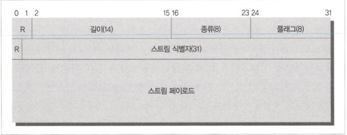

# HTTP/2.0

- HTTP/2.0은 2020년 9월부터 Google에서 사용하는 웹 크롤링 소프트웨어인 Googlebot이 HTTP/2를 통해 일부 웹사이트를 크롤링하기 시작했습니다

## 10.1 HTTP/2.0의 등장 배경

- 커넥션 하나를 통해 요청 하나를 보내고 그에 대해 응답 하나만을 받는 HTTP의 메시지 교환 방식은 단순함 면에서는 더할 나위 없었지만, 응답을 받아야만 그다음 요청을 보낼 수 있기 때문에 심각한 회전 지연(latency)을 피할 수 없었고 이름 해결하기 위해 병렬 커넥션이나 파이프라인 커넥션이 도입되었지만 성능 개선에 대한 근본적인 해결책은 되지 못했습니다.
- 구글의 SPDY를 적용하여 HTTP/2.0 개발이 시작되었습니다.

## 10.2 개요

- HTTP/2.0은 서버와 클라이언트 사이의 TCP 커넥션 위에서 동작한다. 이때 TCP 커넥션을 초기화하는 것은 클라이언트입니다.
- 프레임들에 담긴 요청과 응답은 스트림을 통해 보내지는데 한 개의 스트림이 한 쌍의 요청과 응답을 처리합니다. 하나의 커넥션 위에 여러 개의 스트림이 동시에 만들어질 수 있으므로, 여러 개의 요청과 응답을 동시에 처리하는 것 역시 가능합니다.
- HTTP/2.0은 요청을 명시적으로 받지 않더라도 능동적으로 클라이언트에게 보내줄 수 있는 기존의 요청-응답과는 약간 다른 새로운 상호작용 모델인 서버 푸시를 도입했습니다.
- 기존 웹 애플리케이션들과 호환성을 최대한 유지하기 위해 거의 유사하게 제공됩니다.

## 10.3 HTTP/1.1 과의 차이점

### 10.3.1 프레임

- HTTP/2.0에서 모든 메시지는 프레임에 담겨 전송됩니다.

- R: 예약된 2비트 필드. 값의 의미가 정의되어 있지 않으며, 반드시 0이어야 합니다. 받는 쪽에서는 이 값을 무시해야 합니다.
- 길이: 페이로드의 길이를 나타내는냅니다.
- 종류: 프레임의 종류
- 플래그: 플래그 값의 의미는 프레임의 종류에 따라 다릅니다.
- 스트림 식별자: 특별히 0은 커넥션 전체와 연관된 프레임임을 의미합니다.

### 10.3.2 스트림과 멀티플렉싱

- HTTP/2.0에서는 하나의 커넥션에 여러 개의 스트림이 동시에 열릴 수 있습니다.
- 스트림은 중요한 리소스에 대해 우선순위도 가질 수 있습니다.

### 10.3.3 헤더 압축

- HTTP/2.0에서는 HTTP 메시지의 헤더를 압축하여 전송합니다.

### 10.3.4 서버 푸시

- HTML 문서를 요청 받은 서버는 그 HTML 문서가 링크하고 있는 이미지, CSS 파일, 자바스크립트 파일 등의 리소스를 클라이언트에게 푸쉬할 수 있습니다.
- 리소스를 푸시하려는 서버는 먼저 클라이언트에게 자원을 푸시할 것임을 PUSH_PROMISE 프레임을 보내어 미리 알려주고 클라이언트가 PUSH_PROMISE 프레임을 받게 되면 해당 프레임의 스트림은 클라이언트 입장에서는 `예약됨` 상태가 됩니다. 이 상태에서 클라이언트는 RST_STREAM 프레임을 보내어 푸시 를 거절할 수 있고 RST_STREAM을 보내게 되면 그 스트림은 즉각 닫히게 됩니다.
- 스트림이 닫히기 전까지 클라이언트는 서버가 푸시하려고 하는 리소스를 요청해서는 안됩니다.
- 주의점
  - 서버 푸시를 사용하기로 했더라도, 중간의 프락시가 서버로부터 받은 추가 리소스 를 클라이언트에게 전달하지 않을 수 있으며, 반대로 아무런 추가 리소스를 서버 로부터 받지 않았음에도 클라이 언트에게 추가 리소스를 전달할 수도 있습니다.
  - 서버는 오직 안전하고, 캐시 가능하고, 본문을 포함하지 않은 요청에 대해서만 푸시를 할 수 있습니다.
  - 서버가 보내는 PUSH_PROMISE 프레임은 원 요청을 위해 만들어진 스트림을 통해 보내집니다.
  - 클라이언트는 반드시 서버가 푸시한 리소스를 동일 출처 정책에 따라 검사해야 합니다.
  - 서버 푸시를 끄고 싶다면 SETTINGS_ENABLE_PUSH을 0으로 설정 하면 됩니다.

## 10.4 알려진 보안 이슈

### 10.4.1 중개자 캡슐화 공격(Intermediary Encapsulation Attacks)

### 10.4.2 긴 커넥션 유지로 인한 개인정보 누출 우려
