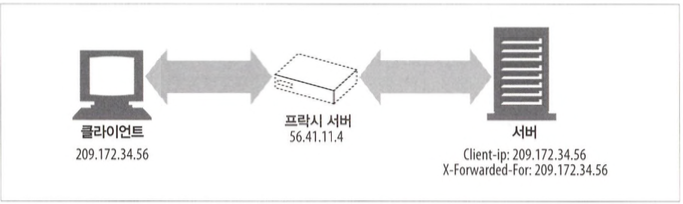
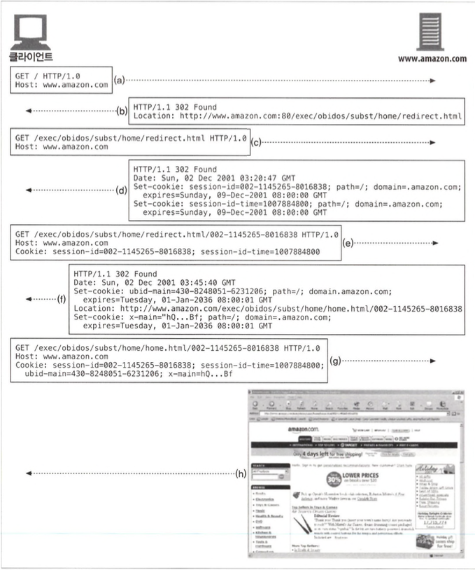

# 클라이언트 식별과 쿠키

## 개별 접촉

- 웹 서버는 요청을 보낸 사용자를 식별하거나 방문자가 보낸 연속적인 요청을 추적하기 위해 약간의 정보를 이용할 수 있습니다.
- 개별 인사

  온라인 쇼핑이 개인에게 맞춰져 있는 것처럼 느끼게 하려고 사용자에게 특화된 환영 메시지나 페이지 내용을 만듭니다.

- 사용자 맞춤 추천

  고객의 흥미가 무엇인지 학습해서 고객이 좋아할 것이라고 예상되 는 제품들을 추천할 수 있습니다.

- 저장된 사용자 정보

  한번 식별하고 나면, 쇼핑을 더 편하게 할 수 있게 저장된 사용자 정보를 사용할 수 있습니다.

- 세션 추적

  HTTP 트랜잭션은 상태가 없고 각 요청 및 응답은 독립적으로 일어나는데 많은 웹사이트에서 사용자가 사이트와 상호작용할 수 있게 사용자의 상태를 남깁니다.

- 식별기술들
  - 사용자 식별 관련 정보를 전달하는 HTTP 헤더들
  - 클라이언트 IP 주소 추적으로 알아낸 IP 주소로 사용자를 식별
  - 사용자 로그인 인증을 통한 사용자 식별
  - URL에 식별자를 포함하는 기술인 뚱뚱한(fat) URL
  - 식별 정보를 지속해서 유지하는 강력하면서도 효율적인 기술인 쿠키

## 11.2 HTTP 헤더

| 헤더 이름       | 헤더 타입  | 설명                                     |
| --------------- | ---------- | ---------------------------------------- |
| From            | 요청       | 사용자의 이메일 주소                     |
| User-Agent      | 요청       | 사용자의 브라우저                        |
| Referer         | 요청       | 사용자가 현재 링크를 타고 온 근원 페이지 |
| Authorization   | 요청       | 사용자 이름과 비밀번호(뒤에서 다룸)      |
| Client-ip       | 확장(요청) | 클라이언트의 IP 주소(뒤에서 다룸)        |
| X-Forwarded-For | 확장(요청) | 클라이언트의 IP 주소(뒤에서 다룸)        |
| Cookie          | 확장(요청) | 서버가 생성한 ID 라벨(뒤에서 다룸)       |

## 11.3 클라이언트 IP 주소



- 아직도 세션 간에 사용자를 추적하려고 클라이언트 IP 주소를 사용하는 웹사이트가 있지만, 이 방식은 제대로 동작하지 않기 때문에 사용하지 않는것이 좋습니다.
- 보안 기능으로 IP 주소를 사용하여, 특정 IP 주소로부터 오는 사용자에게만 문서 를 전달하기도 하는데 인터넷에서 IP주소를 임의로 변경가능하기에 문제가 발생할 수 있습니다.

## 11.4 사용자 로그인

- 웹 서버는 사용자가 식별을 위해 IP 주소에만 의존하는 대신 WWW-Authenticate Authorization 헤더를 사용하여 사용자 이름과 암호를 제공하여 자신을 인증하도록 요구할 수 있습니다.
- 사용자가 성공적으로 로그인하면 브라우저는 웹 사이트에 대한 후속 요청에 로그인 정보를 포함하여 서버가 사용자의 신원을 확인할 수 있습니다.
- 사용자에게 로그인을 요청하기 위해 서버는 브라우저에 HTTP 401 로그인 필요 응답 코드를 보낼 수 있습니다.

## 11.5 뚱뚱한 URL

- URL에 특정 정보를 포함하여 사용자를 추적하고 식별할 수 있습니다.
- URL 경로의 시작 또는 끝에 상태 정보를 추가하여 웹 서버가 사용자가 사이트를 탐색할 때 사용자의 현재 상태를 유지할 수 있도록 합니다.
- 뚱뚱한 URL에는 몇가지 문제가 있습니다.

  - 못생긴 URL : 브라우저에 보이는 뚱뚱한 URL은 새로운 사용자들에게 혼란을 준다.
  - 공유하지 못하는 URL : 뚱뚱한 URL은 특정 사용자와 세션에 대한 상태 정보를 포함한다. 만약 그 주소를 누군가에게 메일로 보내면, 당신의 누적된 개인 정보를 본의 아니게 공유하게 되는 것이다.
  - 캐시를 사용할 수 없음 : URG 만드는 것은, URL이 달라지기 때문에 기존 캐시에 접근할 수 없다.
  - 서버 부하 가중 : 서버는 뚱뚱한 URL에 해당하는 HTML 페이지를 다시 그려야 한다.
  - 이탈 : 사전에 세션 정보가 추가된 링크만을 사용해야 뚱뚱한 URL이 문제없이 동작할 수 있다. 이탈 시 진척사항들이 초기화 되어버림
  - 세션 간 지속성의 부재 : 특정 뚱뚱한 URL을 북마킹하지 않는 이상, 로그아웃하면 모든 정보를 잃는다.

## 11.6 쿠키

### 11.6.1 쿠키의 타입

- 쿠키는 크게 세션 쿠키(session cookie)와 지속 쿠키(persistent cookie) 두 가지 타 입으로 나눌 수 있습니다.
- 세션 쿠키는 사용자가 사이트를 탐색할 때, 관련한 설정과 선 호 사항들을 저장하는 임시 쿠키, 사용자가 브라우저를 닫으면 삭제
- 지속 쿠키는 삭제되지 않고 더 길게 유지될 수 있고 디스크에 저장, 브라우저를 닫거나 컴퓨터를 재시작하더라도 남아있음

### 11.6.2 쿠키는 어떻게 동작하는가

- 브라우저는 서버로 온 Set-Cookie 혹은 Set-Cookie2 헤더에 있는 쿠키 콘텐츠를 브 라우저 쿠키 데이터베이스에 저장합니다.

### 11.6.3 쿠키 상자: 클라이언트 측 상태

- 브라우저는 쿠키 정 보를 저장할 책임이 있는데, 이 시스템을 ‘클라이언트 측 상태’라고 하며 쿠키 명세에서의 공식적인 이름은 HTTP 상태 관리 체계(HTTP State Management Mechanism)입니다.

- 구글 크롬 쿠키

  구글 크롬은 Cookies라는 SQLite 파일에 쿠키를 저장합니다. 이 SQLite 파일에 있는 각 행이 쿠키 한 개에 해당하며, 총 13개의 필드가 있습니다.

  Cookies 필드

  - creation_utc : 쿠키가 생성된 시점
  - host_key : 쿠키의 도메인
  - name : 쿠키의 이름
  - value : 쿠키의 값
  - path : 쿠키와 관련된 도메 인에 있는 경로
  - expire_utc : 쿠키의 파기 시점
  - secure : 이 쿠키를 SSL 커넥션일 경우에만 보낼지를 가르킵니다.

### 11.6.4 사이트마다 각기 다른 쿠키들

- 브라우저는 수백 수천 개의 쿠키를 가지고 있을 수 있지만, 그렇다고 브라우저가 성능,보안 문제로 쿠키 전부를 모든 사이트에 보내지는 않습니다.
- 쿠키 Domain 속성

  쿠키를 생성할 때 Set-Cookie 응답 헤더에 Domain 속성을 기술해서 어떤 사이트가 그 쿠키를 읽을 수 있는지 제어할 수 있습니다.
  `Set-cookie: user=,,mary!7"; domain="airtravelbargains.com"`

- 쿠키 Path 속성

  웹 사이트 일부에만 쿠키를 적용할 수도 있도록 합니다.
  `Set-cookie: pref=c아npact; domain="airtravelbargains.com"; path=/autos/`

### 11.6.5 쿠키 구성요소

- Version 0 쿠키, Version 1쿠키(‘RFC 2965’)가 있는데 요즘에는 Version 1 쿠키를 많이 사용합니다. 현재는 추가 보안기능이 탑재된 Version 2 쿠키도 있음

### 11.6.6 Version 0(넷스케이프) 쿠키

- 최초의 쿠키 명세는 넷스케이프가 정의

### 11.6.7 Version 1 (RFC 2965) 쿠키

- Version 1 표준은 Set-Cookie2와 Cookie2 헤더를 소개하고 있으며 Version 0 시스템과도 호환됩니다.
- 쿠키마다 그 목적을 설명하는 설명문이 있음
- 파기 주기에 상관없이 브라우저가 닫히면 쿠키를 강제로 삭제할 수 있음
- 절대 날짜값 대신에 초단위의 상대값으로 쿠키의 생명주기를 결정할 수 있는 Max-Age
- 단순히 도메인과 경로뿐 아니라 URL의 포트번호로도 쿠키를 제어할 수 있음
- 도메인, 포트, 경로 필터가 있으면 Cookie 헤더에 담겨 되돌려 보냄
- 호환되는 버전 번호
- 사용자 이름과 추가적인 키워드를 구별하기 위해 Cookie 헤더에 $ 접두어
- Version 1 Cookie 헤더

  ```
  Set-Cookie2: ID="29046"; Domain=".j oes-hardwa re.com"
  Set-Cookie2: color=blue
  Set-Cookie2: support-pref="L2"; Domain#"customer-care.j oes-hardware.com" Set-Cookie2: Coupon=,,hammer027,,; Version="l”; Path=,7tools‘,
  Set-Cookie2: Coupon="handvacl03"; Version="l"; Path-'/tools/cordless"
  ```

  를 서버로 부터 받으면

  ```
  Cookie: $Version="l";
  ID="29046"; $Domain=".joes-hardware.com"; color="blue";
  Coupon스 ,hammer027"; $Path="/tools"; Coupon="handvacl03"; $Path="/tools/cordless"
  ```

  현재의 웹 사이트에 들어맞는 필터 정보에 달러 문자($)를 붙여서 쿠키와 함께 전송합니다.

- 만약 서버가 새로운 형식의 쿠키를 인식하면, Cookie2 헤더를 받고나서 Set-Cookie2(Set-Cookie가 아닌) 응답 헤더를 보내야 합니다. 만약 클라이 언트가 같은 쿠키를 Set-Cookie와 Set-Cookie2 헤더에 기술해서 모두 보내면, 이전 방식인 Set-Cookie 헤더를 무시합니다.

### 11.6.8 쿠키와 세션 추적



### 11.6.9 쿠키와 캐싱

- 캐시를 다루는 기본 원칙

  - 캐시되지 말아야 할 문서가 있다면 표시하라
  - Set-Cookie 헤더를 캐시하는 것에 유의하라
  - Cookie 헤더를 가지고 있는 요청을 주의하라

### 11.6.10 쿠키, 보안 그리고 개인정보

- 쿠키를 비활성화하고 로그 분석과 같은 대체 방법을 활용하면 쿠키와 관련된 잠재적인 보안 위험을 완화할 수 있습니다.
- 개인 정보를 원격 데이터베이스에 저장하고 쿠키를 사용하여 키 값을 저장하면 클라이언트와 서버 간의 민감한 데이터 교환을 최소화할 수 있습니다. 다만, 개인정보를 취급하거나 사용자를 추적하는 기술은 악용될 수 있습니다.
