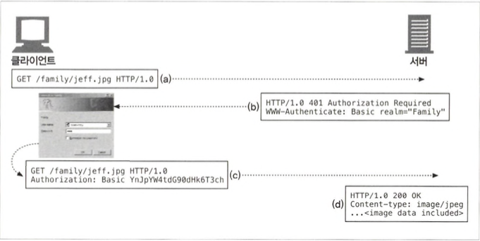

# 기본 인증

## 12.1 인증

- 인증은 당신이 누구인지 증명하는 것입니다.

### 12.1.1 HTTP의 인증요구/응답 프레임워크

### 12.1.2 인증 프로토콜과 헤더

1. 서버가 사용자에게 인증요구를 보낼 때, 서버는 401 Unauthorized 응답과 함께 WWW-Authenticate 헤더를 기술해서 어디서 어떻게 인증할지 설명합니다.
2. 클라이언트가 서버로 인증하려면, 코딩된 비밀번호와 그 외 인증 파라 미터들을 Authorization 헤더에 담아서 요청을 다시 보냅니다.
3. 인증이 성공하면 서버는 200 OK를 반환하며, 추가적인 정보를 Authentication-Info헤더에 기술할 수 있다

### 12.1.3 보안 영역

- 웹 서버는 기밀문서를 보안 영역(realm) 그룹으로 나눕니다. 보안 영역은 저마다 다른 사용자 권한을 요구한다.

## 12.2 기본 인증

- 기본인증은 가장 잘 알려진 HTTP 인증규약입니다.

### 12.2.1 기본 인증의 예

### 12.2.2 Base-64 사용자 이름/비밀번호 인코딩

- HTTP 기본 인증은 사용자 이름과 비밀번호를 콜론으로 이어서 합치고, base-64 인코딩 메서드를 사용해 인코딩합니다.

### 12.2.3 프락시 인증

- 사용자들이 회사의 서버 나 LAN이나 무선 네트워크에 접근하기 전에 프락시 서버를 거치게 하여 사용자를 인증할 수 있습니다.

## 12.3 기본 인증의 보안 결함

- 기본 인증의 인코딩된 비밀번호는 쉽게 디코딩 할 수 있기 때문에 HTTP트랜잭션을 SSL암호화 채널을 통해 보내거나, 보안이 더 강화된 다이제스트 인증 같은 프로토콜을 사용하는 것이 좋습니다.
- 인코딩된 비밀번호를 탈취해서 원 서버에 보내서 인증에 성공하고 서버에 접근할 수 있습니다.
- 사용자는 보통 아이디,비밀번호를 여러 사이트에 사용하므로 악의적인 누군가가 무료 인터넷 이메일 같은 사이트에서 인증정보를 캡처해서 은행사이트 등으로 접근할 수 있습니다.
- 트랜잭션의 본래 의도를 바꿔버리는 프락시나 중개자가 중간에 개입하는 경우 기본 인증이 정상적으로 동작하지 않을 수 있습니다.
- 기본인증은 가짜 서버의 위장에 취약합니다.
