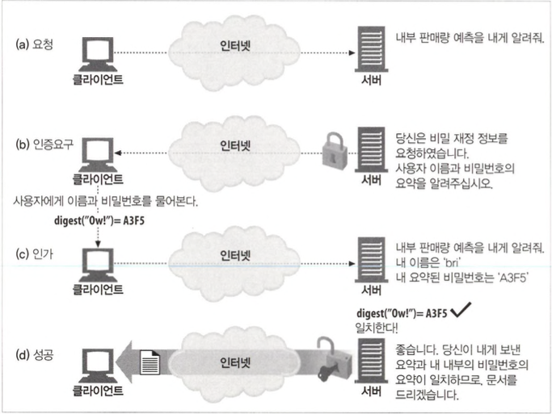
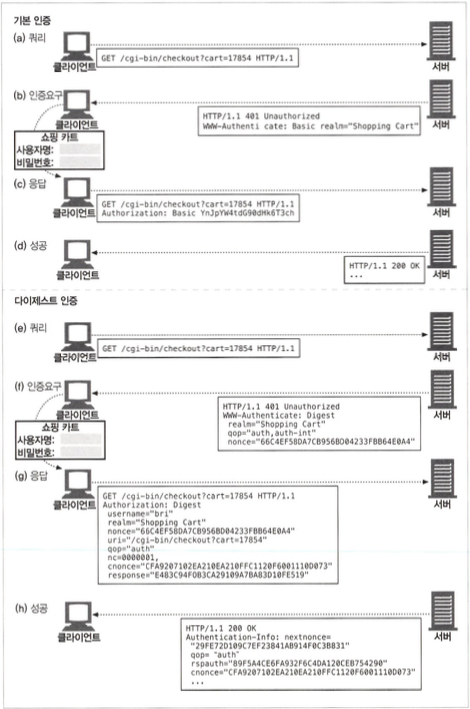
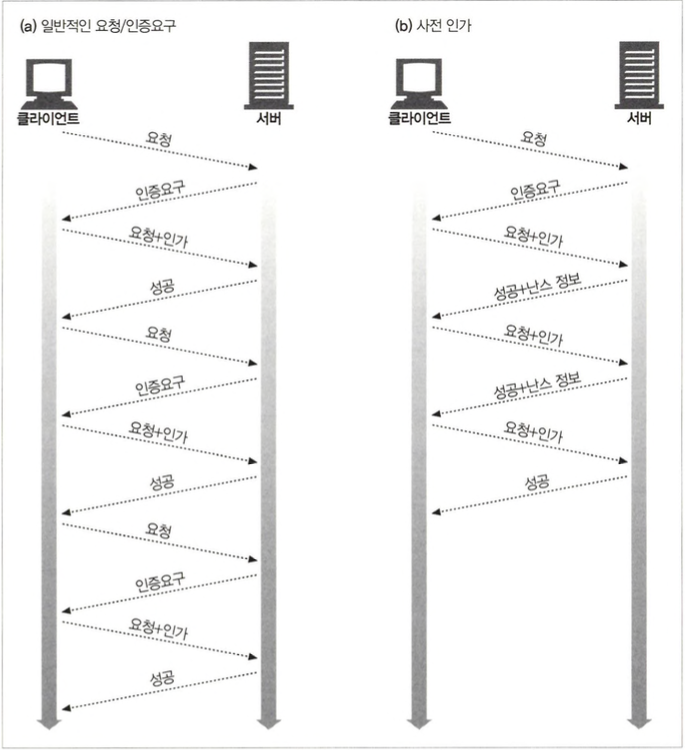

# 다이제스트 인증

## 13.1 다이제스트 인증의 개선점

- 다이제스트 인증은기본인증의 가장 심각한 결함을 수정한 또 다른 HTTP 인증 프로토콜입니다.
  - 비밀번호를 절대로 네트워크를 통해 평문으로 전송X
  - 인증 체결을 가로채서 재현하려는 악의적인 사람들을 차단
  - 구현하기에 따라서, 메시지 내용 위조 방지
  - 그 외 몇몇 잘 알려진 형태의 공격을 막을 수 있습니다.

### 13.1.1 비밀번호를 안전하게 지키기 위해 요약 사용하기



### 13.1.2 단방향 요약

- 요약은 정보 본문의 압축으로 입력 가능한 무한 가지의 모든 입력값들을 유한한 범위의 압축으로 변환합니다.
- 요약 함수는 암호 체크섬으로 불리며 단방향 해시함수이거나 지문 함수입니다.

### 13.1.3 재전송 방지를 위한 난스(nonce) 사용

- 난스는 WWW-Authenticate 인증요구에 담겨서 서버에서 클 라이언트로 넘겨지는 증표(대략 1밀리초마다, 혹은 인증할 때마다 변경)입니다.

### 13.1.4 다이제스트 인증 핸드셰이크



## 13.2 요약 계산

### 13.2.1 요약 알고리즘 입력 데이터

- 세 요소로 계산됩니다.
  - 단방향 해시 함수 H(d)와 요약 함수 KD(s,d) : `s` scecret, `d`는 데이터
  - 비밀번호등 보안 정보를담고 있는 데이터 덩어리. A1
  - 요청 메시지의 비밀이 아닌 속성을 담고 있는 데이터 덩어리. A2
- Al, A2 두 조각의 데이터는 요약을 생성하기 위해 日와 쪼에 의해 처리됩니다.

### 13.2.2 H(d)와 KD(s,d) 알고리즘

- H 함수는 데이터의 MD5(RFC 2617에서 제안된 알고리즘)를 계산하 고, KD 요약 함수는 콜론으로 연결된 비밀 데이터와 일반 데이터의 MD5를 계산합니다.

```
H(<데이터>) = MD5(<데이터>)
KD(<비밀>,<데이터>) = H(연결(<비밀>:<데이터>))
```

### 13.2.3 보안 관련 데이터 (A1)

- Al은H,KD,A2와 마찬가지로 요약을 계산하기 위해 사용됩니다.
- A1을 계산할 수 있는 두가지 방법

  - MD5 : 모든 요청마다 단방향 해시를 실행하며 A1은 사용자 이름, 영역, 비밀번호를 콜론 으로 연결한 것입니다.

  `A1 =〈사용자〉:〈영역〉:〈비밀번호〉`

  - MD5-sess : 사용자 이름, 영역, 비밀번호에 대한 해시를 계산한 결과 뒤에 현재 난스와 클라이언트 난스(c난스)를 붙인 것이 A1이 됩니다.

  `A1 = MD5(〈사용자〉:〈영역〉:〈비밀번호〉):〈난스〉:〈c난스〉`

### 13.2.4 메시지 관련 데이터 (A2)

- URL, 요청 메서드, 메시지 엔터티 본문과 같은 메시 지 자체의 정보를 나타냅니다.
- A2는 H, KD, A1과 마찬가지로 요약을 계산하기 위해 사용됩니다.
- 선택된 보호 수준(quality of protection, qop)에 따른 두 가지 사용법
  - HTTP 요청 메서드와 URL만 포함
  - 메시지 엔터티 본문을 추가

### 13.2.5 요약 알고리즘 전반

| qop                | 요약알고리즘                                     | 비고                         |
| ------------------ | ------------------------------------------------ | ---------------------------- |
| -                  | KD(H(A1),〈난스〉:H(A2))                         | 없어질 예정이다(Deprecated). |
| auth 혹은 auth-int | KD(H(A1),〈난스〉: <nc>:〈c난스〉: <qop> :H(A2)) | 이 방법이 선호된다.          |

### 13.2.6 다이제스트 인증 세션

- nonce가 만료되면, 서버는 새로운 nonce 값과 함께 "stale=true"를 사용하여 인증을 다시 보내라고 요청합니다.

### 13.2.7 사전(preemptive) 인가



- 사전 인가 단계

  1. 서버가 다음 난스를 Authentication-Info 성공 헤더에 담아서 미리 보낸다.
  2. 서버가 짧은 시간 동안 같은 난스를 재사용하는 것을 허용한다.
  3. 클라이언트와 서버가 동기화되어 있고 예측 가능한 난스 생성 알고리즘을 사용한다.

### 13.2.8 난스 선택

- RFC 2617가 제안한 난스 공식

  ```
    BASE64(타임스탬프H(타임스탬프":H ETag H:H 개인키))
  ```

  - 타임 스태프는 서버에서 생성된 시간 혹은 아무것이나 반복 불가능한 값
  - ETag는 요청된 엔터티에 대한 ETag 헤더값
  - 개인 키는 서버만이 알고 있는 값

### 13.2.9 상호 인증

- RFC 2617은 다이제스트 인증을 서버의 인증도 허용하도록 확장되었는데 클라이언트 nonce 값을 제공하여 서버가 공유된 비밀 정보를 기반으로 올바른 응답 다이제스트를 생성할 수 있습니다.

## 13.3 보호 수준(Quality of Protection) 향상

- qop 필드는 클라이언트와 서버가 어떤 보호 기법을 어느 정도 수준으로 사용할 것인지 협상할 수 있게 해줍니다.

### 13.3.1 메시지 무결성 보호

- 무결성 보호가 적용되었을 때(qop= “auth-int”) 계산되는 H(엔터티 본문)는, 메시지 본문의 해시가 아닌 엔터티 본문의 해시입니다.

### 13.3.2 다이제스트 인증 헤더

- 기본인증, 다이제스트인증 모두 WWW-Authenticate 헤더나 Authorization 헤더가 포함되는데 다이제스트 인증은 Authentication-Info 헤더를 추가할 수 있습니다.

## 13.4 실제 상황에 대한 고려

### 13.4.1 다중인증요구

- 서버는 기본 인증을 제한적으로 사용해야 하며, 관리자는 다른 수준의 보안을 가진 여러 시스템에서 동일한 비밀번호를 사용하는 위험에 대해 사용자에게 경고해야 합니다.

### 13.4.2 오류 처리

- 값이 적절하지 않거나 요구된 지시자가 없을경우 `401`이 아닌 `400`이 적절합니다.

### 13.4.3 보호 공간(Protection Space)

- 보호 공간은 어떤 자격이 자동으로 적용되는 영역을 결정하는데 이전 요청이 인가 되면, 같은 자격은 인증 제도, 매개변수, 사용자 설정 중 한 가지 이상에 의해 정해 진 시간 동안 재사용 될 수 있습니다.

### 13.4.4 URI 다시 쓰기

- 프락시는 가리키는 리소스의 변경 없이 구문만 고쳐서 URI를 다 시 쓰기도 합니다.
  - 호스트 명은 정규화되거나 IP 주소로 대체될 수 있다.
  - 문자들은 “%” escape 형식으로 대체될 수 있다.
  - 특정 원 서버로부터 가져오는 리소스에 영향을 주지 않는, 타입에 대한 추가 속성이 URI의 끝에 붙거나 중간에 삽입될 수 있다.

### 13.4.5 캐시

- 어떤 공유 캐시가 Authorization 헤더를 포함한 요청과 그에 대한 응답을 받은 경우, “must-revalidate” Cache-Control,“public” Cache-Control 지시자 중 하나가 응답에 존재하지 않는 한 다른 요청 에 대해 그 웅답을 반환해서는 안됩니다.

## 13.5 보안에 대한 고려사항

### 13.5.1 헤더 부당 변경

- 다이제스트 인증은 쉽게 조작할 수 없는 인증 제도를 제공하는 것에 초점을 맞추고 있으나 반드시 그 보호를 데이터에까지 확장하는 것은 아니며 보호 수준에 대한 정보는 WWW-Authenticate와 Authorization 헤더 에만 담겨 있습니다.

### 13.5.2 재전송 공격

- 재전송 공격을 완전히 피할 수 있는 한 방법은 매 트랜잭션마다 유일한 난스 값 을 사용하는 것입니다.

### 13.5.3 다중 인증 메커니즘

- 가장 강력한 인 증 제도만을 유지하는 프락시 서버를 사용하면 다중 인증 제도를 지원하기 용이합니다.

### 13.5.4 사전(dictionary) 공격

- 크래킹하기 어렵도록 상대적으로 복잡한 비밀번 호를 사용하는 것과 괜찮은 비밀번호 만료 정책을 세워서 사전 공격을 방지할 수 있습니다.

### 13.5.5 악의적인 프락시와 중간자 공격(Man-in-the-Mid세e Attack)

- 중간자 공격은 SSL을 사용하여 방지할수 있습니다.

### 13.5.6 선택 평문 공격

- 미리 계산된 사전 공격

  난스와 자주 쓰이는 비밀번호들로 웅답의 집합을 생성하고 사전을 만들고 공격 서버/프락시는 트래픽을 차단하고 미 리 결정된 난스를 클라이언트로 전송하기 시작합니다. 클라이언트로부터 응답을 받을 때, 공격자는 대응되는 항목을 생성한 사전에서 찾는다면 특정 사용자의 비밀번호를 알 수 있게 됩니다.

- 자동화된 무차별 대입 공격

  많은 컴퓨터를 동원해 주어진 범위에서 가능한 모든 비 밀번호를 열거하여 맞는 공격입니다. 서버에서 제공된 난스 대신 선택적인 C난스 지시자를 사용하여 응답을 생성할 수 있도록 설정하면 방어할 수 있습니다.

### 13.5.7 비밀번호저장

- 유닉스 장치의 전통적인 비밀번호 파일과는 달리, 다이제스트 인증 비밀번호 파 일이 유출되면 영역의 모든 문서는 즉각 공격자에게 노출됩니다.
- 방지하기 위한 방법은

  - 비밀번호 파일이 평문으로 된 비밀번호를 포함하고 있다고 생각하고 안전하게 보호한다.
  - 영역 이름이 유일함을 보장하며, 비밀번호 파일이 유출되더라도 피해를 특정 영 역으로 국소화한다. 호스트와 도메인을 포함한 완전한 영역 이름은 이 요구를 만족한다.
