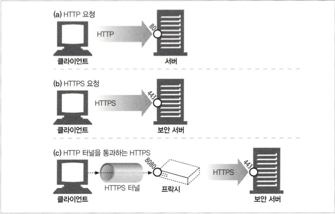

# 보안 HTTP

## 14.1 HTTP를 안전하게 만들기

- HTTP 보안 기술
  - 서버 인증
  - 클라이언트 인증
  - 무결성
  - 암호화
  - 효율
  - 편재성
  - 관리상 확장성
  - 적응성
  - 사회적 생존성

### 14.1.1 HTTPS

- HTTPS를 사용할 때, 모든 HTTP 요청과 응답 데이터는 네트워크로 보내지기 전 에 암호화됩니다.
- 보안 계층은 안전 소켓 계층(Secure Sockets Layer, SSL) 혹은 그를 계승한 전송 계층 보안(Transport Layer Security, TLS)을 이용하여 구현됩니다.


## 14.2 디지털 암호학

- 암호 : 텍스트를 아무나 읽지 못하도록 인코딩하는 알고리즘
- 키 : 암호의 동작을 변경하는 숫자로 된 매개변수
- 대칭키 암호 체계 : 인코딩과 디코딩에 같은 키를 사용하는 알고리즘
- 비대칭키 암호 체계 : 인코딩과 디코딩 에 다른 키를 사용하는 알고리즘
- 공개키 암호법 : 비밀 메시지를 전달하는 수백만 대의 컴퓨터를 쉽게 만들 수 있는 시스템
- 디지털 서명 : 메시지가 위조 혹은 변조되지 않았음을 입증하는 체크섬
- 디지털 인증서 : 신뢰할 만한 조직에 의해 서명되고 검증된 신원 확인 정보

### 14.2.1 비밀코드의기술과 과학

### 14.2.2 암호(cipher)

### 14.2.3 암호 기계

### 14.2.4 키가 있는 암호

### 14.2.5 디지털 암호

## 14.3 대칭키 암호법

- 대칭키 암호에서, 발송자와 수신자 모두 통신을 위해 비밀 키 k를 똑같이 공유할 필요가 있습니다.
- 대칭키 암호 알고리즘으로는 DES, Triple-DES, RC2, RC4 등이 있습니다.

### 14.3.1 키 길이와 열거 공격(Enumeration Attack)

- 무차별로 모든 키 값 을 대입해보는 공격을 열거 공격이라고 합니다.
- 대칭키 암호화의 경우 128비트 정도면 강력하다고 할 수 있습니다.

### 14.3.2 공유키 발급하기

- 대칭키 암호의 단점 중 하나는 발송자와 수신자가 서로 대화하려면 둘 다 공유키를 가져야 한다는 것입니다.

## 14.4 공개키 암호법

- 공개키 암호 방식은 호스트의 메시지를 인코딩하기 위한 키(공갸키), 그 호스트의 메시지를 디코딩하기 위한 키(비밀키)로 두 개의 비대칭 키를 사용합니다.

### 14.4.1 RSA

- 공개키 암호 체계 중 유명한 RSA 알고리즘이 있습니다.

### 14.4.2 혼성 암호 체계와 세션 키

- 공개키 암호 방식의 알고리즘은 계산이 느려서 노드들 사이의 안전한 의사소통 채널을 수립할 때는 편리하게 공개 키 암호를 사용하고 이렇게 만들어진 안전한 채 널을 통해 임시의 무작위 대칭 키를 생성하고 교환하여 이후의 나머지 데이터를 암호화할 때는 빠른 대 칭 키를 사용하는 방식을 사용합니다.

## 14.5 디지털 서명

### 14.5.1 서명은 암호 체크섬이다

- 디지털 서명은 메시지에 붙어있는특별한 암호 체크섬입니다.
- 서명은 메시지를 작성한 저자가 누군지 알려줍니다.
- 서명은 메시지 위조를 방지합니다.
- 디지털 서명은 보통 비대칭 공개키에 의해 생성되는데 개인 키는 오직 소유자만이 알고 있기 때문에, 저자의 개인 키는 일종의 ‘지문’처럼 사용됩니다.


## 14.6 디지털 인증서

- 디지털 인증서(흔히 ‘certs’라고 불리는)는 신뢰할 수 있는 기관으로부터 보증 받은 사용자나 회사에 대한 정보를 담고 있습니다.

### 14.6.1 인증서의 내부

- 대상의 이름
- 유효 기간
- 인증서 발급자
- 인증서 발급자의 디지털 서명

### 14.6.2 X.509 v3 인증서

- 디지털 인증서에 대한 전 세계적인 단일 표준은 없고 모든 인쇄된 ID 카드가 같은 위치에 같은 정보를 담고 있지 않은 것처럼, 여러 가지 미묘하게 다른 스 타일의 디지털 인중서들이 존재합니다.

### 14.6.3 서버 인증을 위해 인증서 사용하기

- 사용자가 HTFPS를 통한 안전한 웹 트랜잭션을 시작할 때, 최신 브라우저는 자동 으로 접속한 서버에서 디지털 인증서를 가져오는데 서버가 인증서를 갖고 있지 않다면, 보안 커넥션은 실패합니다.

- 서버 인증서 필드
  - 웹사이트의 이름과 호스트명
  - 웹 사이트의 공개키
  - 서명 기관의 이름
  - 서명 기관의 서명

## 14.7 HTTPS의 세부사항

### 14.7.1 HTTPS 개요

- HTTPS는 HTTP 메시지를 TCP로 보내기 전에 번저 그것들을 암호화하는 보안 계층으로 보냅니다.

### 14.7.2 HTTPS 스킴

- 보안이 없는 일반적인 http
  - URL 스킴 `http`
  - 클라이언트는 서버에 80번(기본값) 포트로 연결하고 평범한 HTTP 명령을 전송
- 보안이 되는 https
  - URL 스킴 `https`
  - 클라이언트는 서버에 443번(기본값) 포트 로 연결하고 서버와 바이너리 포맷으로 된 몇몇 SSL 보안 매개변수를 교환하면서 ‘핸드셰이크’를 하고, 암호화된 HTTP 명령으로 요청



### 14.7.3 보안 전송 셋업


### 14.7.4 SSL 핸드셰이크

- 핸드쉐이크에서 일어나는 일
  - 프로토콜 버전 번호 교환
  - 양쪽이 알고 있는 암호 선택
  - 양쪽의 신원을 인증
  - 채널을 암호화하기 위한 임시 세션키 생성


### 14.7.5 서버 인증서

- 서버 인증서는 항상 안전한 HTTPS 트랜잭션에 필요하고 사용자에게 서버의 신뢰성을 보장합니다. 그러나 현재는 웹 브라우징에서 클라이언트 인증서 사용이 드물며 대부분의 웹 서버에서도 클라이언트 인증을 요구하지 않습니다.

### 14.7.6 사이트 인증서 검사

- 날짜 검사
- 서명자 신뢰도 검사
- 서명 검사
- 사이트 신원 검사

### 14.7.7 가상 호스팅과 인증서

- 사용자가 인증서의 이름과 정확히 맞지 않는 가상 호스트 명에 도착했다면 경고 상자가 나타납니다. 따라서 리다이렉트하는 방식으로 구현해야합니다.

## 14.8 진짜 HTTPS 클라이언트

### 14.8.1 OpenSSL

- OpenSSL은 SSL과 TLS의 가장 인기 있는 오픈 소스입니다.

### 14.8.2 간단한 HTTPS 클라이언트

### 14.8.3 우리의 단순한 OpenSSL 클라이언트 실행하기

## 14.9 프락시를 통한 보안 트래픽 터널링

- 많은 회사가 기업 네트워크와 공공 인터넷을 잇는 경계에 보안을 위한 프락시를 설치하며, 이 프락시는 방화벽 라우터가 HTTP 트래픽의 교환을 허락한 유일한 장치이며, 바이러스 검사나 기타 콘텐츠 제어를 수행할 수 있습니다.
- 클라이언트가 서버로 보낼 데이터를 서버의 공개키로 암호화하기 시작했다면, 프락시는 더 이상 HTTP 헤더를 읽을 수 없고 따라서 프락시는 요청을 어디로 전달 할지 알 수 없습니다. -> HTTPS SSL 터널링 프로토콜을 통해 해결가능
- HTTPS SSL 터널링 프로토콜

  - 클라이언트는 먼저 프락시에게 자신이 연결하고자 하는 안전한 호스트와 포트를 말해줍니다.
  - 클라이언트는 이 내용을 프락시가 읽을 수 있도록 암호화가 시작되기 전의 평문으로 말해줍니다.
  - HTTP는 CONNECT라 불리는 새로운 확장 메서드를 이용해서 프락시 에게 희망하는 호스트 와 포트번호로 연결을 해달라고 말합니다.
  - 클라이언트와 서버 사 이에서 데이터가 직접적으로 오갈 수 있게 해주는 터널을 만듭니다.

  ```
  CONNECT home.netscape.com:443 HTTP/1.0
  User-agent: Mozilla/1.1N

  <SSL로 암호화된 데이터>
  ```
