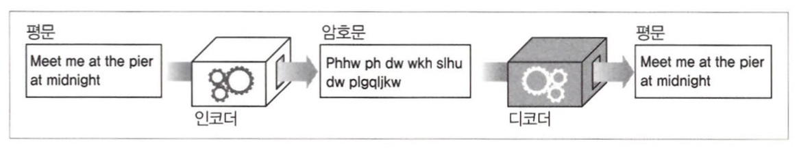
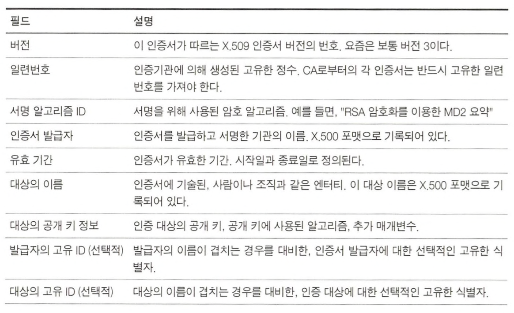
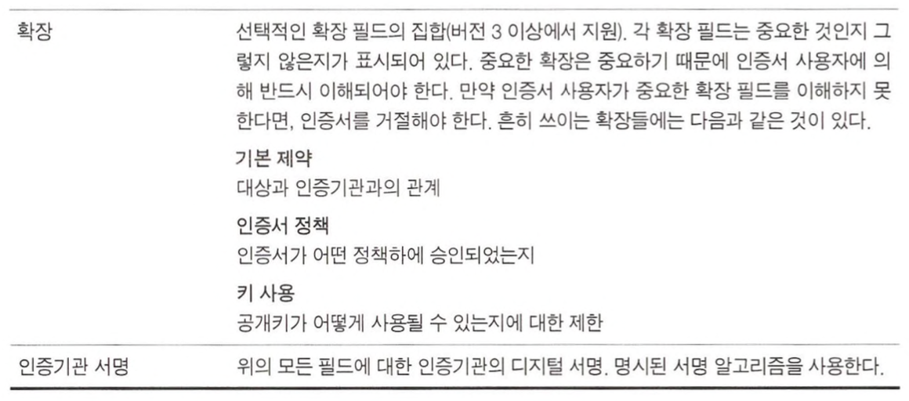
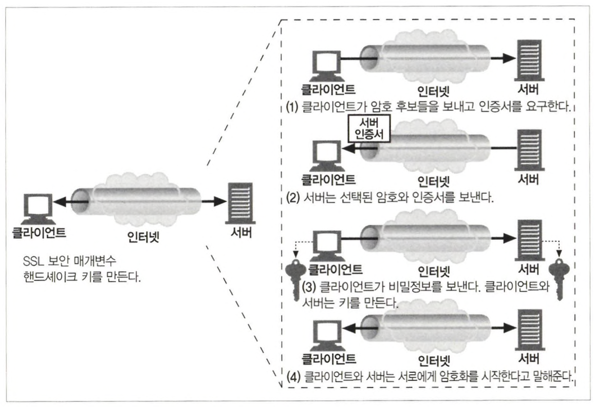

# 보안 HTTP

## HTTP를 안전하게 만들기

HTTP 통신에서 필요한 보안 기술은 아래와 같다.

- 서버 인증  
   클라이언트에게 올바른 서버와 통신하고 있음을 알린다.
- 클라이언트 인증  
   서버에게 올바른 클라이언트와 통신하고 있음을 알린다.
- 무결성  
   클라이언트와 서버가 주고받는 데이터가 위조되지 않아야한다.
- 암호화  
   클라이언트와 서버의 통신이 도청되지 않아야한다.
- 효율  
   저렴한 클라이언트와 서버도 이용할 수 있도록 알고리즘이 충분히 빨라야한다.
- 편재성  
   프로토콜이 거의 모든 클라이언트와 서버에서 지원되어야한다.
- 관리상 확장성  
   누구든, 어디서든 즉각적인 보안통신을 할 수 있어야한다.
- 적응성  
   최선의 보안 방법을 지원해야한다.
- 사회적 생존성  
   사회의 문화적, 정치적 요구를 만족시켜야한다.

### HTTPS

HTTPS를 사용할 때 모든 HTTP 요청과 응답 데이터는 네트워크로 보내지기 전에 암호화된다. HTTPS는 SSL을 이용해 구현되며 HTTP 하부에 보안 계층을 제공한다.

어려운 인코딩 및 디코딩 작업은 대부분 SSL 라이브러리 안에서 일어나기 때문에 클라이언트와 서버는 프로토콜을 처리하기 위한 로직을 크게 변경할 필요가 없다. 대부분 TCP 통신을 SSL 호출로 대체하고 보안 정보를 관리하는 로직이 추가된다.

 

## 디지털 암호학

디지털 암호학에서 사용되는 주요 단어는 아래와 같다.

- 암호  
   인코딩 알고리즘
- 키  
   암호의 동작을 변경하는 매개변수
- 대칭키 암호체계  
   인코딩과 디코딩에 같은 키를 사용하는 알고리즘
- 비대칭키 암호체계  
   인코딩과 디코딩에 다른 키를 사용하는 알고리즘
- 공개키 암호법
  비밀 메시지를 전달하는 수백만 대의 컴퓨터를 쉽게 만들 수 있는 시스템
- 디지털 서명  
   메시지가 위조되지 않았음을 입증하는 체크섬
- 디지털 인증서  
   신뢰할 만한 조직에 의해 서명되고 검증된 신원 확인 정보

### 암호

평문은 암호가 적용되어 암호문으로 코딩된다.

### 키가 있는 암호

키는 디코딩 작업을 바르게 동작시키기 위해 사용되며, 암호 키를 여러 개 설정함으로써 가상의 암호 기계를 여러 개 만들 수 있다. 각각의 암호 기계는 서로 다른 키를 갖고 있기 때문에 제각각 다르게 작동한다.

### 디지털 암호

디지털 계산의 도래로 아래와 같은 발전이 있었다.

- 복잡한 인코딩과 디코딩 알고리즘이 가능해졌다.
- 매우 큰 키를 생성할 수 있게 되면서, 많은 조합이 가능해지고 무작위로 추측한 키에 의한 크래킹이 어려워졌다.

 

## 대칭키 암호법

인코딩에 쓰이는 키와 디코딩에 쓰이는 키가 동일한 암호법이다. 발송자와 수신자 모두 **비밀키**를 똑같이 공유한다.

발송자는 비밀키를 메시지를 암호화하고, 발송하는 데에 사용하고, 수신자는 평문으로 복원하기 위해 키를 사용한다.

잘알려진 대칭키 알고리즘에는 DES, Triple-DES, RC2, RC4 등이 있다.

### 키 길이와 열거 공격

열거 공격은 무차별로 모든 키 값을 대입해보는 공격이다.

대칭키 암호에서는키의 크기만큼 유효한 키를 생성할 수 있다. 8비트 키라면 256가지 키를 생성할 수 있다. 128비트 키를 사용한 대칭키 암호는 매우 강력한 것으로 간주된다.

길이가 긴 키는 열거 공격을 어렵게 만들기 때문에 키의 길이는 매우 중요하다.

### 공유키 발급하기

대칭키 암호의 단점 중 하나는 발송자와 수신자가 통신하기 위해 둘 다 공유키를 가져야한다는 것이다. 발송자와 수신자가 늘어날때마다 관리해야하는 키도 늘어난다.

 

## 공개키 암호법

공개키 암호 방식은 두개의 비대칭 키를 사용한다. 하나는 메시지를 인코딩하기 위한 것이고, 다른 하나는 메시지를 디코딩하기 위한 것이다. 인코딩 키는 모두에게 공개되어 있고, 수신자만 디코딩 키를 알고 있다.

따라서 메시지 인코딩은 누구나 할 수 있지만 디코딩은 소유자만 할 수 있다.

### RSA

공개키 비대칭 암호는 암호문의 일부를 가로챈 경우와 암호 방식을 알고 있는 상황에도 개인키를 계산할 수 없다는 것을 보장해야한다.

이 요구를 만족시키는 공개키 암호 체계 중 유명한 알고리즘이 RSA이다.

### 혼성 암호 체계와 세션 키

두 노드가 안전하게 통신하려고 할 때 개인 키에 대한 협상이 먼저 필요하다. 그러나 공개키 암호 방식은 계산이 느리다는 단점이 있다. 때문에 실제로는 대칭과 비대칭 방식을 섞는 형태로 쓰인다. 통신 채널을 수립할 때는 공개키 암호화 방식을 사용해 안전한 채널을 만들고, 이 채널 안에서는 대칭키를 생성해 교환한다.

 

## 디지털 서명

암호 체계는 메시지를 암호화하고 해독하는 것뿐 아니라 누가 메시지를 썼는지 알려주고 그 메시지가 위조되지 않았음을 증명하기 위해서도 쓰인다.

### 서명은 암호 체크섬이다

서명은 메시지를 작성한 저자가 누구인지 알려준다. 저자는 개인키를 갖고 있기 때문에 오직 저자만이 이 체크섬을 계산할 수 있다.

또한 서명은 메시지 위조를 방지하는 데에 쓰인다. 만약 메시지가 위조되었다면 체크섬은 더 이상 메시지와 맞지 않게 된다. 체크섬은 저자가 갖고 있는 비밀키와 관련이 있기 때문에, 체크섬을 위조할 수는 없다.

디지털 서명은 보통 비대칭 공개키에 의해 생성된다.

1. 메시지를 고정된 길이의 요약으로 만든다.
2. 요약에 개인키를 사용해 서명을 만든다.
3. 메시지와 서명을 보낸다.
4. 메시지와 서명을 받은 수신자는 발송자를 확인하기 위해 서명에 공개키를 사용해 복호화한다. 만약 풀어낸 요약이 수신자가 갖고 있는 요약과 일치하지 않다면, 메시지가 위조되었거나 잘못된 발송자인 것으로 판단한다.

 

## 디지털 인증서

신뢰할 수 있는 기관(CA)으로부터 보증 받은 사용자나 회사에 대한 정보를 담고 있다.

### 인증서의 내부

디지털 인증서에는 아래와 같은 정보가 포함된다.

- 대상의 이름
- 유효기간
- 인증서 발급자
- 발급자의 디지털 서명

### X.509 v3 인증서

오늘날 사용되는 대부분의 인증서는 X.509라고 불리는 표준화된 서식에 데이터를 저장하고 있다.

### 서버 인증을 위해 인증서 사용하기

HTTPS를 통한 웹 트랜잭션을 시작할 때, 브라우저는 서버에서 디지털 인증서를 가져온다. 만약 서버가 인증서를 갖고 있지 않다면, 보안 커넥션은 실패한다.  
인증서를 받은 후에는 서명 기관을 검사한다. 만약 신뢰할만한 서명 기관이라면 브라우저는 이미 공개키를 알고 있을 것이며, 그 서명을 검증할 수 있다.  
만약 모르는 서명 기관이라면, 브라우저는 사용자에게 신뢰하는 서명 기관인지 확인하는 대화상자를 보여준다.

 

## HTTPS의 세부사항

HTTPS는 HTTP 프로토콜에 대칭, 비대칭 인증서 기반 암호 기법의 강력한 집합을 결한 것이다.

서버에 HTTP의 보안 프로토콜 버전을 수행한다고 말하기 위해 URL에 **https** 가 사용된다.  
만약 URL에 http가 있다면 클라이언트는 서버에 80번 포트로 연결하고, HTTP 명령을 전송한다.  
https가 있다면 클라이언트는 443번 포트로 연결하고, 서버와 핸드셰이크를 한 후 암호화된 HTTP 명령을 전송한다.

### 보안 전송 셋업

1. 클라이언트는 서버의 443번 포트로 연결한다.
2. 암호법 매개변수와 교환 키를 협상하면서 SSL 계층을 초기화한다.
3. 핸드셰이크가 완료되면 SSL 초기화가 완료된다.
4. 클라이언트는 요청 메시지를 보안 계층에 보낼 수 있다.

### SSL 핸드셰이크

핸드 셰이크에는 아래 과정이 포함된다.

- 프로토콜 버전 번호 교환
- 암호 선택
- 신원 인증
- 채널을 암호화하기 위한 임시 세션키 생성

### 서버 인증서

오늘날 클라이언트 인증서는 보통 쓰이지 않으며 보안 HTTPS 트랜잭션은 항상 서버 인증서를 요구한다.

넷스케이프가 제안한 서버 인증서 감사를 위한 알고리즘은 아래와 같다.

- 날짜 검사  
   인증서의 유효기간을 확인한다.
- 서명자 신뢰도 검사  
   모든 인증서는 CA에 의해 서명되어 있다. 인증서에는 여러 수준이 있고, 각각 다른 수준의 배경 검증을 요구한다.  
   브라우저는 신뢰할 만한 서명 기관의 목록을 갖고 있고, 알려져 있지 않은 기관일 경우 브라우저는 경고를 보여준다.  
   다만 CA가 간접적으로 서명한 인증서를 받아들이는 것을 선택할 수 있다.
- 서명 검사  
   서명 기관이 믿을 만하다고 판단되면 브라우저는 서명기관의 공개키를 서명에 적용해 인증서의 무결성을 검사한다.
- 사이트 신원검사  
   브라우저는 인증서의 도메인 이름이 서버의 도메인 이름과 일치하는지 검사한다. 만약 호스트명이 인증서와 다르다면 사용자에게 알리거나 커넥션을 끊어야한다.

### 가상 호스팅과 인증서

가상호스트로 운영되는 사이트의 경우 보안 트래픽을 다루기 까다로울 수 있다. 만약 인증서의 도메인 이름과 일치하지 않는 가상 호스트 명에 도착했다면 사용자는 경고 메시지를 받을 것이다.  
이런 문제를 피하기 위해 보안 트랜잭션을 시작하는 사용자를 인증서의 도메인으로 리다이렉트할 수 있다.

 

## 프락시를 통한 보안 트래픽 터널링

클라이언트가 서버와 보안 트랜잭션을 시작한다면 프락시는 이를 이해할 수 없다. 이를 해결하기위 사용되는 방식이 **HTTPS SSL 터널링 프로토콜**이다.

**SSL 터널링**  
SSL 터널링을 이용하면 프락시에 SSL을 구현할 필요가 없다. SSL 세션은 클라이언트 요청과 웹 서버 간에 생성되고, 프록시는 암호화된 데이터를 그대로 터널링한다.

### 터널 인증

프락시 인증 기능을 클라이언트가 터널을 사용할 수 있는 권한을 갖는지 확인하는 용도로 사용할 수 있다.

1. 클라이언트가 게이트웨이에 CONNECT 요청을 보낸다.
2. 프락시가 클라이언트에 인증을 요구한다.
3. 클라이언트가 인증과 함께 CONNECT 요청을 보낸다.
4. 프락시에서 443 포트로 서버에 TCP 커넥션 요청을 보낸다.
5. 서버와 커넥션이 맺어진다.
6. 프락시에서 클라이언트로 200을 보낸다.
