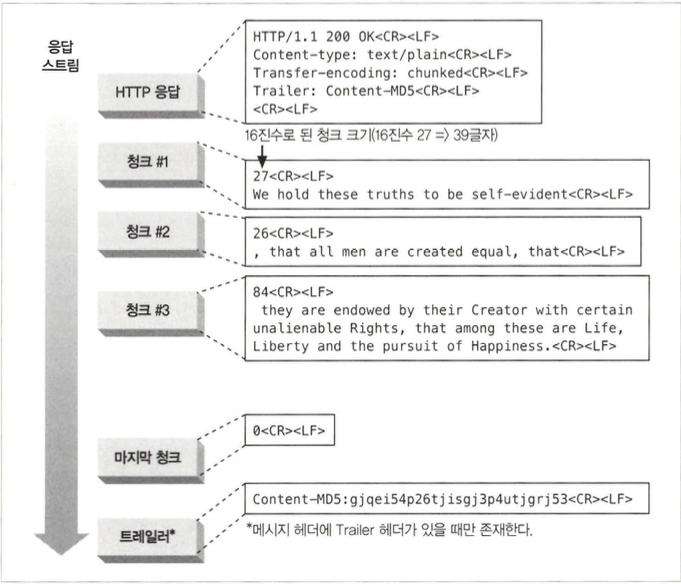
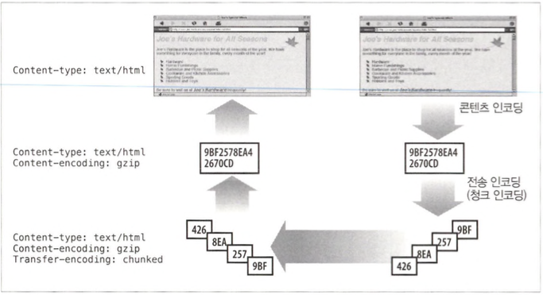
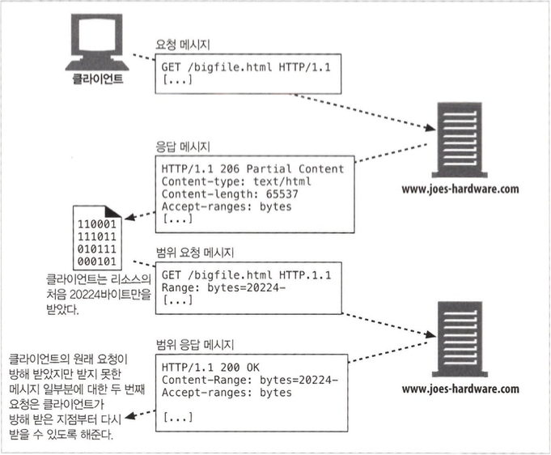
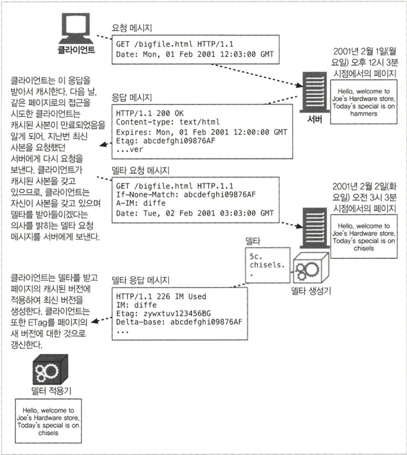

# 엔터티와 인코딩

- HTTP가 보장 하는것

  - 객체 식별 (Content-Type, Content-Language)
  - 객체 압축 해제(Content-Length, Content-Encoding)
  - 객체 최신상태 보장(엔티티 검사기, 캐시 만료 제어)
  - 사용자 요구 만족(Accept)
  - 빠르고 효율적인 네트워크 이동(범위 요청, 델타 인코딩, 그 외의 데이터 압축)
  - 신뢰성(전송 인코딩, Cotent-MD5 체크섬)

## 15.1 메시지는 컨테이너, 엔티티는 화물

- Content-Type: 종류
- Content-Length: 길이
- Content-Language: 잘 대응되는 자연어
- Content-Enconding: 변형
- Content-Location: 요청 시점을 기준으로, 객체의 또 다른 위치
- Content-Range: 만약 이 엔터티가 부분 엔터티라면, 이 헤더는 이 엔터티가 전체에서 어느 부분에 해당하는지 정의
- Content-MD5: 엔티티 본문의 콘텐츠에 대한 체크섬
- Last-Modified: 생성 혹은 수정된 날
- Expires: 캐시만료일
- Allow: 허용 메서드
- ETag: 이 인스턴스1에 대한 고유한 검사기. 엄밀히 말해 ETag 헤더는 엔터티 헤더로 정의되어 있지는 않지만 엔터티와 관련된 많은 동작을 위해 중요한 헤더
- Cache-Control: 캐시 지시자

### 15.1.1 엔터티본문

## 15.2 Content-Length: 엔터티의 길이

- Content-Length 헤더는, 메시지를 청크 인코딩으로 전송하지 않는 이상, 엔터티 본문을 포함한 메시지에서는 필수적이며 메시지가 잘렸는지 감지하거나 지속커넥션을 공유하는 메시지를 올바르게 분할하고자 할 떄 필요합니다.

### 15.2.1 잘림 검출

- Content-Length가 없다면 클라이언트는 커넥션이 정상적으로 닫힌 것인지 메시 지 전송 중에 서버에 중돌이 발생한 것인지 구분하지 못합니다.
- 캐싱 프락시 서버는 명시적으로 Content-Length 헤더를 갖고 있지 않은 HTTP 본 문은 보통 캐시하지 않습니다.

### 15.2.2 잘못된 Content-Length

- HTTP/1.1 사 용자 에이전트는 잘못된 길이를 받고 그 사실을 인지했을 때 사용자에게 알려주게 되어 있습니다.

### 15.2.3 Content-Length와 지속 커넥션(Persistent Connection)

- HTTP 애플리케이션은 Content-Length 헤더 없이는 어디까지가 엔터티 본문이고 어디부터가 다음 메시지인지 알 수 없습니다.

### 15.2.4 콘텐츠 인코딩

- HTTP는 콘텐츠 인코딩을 통해 보안을 강화하거나 압축할 수 있는데 이때 Content-Length 헤더는 인코딩된 본문의 길이를 바이트 단위로 정의하게되며 인코딩 하지 않는 본문 길이로 보낼경우 심각한 오류를 유발할 수 있습니다.

### 15.2.5 엔티티 본문 길이 판별을 위한 규칙

- 본문을 갖는 것이 허용되지 않는 특정 타입의 HTTP 메시지에서는, 본문 계산을 위한 Content-Length 헤더가 무시됩니다.
- 메시지가 Transfer-Encoding 헤더를 포함하고 있다면,메시지가 커넥션이 닫혀서 먼저 끝나지 않는 이상 엔터티는 ‘0 바이트 청크’라 불리는 특별한 패턴으로 끝나야 합니다.
- 메시지가 Content-Length 헤더를 갖는다면 Transfer-Encoding 헤더가 존재하지 않는 이상 Content-Length 값은 본문의 길이를 담게 됩니다.
- 메시지가 ‘multipart/byteranges’ 미디어 타입을 사용하고 엔터티 길이가 별도로 정의되지 않았다면 멀티파트 메시지의 각 부분은 각자가 스스로의 크기를 정의합니다.
- 어떤 규칙에도 해당되지 않는다면, 엔터티는 커넥션이 닫힐 때 끝납니다.
- Content-Length를 요구하고 싶다면 411 Length Required 응답을 보내라고 조언하고 있습니다.

## 15.3 엔터티 요약

- Content-MD5 헤더는 서버가 엔터티 본문에 MD5 알고리즘을 적용한 결과를 보 내기 위해 사용됩니다.

## 15.4 미디어 타입과 차셋(Charset)

- Content-Type 헤더 필드는 엔터티 본문의 MIME 타입을 기술합니다.

### 15.4.1 텍스트 매체를 위한 문자 인코딩

- Content-Type 헤더는 내용 유형을 더 자세히 지정하기 위한 선택적인 매개변수도 지원하는데 대표적으로 `charset`이 있습니다.

```
Content-Type: text/html; charset=iso-8859-4
```

### 15.4.2 멀티파트 미디어 타입

- MIME “멀티파트” 이메일 메시지는 서로 붙어있는 여러 개의 메시지를 포함하며, 하나의 복합 메시지로 보내집니다.
- 본문도 지원하는데, 일반적으로는 폼을 채워서 제출할 때 와 문서의 일부분을 실어 나르는 범위 응답을 할 때의 두 가지 경우에만 사용합니다.

### 15.4.3 멀티파트 폼 제출

- boundary는 본문의 서로 다른 부분을 구분하기 위한 구분자로 쓰입니다.

```
Content-Type: muLt ipa rt/fo rm-data; boundary=AaB03x AaB03x
Content-Disposition: form-data; name스'submit—name"
Sally
——AaB03x
Content-Disposition: form-data; name스,files"; filenalne=’,essayfile.txt" Content-Type: text/plain
.. .contents of essayfile.txt...
——AaB03x—
```

### 15.4.4 멀티파트 범위 응답

## 15.5 콘텐츠 인코딩

- 느린 속도로 연결된 클라이언트에게 큰 HTML 문서를 전송하기 전에 서버는 전송 시간을 줄이기 위해 압축을 할 수 있습니다.
- 서버는 허가받지 않은 제삼자가 볼 수 없도록 콘텐츠를 암호화하거나 뒤섞 어서 보낼 수도 있습니다.

### 15.5.1 콘텐츠 인코딩 과정

1. 웹 서버가 원본 Content-Type과 Content-Length 헤더를 수반한 원본 응답 메시지 생성
2. 콘텐츠 인코딩 서버가 인코딩된 메시지를 생성, 콘텐츠 인코딩 서버는 Content- Encoding 헤더를 인코딩된 메시지에 추가하여, 수신 측 애플리케이션이 그것을 디코딩할 수 있도록 합니다.
3. 수신 측 프로그램은 인코딩된 메시지를 받아서 디코딩하고 원본을 얻습니다.

### 15.5.2 콘텐츠 인코딩 유형

| 콘텐츠 인코딩 값 | 설명                                                                                                                   |
| ---------------- | ---------------------------------------------------------------------------------------------------------------------- |
| gzip             | 엔터티에 GNU zip 인코딩이 적용되었음을 의미한다.                                                                       |
| compress         | 엔터티에 대해 유닉스 파일 압축 프로그램인 ‘compress’가 실행되었음을 의미한다.                                          |
| deflate          | 엔터티가 zlib 포맷으로 압축되었음을 의미한다.                                                                          |
| identity         | 엔터티에 어떤 인코딩도 수행되지 않았음을 의미한다. Content-Encoding 헤더가 존재 하지 않는다면 이 값인 것으로 간주된다. |

### 15.5.3 Accept-Encoding 헤더

- 서버 에서 클라이언트가 지원하지 않는 인코딩을 사용하는 것 을 므]■기 위해, 클라이언트는 자신이 지원하는 인코딩의 목록을 Accept-Encoding 요청 헤더를 통해 전달합니다.

## 15.6 전송 인코딩과 청크 인코딩

- 콘텐츠 인코딩된 메시지는 단지 메시 지의 엔터티 부분만 인코딩한다. 전송 인코딩된 메시지에서는, 인코딩은 전체 메시지에 대해 적용되어 메시지 자체 의 구조를 바꿉니다.

### 15.6.1 안전한 전송

- HTTP에서 전송된 메시지의 본문이 문제를 일으킬 수 있는 이유는 두 가지 있습니다.
  - 알 수 없는 크기
  - 보안

### 15.6.2 Transfer-Encoding 헤더

- 전송 인코딩을 제어하고 서술하기 위해 정의된 헤더는 단 두 개입니다.
  - Transfer-Encoding: 안전한 전송을 위해 어떤 인코딩이 메시지에 적용되었는지 수신자에게 알려줍니다.
  - TE: 어떤 확장된 전송 인코딩을 사용할 수 있는지 서버에게 알려주기 위해 요청 헤더에 사용합니다.

### 15.6.3 청크 인코딩

- 청크 인코딩은 메시지를 일정 크기의 청크 여럿으로 쪼갭니다.
- 청크와 지속 커넥션: 청크 인코딩은 서버가 본문을 여러 청크로 쪼개 보낼 수 있게 해줌으로써 지속 커넥션에서는, 본문을 쓰기 전에 반드시 Content-Length 헤더에 본문의 길이를 담아서 보내줘야하는 제약을 해결할 수 있습니다.
- 트레일러: 본문의 콘텐츠가 먼저 생성되어야 한다거나 하는 등의 이유로 메시지 시작 시점에서는 그 값을 알 수 없는 추가적인 헤더 필드를 담을 수 있음



### 15.6.4 콘텐츠와 전송 인코딩의 조합



### 15.6.5 전송 인코딩 규칙

- 전송 인코딩의 집합은 반드시 ‘chunked’를 포함, 메시지가 커넥션의 종료일 경우 예외
- 메시지 본문에 적용된 마지막 전송 인코딩이 존재
- 청크 전송 인코딩은 반드시 메시지 본문에 한 번 이상 적용

## 15.7 시간에 따라 바뀌는 인스턴스

- HTTP 프로토콜은 어떤 특정한 종류의 요청이나 응답을 다루는 방법들을 정의하는데, 이것은 인스턴스 조작이라고 합니다. 대표적적으로 범위 요청과 델타인코딩이 있습니다.

## 15.8 검사기와 신선도

### 15.8.1 신선도

### 15.8.2 조건부 요청과 검사기

## 15.9 범위 요청

- HTTP는 클라이언트가 문서의 일부분이나 특정 범위에 대해서만 요청을 할 수 있습니다.
- 서버는 클라이언트에게 자신의 범위를 받아들일 수 있는지 응답에 Accept-Range 헤더를 포함시키는 방법으로 알려줄 수 있습니다.
- 단, 범위 요청은 클라이언트와 서버가 같은 버전의 문서를 갖고 있을 때만 의미가 있다는 것을 유의



## 15.10 델타 인코딩

- 객체 전체가 아닌 변경된 부분에 대해서만 통신하여 전송량을 최적화는 HTTP 프로토콜의 확장입니다.



- A-IM(Accept-Instance-Manipulation) 헤더: 클라이언트가 서버에게 자신이 페이지에 대한 델타를 받아들일 수 있음을 알려주는 헤더입니다.

### 15.10.1 인스턴스 조작, 델타 생성기 그리고 델타 적용기

- 델타 인코딩은 전송 시간을 줄일 수 있지만 구현하기가 까다로울 수 있습니다.
- 델타 인코딩을 지원하는 서버는 자신이 제공하는 페이지가 변경되는 매 순간의 사본을 유지하고 있어야합니다. 따라서 디스크 공간이 많이 필요합니다.
