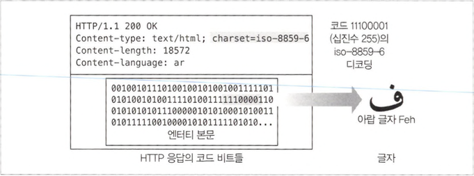
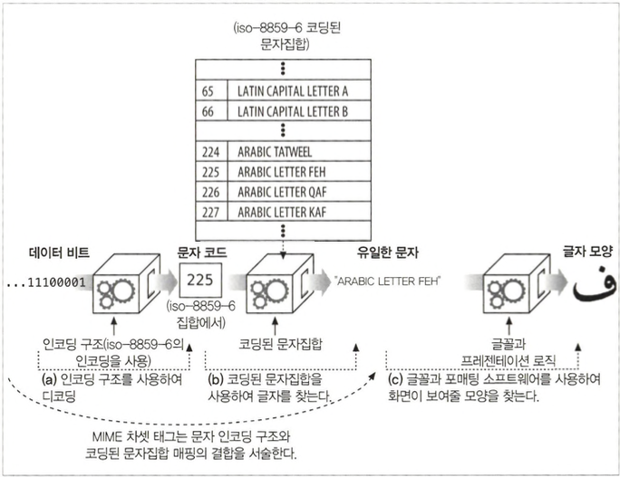

# 국제화

## 16.1 국제적인 콘텐츠를 다루기 위해 필요한 HTTP 지원

- 국제 콘텐츠를 지원하기 위해, 서버는 클라이언트에게 각 문서의 문자와 언어를 알려줘서, 클라이언트가 올바르게 문서를 이루고 있는 비트들을 문자들로 풀어내고, 올바르게 처리해서 사용자에게 콘텐츠를 제공해줄 수 있도록 할 필요가 있습니다.
- 클라이 언트는 서버에게 자신이 어떤 차셋 인코딩 알고리즘들과 언어들을 이해하며 그중 무엇을 선호하는지 말해주기 위해 Accept-Charset과 Accept-Language 헤더를 보냅니다.

```
Accept-Language: fr, en;q=0.8
Accept-Charset: iso-8859-1, utf-8

```

- 매개변수 ‘q=0.8’은 품질 인자(quality factor)이다. 프랑스어(기본값 1.0)보다 영어 에 낮은 우선순위(0.8)을 주는 예시입니다.

## 16.2 문자집합과 HTTP

### 16.2.1 차셋(Charset)은 글자를 비트로 변환하는 인코딩이다

- HTTP 차셋 값은, 어떻게 엔터티 콘텐츠 비트들을 특정 문자 체계의 글자들로 바꾸는지 말해줍니다.



### 16.2.2 문자집합과 인코딩은 어떻게 동작하는가



### 16.2.3 잘못된 차셋은 잘못된 글자들을 낳는다

- 만약 클라이언트가 잘못된 charset 매개변수를 사용한다면, 클라이언트는 이상 한 깨진 글자를 보여주게 될 것입니다.

### 16.2.4 표준화된 MIME 차셋 값

- 특정 문자 인코딩과 특정 코딩된 문자집합의 결합을 MIME 차셋이라고 합니다.

### 16.2.5 Content-Type charset 헤더와 META 태그

```
Content-Type: text/html; charset=iso-2022-jp

```

- 웹 서버는 클라이언트에게 MIME 차셋 태그를 charset 매개변수와 함께 Content-Type헤더에 담아 보냅니다.
- 클라이언트가 문자 인코딩을 추측하지 못했다면, iso-8859-l인 것으로 가정합니다.

### 16.2.6 Accept-Charset 헤더

- Accept-Charset 헤더의 값은 클라이언 트가 지원하는 문자 인코딩의 목록을 제공합니다.
- Accept-Charset 요청 헤더에 대웅하는‘ Content-Charset 응답 헤더는 존재하지 않습니다. 대신에 웅답 문자집합은 MIME과의 호환을 위해 Content-Type 응답 헤더의 charset 매개변수를 통해 서버로부터 응답받습니다.
