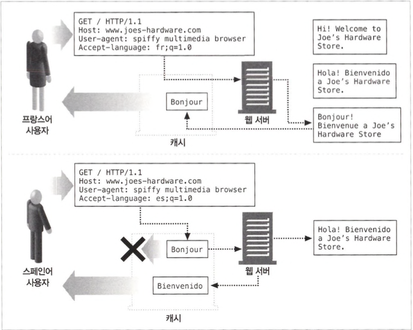
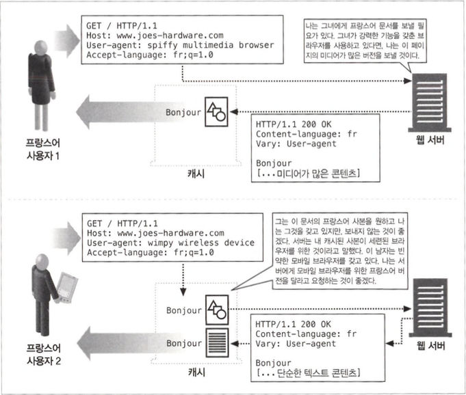
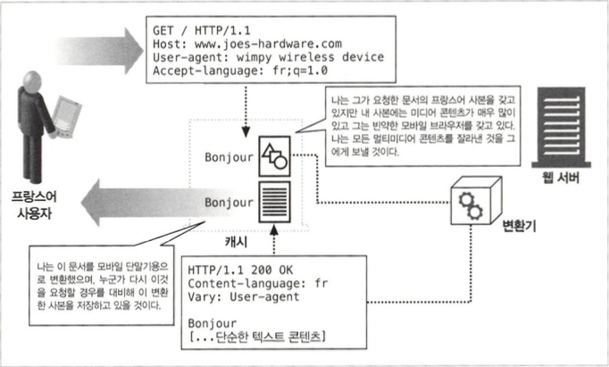

# 내용 협상과 트랜스코딩

## 17.1 내용협상기법

- 서버에 있는 페이지들 중 어떤 것이 클라이언트에게 맞는지 판단하는 세 가지 다른 방법
  - 클라이언트 주도 협상
  - 서버 주도 협상
  - 투명 협상

## 17.2 클라이언트 주도 협상

- 서버에게 있어 가장 쉬운 방법은 서버가 클라이언트의 요청을 받았을 때 가능한 페 이지의 목록을 응답으로 돌려주어 클라이언트가 보고 싶은 것을 선택하게 하는 것입니다.
- 단점은 각 페이지에 두 번의 요청이 필요, 여러 개의 URL(주 페이지 하나와 각 특정 조건별 페이지들)을 요구한다는 점
- 여러 가지 버전에 대한 링크와 각각에 대한 설명이 담긴 HTML 페이지를 돌려주거나 300 Multiple Choices 응답 코드로 HTTP/1.1 웅답을 돌려주는 방법이 있습니다.

## 17.3 서버 주도 협상

- 내용 협상 헤더들을 통해 서버는 클라이언트의 Accept 관련 헤더들을 확인하고 그에 알맞은 응답 헤더를 준비하거나 내용 협상 헤더 외의 다른 헤더들을 통해 응답을 보내줄 수도 있습니다.
- 단점으로 요청에 대한 응답으로 돌려줄 최적의 페이지를 결정하기 위한 클라 이언트와 서버 사이의 커뮤니케이션을 증가합니다.

### 17.3.1 내용 협상 헤더

- HTTP는 상태가 없는 프로토콜이기 때문에 클라이언트는 자신의 선호 정보를 반 드시 매 요청마다 보내야합니다.

### 17.3.2 내용 협상 헤더의 품질값

- HTTP 프로토콜은 클라이언트가 각 선호의 카테고리마다 여러 선택 가능한 항목을 선호도와 함께 나열할 수 있도록 품질값을 정의하였습니다.

```
Accept-Language: en;q=0.5, fr;q=0.0, nl;q=1.0, tr;q=0.0
```

### 17.3.3 그 외의 헤더들에 의해 결정

### 17.3.4 아파치의 내용 협상

- 내용 협상은 웹 사이트 콘텐츠의 제공자에게 달려있는데 만약 색인 페이지를 여러 가지 버전으로 제공해 주려고 한다면 우선 콘텐츠 제공자가 각각의 버전에 해당하는 파일들을 아파치 서버의 적절한 디렉터리에 모두 넣어주어야합니다.

### 17.3.5 서버 측확장

## 17.4 투명 협상

- 투명 협상은 클라이언트 입장에서 협상하는 중개자 프락시를 둠으로써 클라이언트와의 메시지 교환을 최소화하는 동시에 서버 주도 협상으로 인한 부하를 서버에서 제거합니다.
- 서버는 응답에 Vary 헤더를 포함시켜 보냄으로써 중개자에 게 내용 협상을 위해 어떤 헤더를 사용하고 있는지 알려줄 수 있습니다.

### 17.4.1 캐시와얼터네이트(alternate)



### 17.4.2 Vary 헤더

- HTTP Vaiy 응답 헤더는 서버가 문서를 선택하거나 커스텀 콘텐츠를 생성할 때 고려한 클라이언트 요청 헤더 모두(일반적인 내용 협상 헤더 외에 추가로 더해서) 를 나열합니다.



- 서버가 특정 요청 헤더에 따라 다르게 응답한다면, 캐시된 응답을 돌려보내기 전에 캐시는 반드시 일반적인 내용 협상 헤더들뿐 아니라 이들 요청 헤더들도 맞춰보아야합니다.

## 17.5 트랜스코딩

- 나 서버가 클라이언트의 요구에 맞는 문서를 아예 갖고 있지 않다면 서버는 기존의 문서를 클라이 언트가 사용할 수 있는 무언가로 변환할 수 있는걸 트랜스코딩이라고합니다.
- 트랜스코딩에는 포맷 변환, 정보 합성, 내용 주입의 세 종류가 있습니다.

### 17.5.1 포맷 변환

- 포맷 변환은 데이터를 클라이언트가 볼 수 있도록 한 포맷에서 다른 포맷으로 변환 하는것입니다.

### 17.5.2 정보 합성

- 각 절의 제목에 기반 한 문서의 개요 생성이나 페이지에서 광고 및 로고 제거 등 있습니다.

### 17.5.3 콘텐츠 주입

- 양을 늘리는 변환인 내용 주입 트랜스코딩도 있습니다. 자동 광고 생성과 사용자 추적 시스템 등이 있습니다.

### 17.5.4 트랜스코딩 vs. 정적으로 미리 생성해놓기

- 트랜스코딩의 대안은 웹 서버에서 웹페이지의 여러 가지 사본을 만드는 것입니다.


