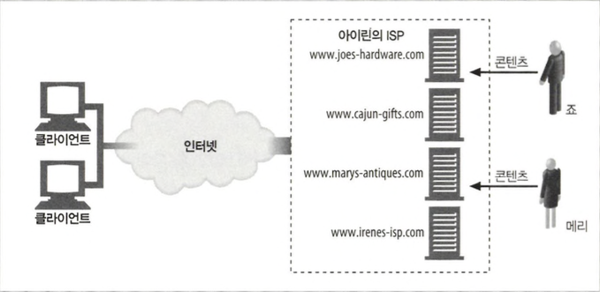
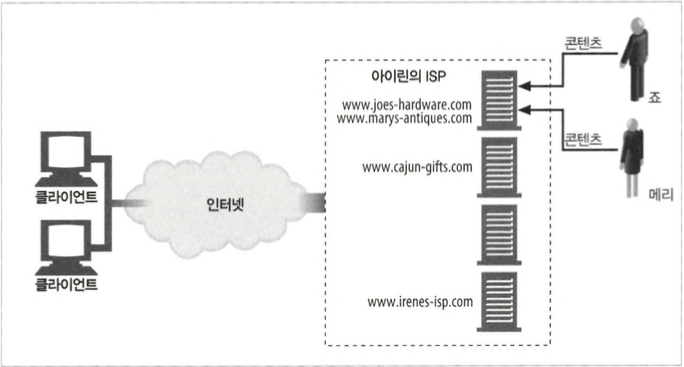
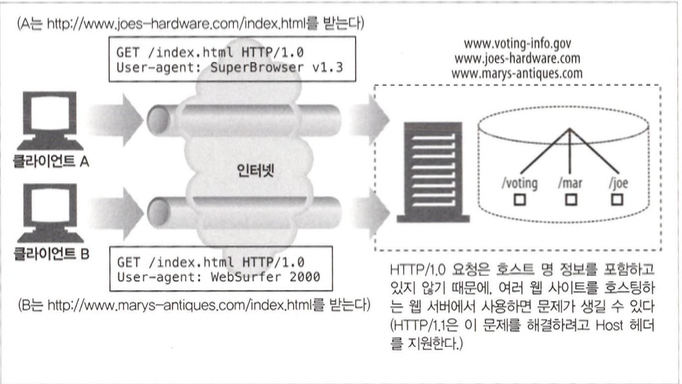
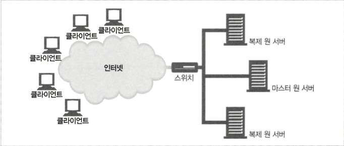

# 웹 호스팅

- 콘텐츠 리소스를 저장, 중개, 관리하는 일을 통틀어 웹 호스팅이라 합니다.

## 18.1 호스팅서비스

### 18.1.1 간단한 예 : 전용 호스팅



## 18.2 가상 호스팅



### 18.2.1 호스트정보가없는 가상 서버 요청



### 18.2.2 가상 호스팅 동작하게 하기

- URL 경로를 통한 가상 호스팅 : 서버가 어떤 사이트를 요청하는 것인지 알 수 있게 URL에 특별한 경로 컴포넌트를 추가
- 포트번호를 통한 가상 호스팅 : 각 사이트에 다른 포트번호를 할당하여, 분리된 웹 서버의 인스턴스가 요청을 처리
- IP 주소를 통한 가상 호스팅 : 각 가상 사이트에 별도의 IP 주소를 할당하고 모든 IP 주소를 장비 하나에 연결
- Host 헤더를 통한 가상 호스팅 : 웹 서버는 Host 헤더로 가상 사이트를 식별

### 18.2.3 HTTP/1.1 Host 헤더

```
Host = "Host" H:H 호스트[ H:" 포트 ]
```

- Host 헤더 해석하기
  1. HTTP 요청 메시지에 전체 URL이 기술되어 있으면(예를 들어 스킴과 호스트 컴 포넌트가 기술되어 있을 때), Host 헤더에 있는 값은 무시하고 URL을 사용한다.
  2. HTTP 요청 메시지에 있는 URL에 호스트 명이 기술되어 있지 않고 요청에 Host 헤더가 있으면, 호스트 명과 포트를 Host 헤더에서 가져온다.
  3. 1단계나 2단계에서 호스트를 결정할 수 없으면 클라이언트에 400 Bad Request 응답을 반환한다.

## 18.3 안정적인 웹 사이트 만들기

### 18.3.1 미러링된서버 팜

- 서버 팜은 서로 대신할 수 있고 식별할 수 있게 설정된 웹 서버들의 집합입니다.



- 클라이언트의 요청이 특정 서버로 가는 두 가지 방법
  - HTTP 리다이렉션 : 콘텐츠에 대한 URL은 마스터 서버의 IP를 가리키고, 마스터 서버는 요청을 받는 즉 시 복제 서버로 리다이렉트
  - DNS 리다이렉션 : 콘텐츠의 URL은 네 개의 IP 주소를 가리킬 수 있고, DNS 서버는 클라이언트에게 전송할 IP 주소를 선택

### 18.3.2 콘텐츠 분산 네트워크

- 콘텐츠 분산 네트워크(CDN)는 특정 콘텐츠의 분산을 목적으로 하는 단순한 네트워크(네트워크의 노드는 서버, 대리 서버, 혹은 프락시 서버)

### 18.3.3 CDN의 대리 캐시

- 리버스 프락시라고도 불리는 대리 서버는 미러링 된 웹 서버처럼 콘텐츠에 대한 요 청을 받습니다.
- 대리 서버와 미러링 된 서버의 차이점
  - 대리 서버는 원 서버의 전체 콘텐츠를 복사하지는 않고 클라이언트가 요청하는 콘텐츠만 저장

### 18.3.4 CDN의 프락시 캐시

- 전통적인 프락시 캐시는 어떤 웹 서버 요청이든지 다 받을 수 있습니다.

## 18.4 웹 사이트 빠르게 만들기

- 서버 팜이나 분산 프락시 캐시나 대리 서버는 혼잡을 조절하고 네트워크 트래픽을 분산 시켜서 콘텐츠를 서버에서 클라이언트로의 전송하는 시간이 단축시킬수 있습니다.
