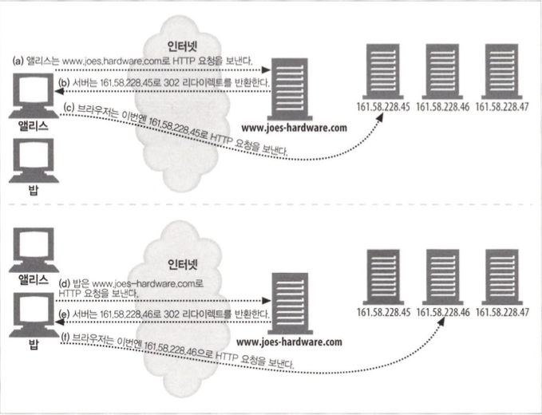
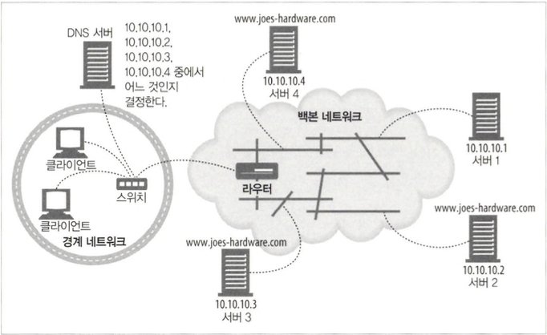
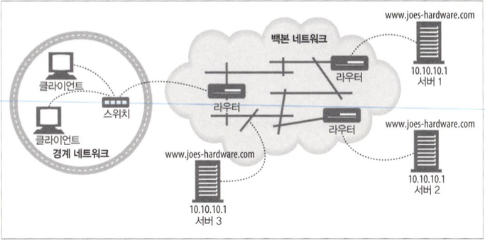
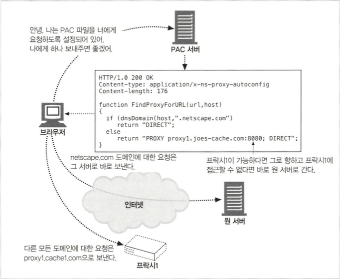

# 리다이렉션과 부하 균형

## 20.1 왜 리다이렉트인가?

- 신뢰할 수 있는 HTTP 트랜잭션의 수행
- 지연 최소화
- 네트워크 대역폭 절약

## 20.2 리다이렉트 할 곳

## 20.3 리다이렉션 프로토콜의 개요

## 20.4 일반적인 리다이렉션 방법

### 20.4.1 HTTP 리다이렉션

- 웹 서버들은 다른 곳에 요청을 보내보라고 말해주는 짧은 리다이렉트 메시지를 클 라이언트에게 돌려줍니다.
- 요청을 처리하는 서버(리다이렉팅 서버)는 가용한 것들 중 부하가 가장 적은 콘텐츠 서버를 찾아서 브라우저의 요청을 그 서버로 리다이렉트합니다.



- 단점
  - 어떤 서버로 리다이렉트할지 결정하려면 원 서버는 상당히 많은 처리필요
  - 페이지에 접근할 때마다 두 번의 왕복이 필요
  - 리다이렉트 서버가 고장 나면, 사이트도 고장

### 20.4.2 DNS 리다이렉션



- DNS 라운드 로빈 : 가장 흔한 동시에 가장 단순한 리다이렉션 기법, 순수한 부하 균형 전략이며, 서버에 대한 클라이언 트의 상대적인 위치나 서버의 현재 스트레스를 고려하지 않음
- DNS 기반 리다이렉션 알고리즘
  - 부하 균형 알고리즘 : 몇몇 DNS 서버는 웹 서버의 로드를 추적하고 가장 로드가 적은 웹 서버를 목록의 가장 위에 놓는다.
  - 근접 라우팅 알고리즘 : 웹 서버들의 팜이 지리적으로 분산되어 있는 경우, DNS 서버는 사용자를 근처의 웹 서버로 보내는 시도를 할 수 있다.
  - 결함 마스킹 알고리즘 : DNS 서버는 네트워크의 건강 상태를 모니터링하고 요청을 정전이나 기타 장애를 피해서 라우팅 할 수 있다.

### 20.4.3 임의 캐스트 어드레싱

- 임의 캐스트 어드레싱에서, 여러 지리적으로 흩어진 웹 서버들은 정확히 같은 아이 피 주소를 갖고 클라이언트의 요청을 클라이언트에서 가장 가까운 서버로 보내주 기 위해 백본 라우터의 ‘최단거리’ 라우팅 능력에 의지합니다.



### 20.4.4 아이피 맥 포워딩

- IPv4 네트워크에서 ARP(Address Resolution Protocol)라고도 하는 IP-MAC 포워딩은 IP 주소를 MAC 주소에 매핑하여 LAN(Local Area Network)의 장치 간 통신을 가능하게 하는 중요한 프로세스입니다. 네트워크 계층(IP)의 장치는 IP 주소를 사용하여 통신하고 데이터 링크 계층(MAC)의 장치는 MAC 주소를 사용하여 로컬 네트워크 내에서 데이터를 전송하기 때문에 이 프로세스가 필수적입니다.

### 20.4.5 아이피 주소 포워딩

- 아이피 주소 포워딩에서, 스위치나 다른 레이어 4를 이해하는 장비는 들어오는 패킷에 대해 TCP/IP 어드레싱을 검증하고 패킷을 목적지 맥 주소가 아니라 목적지 아이피 주소의 변경에 따라 라우팅합니다.

### 20.4.6 네트워크 구성요소 제어 프로토콜

- 아 이피 패킷을 전달하는 라우터나 스위치 같은 네트워크 구성요소들(NE)이 웹 서버 나 프락시 캐시와 같이 애플리케이션 계증 요청을 처리하는 서버 구성요소들(SE) 과 대화할 수 있게 해줍니다.

## 20.5 프락시 리다이렉션 방법

### 20.5.1 명시적브라우저 설정

- 대부분의 브라우저에는 프락시 서버에 접촉하기 위해 프락시 이름, 아이피 주소, 포트번호를 설정할 수 있는 풀다운 메뉴가 존재 사용자가 이를 설정하면 브라우저는 모든 요청에 대해 프락시와 연결합니다.

### 20.5.2 프락시 자동 설정

- 브라우저들이 URL별로 접촉해야 할 프락시를 지정한 PAC 파일이라 불리는 특별한 파일을 찾도록 설정합니다.
- PAC 파일은 다음의 함수를 반드시 정의해야 하는 자바스크립트 파일입니다.

```
function FindProxyForURL(url, host)
```



### 20.5.3 웹 프락시 자동발견 프로토콜(Web Proxy Autodiscovery Protocol)

- HTTP 클라이언트가 PAC 파일의 위치를 알아내고 그 파일을 이용해서 적절한 프락시 서버의 이름을 알아낼 수 있게 해줍니다.
- 순서
  - WPAD를 이용해 PAC 파일 CURL을 찾는다.
  - URL에 해당하는 PAC 파일(설정파일 혹은 CFILE이라고도 알려진)을 가져온다.
  - 프락시 서버를 알아내기 위해 그 PAC 파일을 실행한다.
  - PAC 파일이 반환한 프락시 서버에게 HTTP 요청을 보낸다.
- WPAD 알고리즘
  - DHCP(Dynamic Host Configuration Protocol, 동적 호스트 설정 프로토콜)
  - SLP(Service Location Protocol, 서비스 위치 프로토콜)
  - DNS에게 잘 알려진 호스트명
  - DNS의 SRV 레코드
  - TXT 레코드의 DNS 시비스 URL들

## 20.6 캐시 리다이렉션 방법

### 20.6.1 WCCP 리다이렉션

- 웹 라우터들이 웹 트래픽을 프락시 캐시로 리다이렉트 할 수 있도록 하기 위해 캐시 조직 프로토콜(WCCP)을 개발되었습니다.

## 20.7 인터넷 캐시 프로토콜

- 인터넷 캐시 프로토콜(ICP)는 캐시들이 형제 캐시에서 일어난 캐시 적중을 찾아볼 수 있도록 해줍니다.
- ICP는 단순하고 가볍습니다.(32bit)

## 20.8 캐시 배열 라우팅 프로토콜

- 캐시 배열 라우팅 프로토콜(CARP)은, 프락시 서버의 배열이 클라이언트의 시점에서는 마치 하나의 논리적인 캐시처럼 보이도록 관리해주는 표준입니다.
- ICP와 CARP
  - 둘 다 프록시 서버 간 콘텐츠 전달과 캐시 관리를 최적화하는 웹 캐싱 기술입니다.
  - ICP는 프록시 서버들 간에 캐시된 콘텐츠와 캐시 정보를 공유하며, CARP는 배열 내 적절한 캐시 서버로 요청을 라우팅하여 콘텐츠 중복을 제거하고 캐시 활용을 최적화합니다.

## 20.9 하이퍼텍스트 캐싱 프로토콜

- 네트워크 내에서 웹 콘텐츠 캐싱 및 전달을 개선하기 위해 설계된 프로토콜입니다.
- ICP의 대안으로 개발되었으며 보다 정교하고 유능한 프로토콜을 제공하여 웹 캐싱의 효율성을 높습니다.

### 20.9.1 HTCP 인증

- HTCP 메시지의 인증 부분은 선택적입니다.

### 20.9.2 캐싱 정책 설정

- SET 메시지는 캐시가 캐시된 문서에 대한 정책 변경을 요청할 수 있게 해줍니다.
- 요청과 응답 헤더를 질의 메시지에 담아 형제 캐시로 보내는 것이 허용됨에 따라, HTCP는 캐시 질의에서 거짓 적중의 비율을 줄일 수 있습니다.
